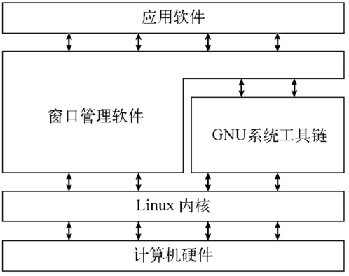

参考：《Linux命令行与shell脚本》
[TOC]

# 初识Linux shell

## 什么是Linux

> Linux可划分为以下四部分，各部分协作起来构成整个Linux系统
>
> * Linux内核
> * GNU工具
> * 图形化桌面环境
> * 应用软件



### Linux内核

> 内核是Linux系统的核心，控制着计算机系统上的所有硬件和软件，在必要时分配硬件，并根据需要执行软件。

内核主要功能分为

* 系统内存管理
* 软件程序管理
* 硬件设备管理
* 文件系统管理
  * 不同于其他一些操作系统，Linux内核支持通过不同类型的文件系统从硬盘中读写数据，还包括windows采用的文件系统中读写数据
  * 内核必须在编译时就加入对所有可能用到的文件系统的支持
  * Linux内核采用虚拟文件系统（Virtual File System，VFS）作为和每个文件系统交互的接口；当每个文件系统都被挂载和使用时，VFS将信息都缓存在内存中

### GNU工具


## Linux发行版

* 完整的Linux系统包称为发行版

# 走进shell

## 进入命令行

> 文本命令行界面（command line interface，CLI）：只能接受文本输入，也只能显示出文本和基本的图形输出

* 控制台终端
* 图形化终端

# 基本的bash shell 命令

> 大多数Linux发行版的默认shell都是GNU bash shell

## 启动shell

* `GNU bash shell`能提供对Linux系统的交互式访问

  * 作为普通程序运行，通常是在用户登录终端时启动
  * 登录时系统启动的shell依赖于用户账户的配置
  * `echo $BASH`命令输出默认的bash
* shell提示符：提示符是输入shell命令的地方——默认bash shell提示符是美元符号（$）
* bash手册：man命令用来访问存储在Linux上的手册页面——由分页程序（pager）显示，能够逐页显示文本
  * 空格键进行翻页
  * 回车键逐行查看
  * 箭头键向前向后滚动手册也的内容
  * `q`键退出

## 浏览文件系统

  * Linux使用正斜线（/）而不是反斜线（\）在文件路径中划分目录

  * 遍历目录：使用切换目录命令cd将shell会话切换到另一个目录      cd destination

    * pwd显示shell会话的当前目录
    * 单点符（.）表示当前目录
    * 双点符（..）表示当前目录的父目录

  * 要想知道系统中有哪些文件，乐意使用列表命令 ls

    * ls命令输出的列表是按字母排序的（按列排序而不是按行排序）

    * ls -F 会在目录名后加了正斜线以方便用户在输出中分辨它们

    * ls -a：把隐藏文件和普通文件及目录一起显示出来，就得用到-a参数，隐藏文件以.开头

    * ls -R：递归选项，列出了当前目录下包含的子目录中的文件

    * ls -l：产生长列表格式的输出，包含了目录中每个文件的更多相关信息

      * 第一行显示了在目录中包含的总块数

      * 之后每一行包含了关于文件（或目录）的下述信息

        * 文件类型，比如目录（d）、文件（-）、字符型文件（c）或块设备（b）
        * 文件的权限
        * 文件的硬链接总数
        * 文件属主的用户名
        * 文件属组的组名
        * 文件的大小（以字节为单位）
        * 文件的上次修改时间
        * 文件名或目录名

      * 过滤输出列表：有时输出过多，可以用过滤器来决定应该在输出中显示哪些文件或目录——这个过滤器就是一个进行简单文本匹配的字符串

        ls -l my_scri*

        * 问号（？）代表一个字符
        * 星号（*）代表零个或多个字符
        * [] 中括号中字符是特定位置上可能出现的字符
          * [ai] 代表这个位置可以是a或者i 
          * [a - i]代表这个位置可以是a到i之间的所有字符
          * [!a]代表这个位置上不是a的

    * 选项可以多个分开输入，ls -F -R，也可以合并 ls -FR

## 处理文件

* 创建文件：touch file_name

* 复制文件：cp source destination——cp命令将源文件复制成一个新文件，并且以destination命名。新文件就像全新的文件一样
  * cp -R Scripts/ Mod_Scripts    将整个目录下的内容递归的复制到其他目录

# 更多的bash shell命令

## 监测程序

### 探查进程——ps

* 进程（process）：系统上运行的程序，检测进程，可以使用`ps`命令


### 实时监测进程——top

### 结束进程

## 监测磁盘空间

### 挂载存储媒体

> Linux文件系统将所有的磁盘都并入一个虚拟目录下，在使用新的存储媒体之前，需要把它放到虚拟目录下，称为挂载（mounting）

### 查看磁盘的使用情况——df

### du

## 处理数据文件

### 排序数据——sort

### 搜索数据——grep

### 压缩

### 归档——tar

# 理解shell

# 使用Linux环境变量

## 什么是环境变量（environment variable）

# 构建基本脚本

## 创建shell脚本文件

* 在文件的第一行指定要使用的shell

  * `#!`告诉shell用哪个shell来运行脚本
* `#`添加注释
  ```shell
  #！/bin/bash
  # my first shell
  data 
  ls
  ```

* 运行脚本前，需要先让`bash shell`找到脚本文件，shell会通过`PATH`环境变量查找命令

  * 将shell脚本文件所处的目录添加到`PATH`环境变量中

  * 在提示符中用绝对或相对文件路径来引用shell脚本文件

    ```bash
    ./test_shell
    ```

  * 有时候会遇到权限问题

## 显示消息——echo

* 通过`echo`显示字符串

  ```bash
  echo This is a test
  echo "Let's see if this'll work"
  echo 'Rich says "scriping is easy"'
  ```
  * 默认情况下不需要使用引号将要显示的文本字符串划定出来
  * 在字符串中用到了单引号或者双引号，需要用另外一种引号将其划定

## 使用变量

### 环境变量

### 用户变量

### 命令替换

## 重定向输入和输出

### 输出重定向

* 最基本的重定向将命令的输出发送到一个文件中，用`>`来完成这项功能

  ```bash
  command > outputfile
  ```

  * 重定向操作符创建了一个文件（通过默认的`umask`设置）
  * 将命令的输出重定向到该文件中
  * 如果输出文件已经存在了，重定向操作符会用心的文件数据**覆盖**已有文件
  * 使用`>>`符号不会覆盖文件原有内容，而是将命令的输出**追加**到已有文件中

### 输入重定向

* 输入重定向将文件的内容重定向到命令，用`<`来完成这项内容

  ```bash
  command < inputfile
  ```

  * 例子：`wc < file`：对数据中的文本精心计数，输出3个值
    * 文本的行数
    * 文本的词数
    * 文本的字节数

## 管道

* 管道连接（piping）：将一个命令输出直接重定向到另一个命令

  ```bash
  command1 | command2
  ```

  * 两个命令不是依次执行，而是同时运行，在系统内部将它们连接起来
  * 在第一个命令产生输出的同时，输出会被立即送给第二个命令，数据传输不会用到任何中间文件或缓冲区

## 执行数学运算

## 退出脚本

# 使用结构化命令

> 一些逻辑流程控制的命令，称为结构化命令（structured command）

## if-then语句

* bash shell的`if`语句会运行`if`后面的命令

  ```bash
  if command
  then
  # 可以进行多个命令
  	commands
  fi
  ```

  * 如果该命令的退出状态码是0（该命令成功运行），位于`then`部分的命令就会被执行
  * 如果该命令的退出状态码是其他值，`then`部分的命令就不会被执行
  * `fi`表示语句结束

## if-then-else语句

## 嵌套if


