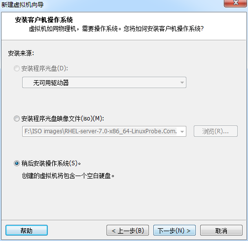
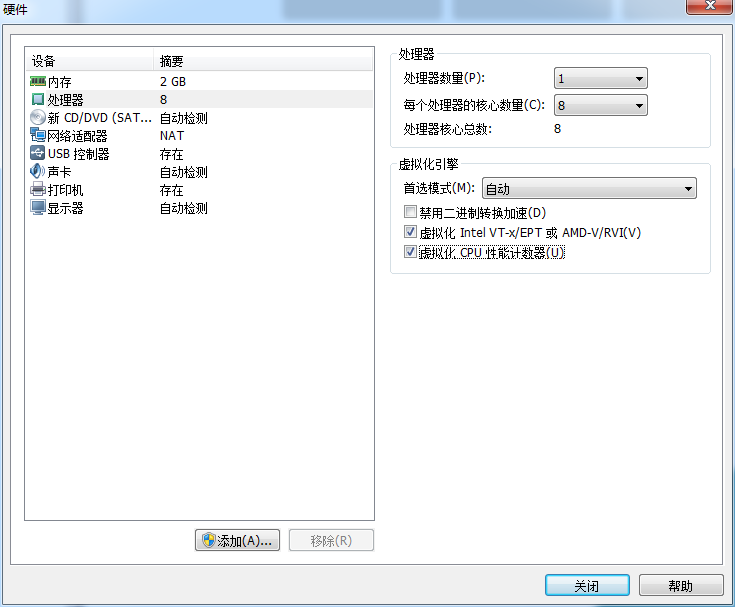
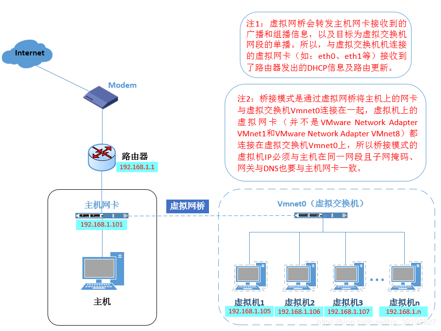
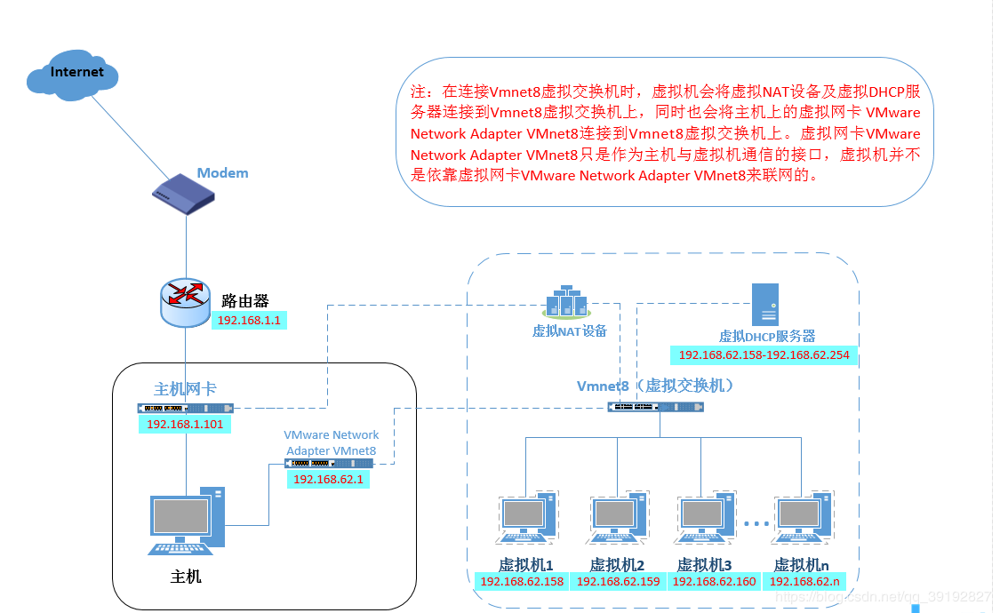
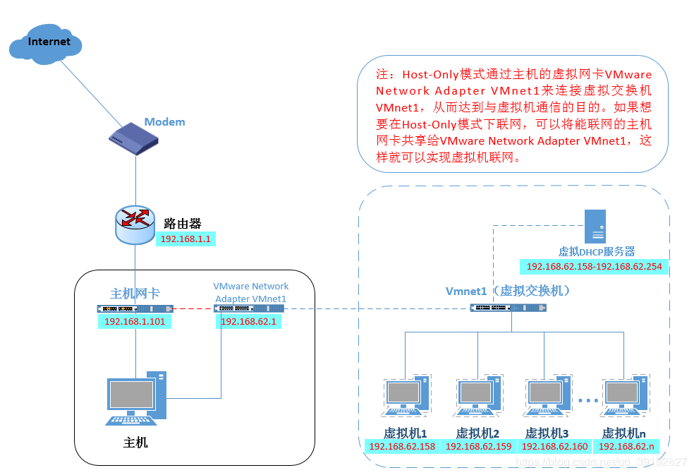
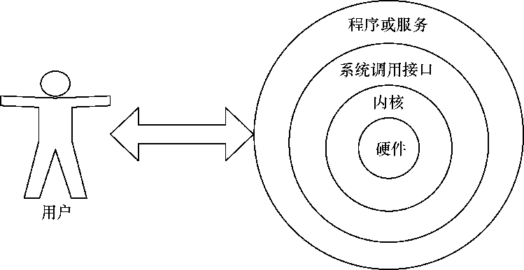

[TOC]

# 部署虚拟环境安装Linux系统

## 安装VM虚拟机

* 选中“稍后安装操作系统”单选按钮

  > 如果直接选择“安装程序光盘镜像文件”，虚拟机会通过默认的安装策略部署最精简的Linux系统，而不会询问安装设置的选项

  

* 根据真机的性能设置CPU处理器的数量以及每个处理器的核心数量，并开启虚拟化功能

  

* VM虚拟机提供了3中可选的网络模式，分别为**桥接模式**、**NAT模式**与**仅主机模式**

  * 桥接模式：相当于在物理主机与虚拟网卡之间架设了一座桥梁，从而通过物理主机的网卡访问外网

    
  
  * NAT模式：让VM虚拟机的网络服务发挥路由器的作弄，使得通过虚拟机软件模拟的主机可以通过物理主机访问外网，在真机中NAT虚拟机网卡对应的物理网卡是VMnet8
  
    
  
  * 仅主机模式：仅让虚拟机的主机与物理主机通信，不能访问外网，在真机中仅主机模式模拟网卡对应的物理网卡是VMnet1
  
    

## 安装Linux系统

> 安装RHEL 7或Centos 7系统时，CPU需要支持VT（Virtualization Technology，虚拟化技术）

* VT：让单台计算机能够分割出多个独立资源区，并让每个资源区按照需要模拟出系统的一项技术，其本质就是通过中间层实现计算机资源的管理和再分配，让系统资源的利用率最大化

## RPM（红帽软件包管理器）

> 在RPM之前，只能通过源码的方式按照软件

* RPM建立统一的数据库文件，详细记录软件信息并能够自动分析以来关系

  * 安装软件（install--verbose--hash） `rpm -ivh filename.rpm`
* 升级软件（update--verbose--hash） `rpm -Uvh filename.rpm`
  * 卸载软件 `rpm -e filename.rpm`
  * 查询软件描述信息（Query Package install package(s)） `rpm -qpi filename.rpm`
  * 列出软件文件信息（Query Package list） `rpm -qpl filename.rpm`
  * 查询文件属于哪个RPM（Query File） `rpm -qf filename`

## Yum软件仓库

> RPM能够帮助用户查询软件相关的依赖关系，但还是要运维人员自己来安装

* Yum软件仓库可以根据用户的要求分析出所需软件包及其相关的依赖关系，然后自动从服务器下载软件包并安装到系统
* 列出所有仓库 `yum repolist all`
  * 列出仓库中所有软件包 `yum list all`
  * 查看软件包信息 `yum info software`
  * 安装软件包 `yum install software -y`
  * 升级软件包 `yum update -y`
  * 移除软件包 `yum remove software`
  * 清除所有仓库缓存 `yum clean all`

## systemd初始化进程

* Linux操作系统的开机过程
  * 从BIOS开始，进入BootLoader，加载系统内核
  * 内核进行初始化，启动初始化进程
  * 初始化进程作为Linux系统的第一个进程，需要完成Linux系统中相关的初始化工作
  
* 红帽RHEL7系统替换掉了熟悉的初始化进程服务System V init，正式采用全新的systemd初始化进程服务——采用了并发启动机制，开机速度得到了不小的提升

* Linux系统在启动时要进行大量的初始化工作，比如挂载文件系统和交换分区、启动各类进程服务等，这些可以看做是单个单元，systemd用目标（target）代替了System V init中运行级别的概念

  * 以下是两者的区别

    | System V init |           systemd目标名称           |       作用       |
    | :-----------: | :---------------------------------: | :--------------: |
    |       0       |  runlevel0.target, poweroff.target  |       关机       |
    |       1       |   runlevel1.target, rescue.target   |    单用户模式    |
    |       2       | runlevel2.target, multi-user.target |   等同于级别 3   |
    |       3       | runlevel3.target, multi-user.target | 多用户的文本界面 |
    |       4       | runlevel4.target, multi-user.target |   等同于级别 3   |
    |       5       | runlevel5.target, graphical.target  | 多用户的图形界面 |
    |       6       |   runlevel6.target, reboot.target   |       重启       |
    |   emergency   |          emergency.target           |    紧急 Shell    |

  * 想要将系统默认的运行目标修改为“多用户，无图形”模式，用`ln`命令把多用户模式目标文件链接到`/etc/systemd/system/目录`

    ```bash
    ln -sf /lib/systemd/system/multi-user.target /etc/systemd/
    system/default.target
    ```

  * RHEL7之前使用`service`，`chkconfig`命令来管理系统服务，现在使用`systemctl`命令来管理服务

    | System V init（RHEL 6） |    systemctl（RHEL 7系统）    |              作用              |
    | :---------------------: | :---------------------------: | :----------------------------: |
    |    service foo start    |  systemctl start foo.service  |            启动服务            |
    |   service foo restart   | systemctl restart foo.service |            重启服务            |
    |    service foo stop     |  systemctl stop foo.service   |            停止服务            |
    |   service foo reload    | systemctl reload foo.service  | 重新加载配置文件（不终止服务） |
    |   service foo status    | systemctl status foo.service  |          查看服务状态          |
    | chkconfig foo on     | systemctl enable foo.service     | 开机自动启动       |
    | chkconfig foo off    | systemctl disable foo.service    | 开机不自动启动     |
    | chkconfig foo        | systemctl is-enabled foo.service | 查看特定服务是否为开机自动启动 |
    | chkconfig --list | systemctl list-unit-files -- type=service | 查看各个级别下服务 的启动与禁用情况 |

# Linux基础命令

> 计算机硬件是由运算器、控制器、存储器、输入/输出设备等共同组成的，而让各种硬件设备各司其职且又能协同运行的东西就是系统内核。Linux系统的内核负责完成对硬件资源的分配、调度等管理任务。
>
> 系统内核对计算机运行十分重要，一般不会直接去编辑内核中的参数，而是让用户通过基于系统调用接口开发出的程序或服务来管理计算机，以满足日常工作的需要。



* Shell（终端或壳）充当的是人与内核（硬件）之间的翻译官，用户把一些命令告诉终端，它就会调用相应的程序服务区去完成某些工作，默认的终端是`Bash`解释器

## 执行查看帮助命令

* 常见的Linux命令格式是`命令名称 [命令参数] [命令对象]`

  * 命令对象：要处理的文件、目录、用户等资源

  * 命令参数

    * 长格式（完整的选项名称）

      ```bash
      man --help
      ```

    * 短格式（单个字母的缩写）

      ```bash
      man -h
      ```

## 常用系统工作命令

* echo：在终端输出字符串或变量提取后的值

  ```bash
  echo Superdan.com
  echo $SHELL
  ```

* date：显示及设置系统的时间或日期

  | 参数   | 作用    |
  | ---- | --------------- |
  | %t   | 跳格[Tab 键]    |
  | %H   | 小时（ 00～23） |
  | %I   | 小时（ 00～12） |
  | %M   | 分钟（ 00～59） |
  | %S   | 秒（ 00～59）   |
  | %j   | 今年中的第几天  |
  
  * 在date命令中输入以“+”号开头的参数，即可按照指定格式来输出系统的时间或日期
  
    ```bash
    date "+%Y-%m-%d %H:%M:%S"
    ```
  
  * 将系统当前时间设置为
  
    ```bash
    date -s "20200403 8:30:00"
    ```
  
* poweroff：关机；reboot：重启

* wget命令：在终端中下载网络文件

  ```bash
wget -O /etc/output.txt www.baidu.com
  ```
  
  | 参数  | 作用                         |
  | ---- | ------------------------------------ |
  | -O   | output文件名称                         |
  | -b   | 后台下载模式                         |
  | -P   | 下载到指定目录                       |
  | -t   | 最大尝试次数                         |
  | -c   | 断点续传                             |
  | -p   | 下载页面内所有资源，包括图片、视频等 |
  | -r   | 递归下载                             |

* ps
* top
* pidof
* kill
* killall

## 系统状态检测命令

## 工作目录切换命令

## 文本文件编辑命令

## 文件目录管理命令

## 打包压缩与搜索命令

# 管道符、重定向与环境变量

## 输入输出重定向

## 管道命令符

> 管道：将前一个命令原本要输出到屏幕的标准正常数据当做是后一个命令的标准输入

```bash
# 查看cpu信息->找到含有"processor"的行->对行计数——得到CPU处理器个数
cat /proc/cpuinfo | grep "processor" | wc -l
```

## 命令行的通配符


# 使用ssh服务管理远程主机

## 配置网络服务

## 远程控制服务

## 不间断会话服务

> 使用ssh远程连接服务器时，当与远程主机的会话被关闭时，在远程主机上运行的命令也随之被中断。

* `screen`和`tmux`可以解决网络异常中断或同时控制多个远程终端窗口
  * 会话恢复：即便网络中断，也可让会话随时恢复，确保用户不会失去对远程会话的控制
  * 多窗口：每个会话都是独立运行，终端窗口内显示过的信息也将被分开隔离保存，以便下次使用时依然能够看到之前的操作记录
  * 会话分享：当多个用户同时登陆到远程服务器时，便可以使用会话共享功能让用户之间的输入输出信息共享

### screen

* screen
  * 创建会话窗口 `screen -S`
  * 将指定会话进行离线处理 `screen -d`
  * 恢复指定会话 `screen -r`
  * 显示当前已有的会话 `screen -ls`
  * 把目前无法使用的会话删除 `screen -wipe`
  * 退出会话 `exit`

### tmux

* 进入tmux窗口

  ```bash
  tmux
  ```

* 退出Tmux窗口

  ```bash
  exit
  ```

* 前缀键：Tmux所有快捷键都要通过前缀键唤起：默认前缀键是`Ctrl+b`

* 会话管理

  * 新建会话：默认会话名字是数字编号

    ```bash
    tmux new -s <session-name>
    ```

  * 分离会话

    ```bash
    tmux detach
    ```

  * 查看所有tmux会话

    ```bash
    tmux ls
    ```

  * 接入会话

    ```bash
    tmux attach -t <session-name>
    ```

  * 杀死会话

    ```bash
    tmux kill-session -t <session-name>
    ```

  * 切换会话

    ```bash
    tmux switch -t <session-name>
    ```

  * 重命名会话

    ```bash
    tmux rename-session -t 0 <session-name>
    ```

* 窗格操作

  * `Ctrl+b %`：划分左右两个窗格。
  * `Ctrl+b "`：划分上下两个窗格。
  * `Ctrl+b <arrow key>`：光标切换到其他窗格。`<arrow key>`是指向要切换到的窗格的方向键，比如切换到下方窗格，就按方向键`↓`。
  * `Ctrl+b {`：当前窗格左移。
  * `Ctrl+b }`：当前窗格右移。
  * `Ctrl+b Ctrl+o`：当前窗格上移。
  * `Ctrl+b Alt+o`：当前窗格下移。
  * `Ctrl+b x`：关闭当前窗格。
  * `Ctrl+b !`：将当前窗格拆分为一个独立窗口。
  * `Ctrl+b z`：当前窗格全屏显示，再使用一次会变回原来大小。
  * `Ctrl+b Ctrl+<arrow key>`：按箭头方向调整窗格大小。
  * `Ctrl+b q`：显示窗格编号。