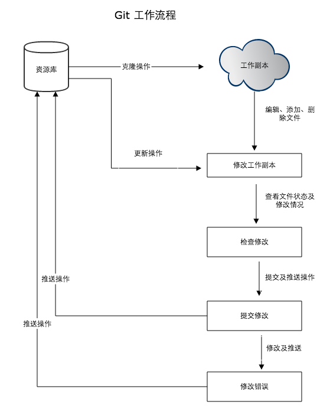

<font size=10 color='black'>Git学习笔记</font>


***

[TOC]

# Git简介

* Git 是一个开源的**分布式**版本控制系统

* 集中式VS分布式
  * 集中式版本控制系统：版本库集中存放在中央服务器，必须要联网才能工作,没有历史版本库。
  * 分布式版本控制系统：没有“中央服务器”，每个开发人员电脑上都有一个完整的版本库，安全性更高，无需联网。
  
* 工作流程

  * 克隆Git资源作为工作目录
  * 在克隆的资源上添加或修改文件
  * 如果其他人修改了，`pull`更新文件
  * 在提交前查看修改
  * 提交修改
  * 在修改完成后，如果发现错误，可以撤回提交并再次修改并提交

  

# Git安装并配置

- 安装
  - Linux系统

  ```shell
  # Debian或Ubuntu Linux
  sudo apt install git
  ```

  ```shell
  # 其他版本Linux，官网下载源码解压，然后依次输入
  ./config ——> make ——> sudo make install
  ```
  - Windows系统

    [官网下载](https://git-scm.com/downloads)，安装完成后，“Git”->“Git Bash”即可打开
  

* Git基本配置

```shell
$ git config --global user.name "Your Name"
$ git config --global user.email "email@example.com"
```

​		**注意** `--global`参数表示你这台机器上所有的Git仓库都会使用这个配置。

# 远程仓库

## 关联GitHub

* 创建SSH Key

```shell
# 在用户主目录下(cd) ls -ah可见.ssh目录
# cd .ssh可见id_rsa(私钥不能泄露)和id_rsa.pub(公钥可公开)
ssh-keygen -t rsa -C "youremail@example.com"
```

* 登陆GitHub，打开“Account settings”，“SSH Keys”页面，在Key文本框里粘贴`id_rsa.pub`文件的内容

  

## 添加远程仓库

* 场景1——在本地已经创建了Git仓库后，又想在GitHub创建一个Git仓库，并且让这两个仓库进行远程同步

  * 首先在GitHub上建立一个空的仓库

  * 在本地仓库下运行命令，将本地仓库与远程仓库关联

  ```shell
  # origin是远程库的名字，也可以叫其他的，但是默认是origin
  git remote add origin git@github.com:michaelliao/learngit.git
  ```

  * 把本地的所有内容推送到远程库上

  > 第一次推送master分支时，加上了-u参数，Git不但会把本地的master分支内容推送到远程新的master分支，还会把本地master分支和远程的master分支关联起来，在以后推送或拉取时就可以简化命令
  
  ``` shell
  git push -u origin master
  ```

* 场景2——远程仓库不为空，将远程库克隆到本地，再进行修改

```shell
git clone git@github.com:username/repositoryname.git
```

# 创建版本库(repository)

* 版本库——仓库：可以简单的理解为一个目录，这个目录里面的所有文件都可以被Git管理起来，每个文件的修改，删除，Git都能跟踪，以便任何时刻都可以追踪历史，或者在将来某个时刻还可以将文件”还原”。

* 选择一个合适目录，如
  * `$ cd d:`
  * `$ mkdir <repository-name>`，创建库名
  * `$ cd <repository-name>`，进入库内

**补充** `pwd`显示路径，`ls`显示当前目录，`ls -ah`显示隐藏目录

* 在当前目录初始化库

```shell
# 目录下多了一个.git的目录，这个目录是Git来跟踪管理版本库的
$ git init
Initialized empty Git repository in /Users/michael/learngit/.git/
```

## 将文件添加到版本库

```shell
# 可以多次git add,最后git commit
# 将某文件的改变添加到暂存区
git add <file-name>
# 将所有改变添加到暂存区
git add .
# 提交缓存内容到版本库中
git commit -m "description"
```

# 版本更改

## 查看工作区当前状态

```shell
git status
```

## 查看修改内容

```shell
# 尚未缓存的改动
git diff
# 查看已缓存的改动
git diff --cached
# 查看已缓存的与未缓存的所有改动
git diff --stat
```

## 查看提交历史

``` shell
git log
# 如果想显示简洁信息 git log --pretty=oneline
```

## 回退版本

```shell
# 在Git中，用HEAD表示当前版本,上一个版本就是HEAD^，上上一个版本就是HEAD^^，往上100个版本写100个^比较容易数不过来，所以写成HEAD~100
git reset --hard HEAD^
```

## 想回退之前回退前的版本

```shell
 # 记录每一次命令,找到想回退的版本号
 git reflog
 git reset --hard 1094a
```

## 工作区和暂存区

* 工作区（Working Directory）:在电脑里能看到的目录

* 版本库（Repository）:隐藏目录.git就是Git的版本库
  * 暂存区(stage or index)
  * Git自动创建的第一个分支master，以及指向master的一个指针HEAD
  
* `git add`把文件修改添加到暂存区；`git commit`把暂存区的所有内容提交到当前分支

  

## 撤销修改

* 场景1——工作区已修改但未add到暂存区

  ```shell
  git checkout -- <file-name>
  ```

* 场景2——工作区修改且已经git add到暂存区，分两步

  ```shell
  # 把暂存区的修改撤销掉，回到场景1
  git reset HEAD <file-name>
  # 再按场景1操作
  git checkout -- <file-name>
  ```

* 场景3——已经commit但没有推送到远程库——版本回退

## 删除文件

假设文件已经commit，从目录中删除某个文件

* 场景1——确实要从版本库中删除该文件

  ```shell
  # 或者 git rm <file-name>
  git add <file-name>
  git commit -m
  ```

* 场景2——删错了，要恢复

  ```shell
  git checkout -- <file-name>
  ```

  其实就是用版本库里的版本替换工作区的版本

# 分支管理

## 创建与合并分支

* 查看分支

  ```shell
  # 查看当前分支
  git branch
  # 列出远程分支
  git branch -r
  # 列出所有分支
  git branch -a
  ```

* 创建分支

  ```shell
  git branch <branch-name>
  ```

* 切换分支

  ```shell
  git checkout <branch-name>
  ```

* 创建+切换分支

  ```shell
  git checkout -b <branch-name>
  ```

  > 切换分支使用`git checkout <branch>`,而撤销修改使用`git chechout -- <file>`,同一个命令有2种作用，使人迷惑；最新版本Git提供`git switch`切换分支

  ```shell
  # 切换到已有的master分支
  git switch master
  # 创建并切换到新的dev分支
  git switch -c dev
  ```

* 合并某分支到当前分支

  ```shell
  git merge <branch-name>
  ```

* 普通模式合并分支

  >通常进行分支合并时，如果可以，Git会使用`Fast forward`模式，删除分支后，分支历史信息会丢失 
  >
  >`--no-ff`表示禁用`Fast forward`模式，Git会在merge时生成一个新的commit，这样，从分支历史上就可以看出分支信息

  ```shell
  git merge --no-ff -m "description" <branch-name>
  ```

* 删除分支

  ```shell
  git branch -d <branch-name>
  ```

* 强行删除分支

  ```shell
  git branch -D <branch-name>
  ```
  
* 查看分支合并图

  ```shell
  git log --graph
  # 简洁查看
  git log --graph --pretty=oneline --abbrev-commit
  ```

## 解决冲突

* 两个分支`master`和`dev`，在两个分支上分别提交修改，这种情况下无法执行“快速合并”


* 这种情况下只能先解决冲突，之后再提交，合并完成

  

* 分支策略
  * `master`分支是非常稳定的，仅用来发布新版本，平时不能在上面工作
  * 工作应在`dev`分支上，即不稳定的——例如在1.0版本发布时，再把`dev`分支合并到`master`上
  * 多人协作时应每个人都都有自己的分支，合并到`dev`分支上


## Bug分支

> 每个bug都可以通过一个新的临时分支来修复，修复后合并分支，然后将临时分支删除

* 情景：开发软件

  * `master`上发布了软件1.0版本
  * `dev`分支上正在开发2.0版本，还未开发完成
  * 此时有用户反映1.0版本的漏洞，亟需修复
  * 此时需要从`dev`切换到`master`分支上修复漏洞，正常需要先提交`dev`目前的工作，但是此时`dev`的工作尚未完成，不想提交，所以先把dev的工作保存下，然后切换到`dev`
  * 再在`master`上建立`issue`分支进行修复
  * 修复后，在`master`上合并并删除`issue`
  * 切换回`dev`分支，恢复原本工作，继续工作

* 保存工作现场

  ```shell
  git stash
  ```

* 查看保存的工作现场

  ```shell
  git stash list
  ```

* 恢复保存的工作现场

  ```shell
  git stash apply
  ```

* 删除工作现场

  ```shell
  git stash drop
  ```

* 恢复并删除工作现场

  ```shell
  git stash pop
  ```

## 多人协作

* 查看远程库的信息

  ```shell
  # git remote -v 显示详细的信息
  git remote
  ```

* 推送分支

  > 不一定要把本地分支往远程推送
  >
  > * `master`分支是主分支，因此需要时刻与远程同步
  > * `dev`分支是开发分支，团队所有成员都需要在上面工作，所以也需要与远程同步
  > * bug分支只用于在本地修复bug，就没必要推到远程了，只需要修复好与本地的`dev`分支merge
  > * `feature`是否推到远程，取决于是否和他人协作开发

  ```shell
  git push origin master
  ```

* 抓取分支

  > 情景：你和同事对同一个文件进行了修改，同事已经推送到远程仓库，所以你需要把最新的提交从`origin`抓取下来，在本地合并，解决冲突，再推送

  ```shell
  git pull
  ```

  > 如果`git pull`提示`no tracking information`说明本地分支和远程分支的链接关系没有创建

  ```shell
  # 创建本地分支和远程分支的链接关系
  git branch --set-upstream-to <branch-name> origin/<branch-name>
  ```
## Rebase

# 标签管理

  # 使用GitHub和码云(Gitee.com)

* 流程图

  

* 参与开源项目

  1. 将项目`Fork`到自己的账号
  2. 从自己的账号将仓库`clone`
  3. 修复bug或者新增feature，完成后往自己的远程仓库`push`
  4. 在GitHub上发起`pull request`，希望项目接受自己的修改

* 情景：本地仓库已经关联到GitHub的远程仓库，名字为`origin`，如何让本地仓库同时与GitHub和Gitee关联

  1. 查看远程库信息`git remote -v`

  2. 删除已有的GitHub远程库`git remote rm origin`

  3. 先关联GitHub的远程库`git remote add github git@github.com:xxx/learngit.git`

  4. 再关联Gitee的远程库`git remote add gitee git@gitee.com:xxx/learngit.git`


