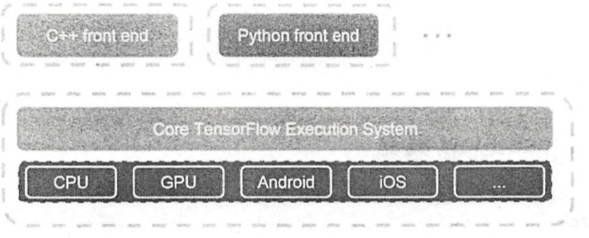
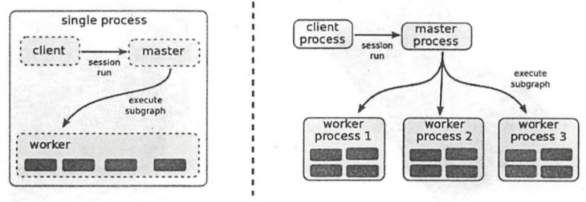

[TOC]

# Tensorflow基础

## Tensorflow概要

* Tensorflow既是一个实现机器学习算法的接口，同时也是执行机器学习算法的框架

  * 前端支持Python、C++、Go、Java等多种开发语言

  * 后端使用C++、CUDA等写成

    

* Tensorflow使用数据流式图来规划计算流程，可以将计算映射到不同的硬件和操作系统平台
  * 凭借统一的架构，Tensorflow可以方便地部署到各种平台
  * Tensorflow给训练和预测的共同部分提供了一个恰当的抽象
  * TODO

## Tensorflow编程模型简介

### 核心概念

* Tensorflow中的计算可以表示为一个有向图（directed graph），或称计算图（computation graph）
  * 每一个运算操作（operation）将作为一个节点（node）
  * 节点与节点之间的连接成为边（edge）
  * 在计算图的边中流动（flow）的数据被称为张量（tensor）
* Session是用户使用tensorflow时的交互式接口

### 实现原理

* Tensorflow有一个重要组件`client`，通过Session的接口与`master`及多个`worker`相连，其中每一个`worker`可以与多个硬件设备（`device`）相连，`master`则负责指导所有`worker`按流程执行计算图

* Tensorflow有单机模式和分布式模式

  * 单机：client、master、worker全部在一台机器上的同一个进程中
  * 分布式版本允许client、master、worker在不同机器的不同进程中，同时由集群调度系统统一管理各项任务

  

* TODO

### 拓展功能

### 性能优化

