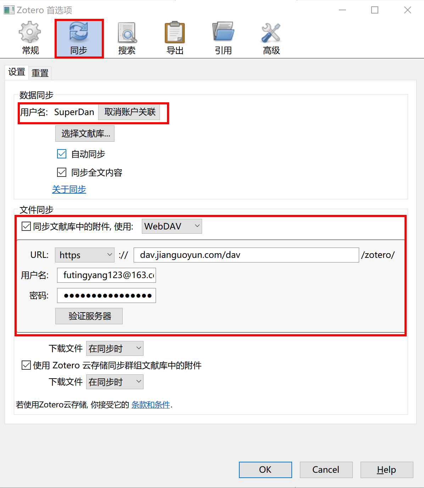

**参考**：

1. [Zotero（1）：文献管理软件Zotero基础及进阶示范](https://www.yangzhiping.com/tech/zotero1.html)

[TOC]

# 安装及配置

* 登陆[官网](https://www.zotero.org/user/register/)，注册一个自己的Zotero账号

* 下载并安装**Zotero**单机版

* 配置Zotero：编辑——首选项

  * 在同步一栏输入注册的账号，使得文献可以同步

  * 由于Zotero免费同步的大小为300MB，所以使用**坚果云**的WebDAV

    

  * 高级中选择数据存储位置

* 安装插件

  * 浏览器插件：Zotero Connector
  * Zotero Scholar Citations
  * ZotFile