参考：《Python Spark 2.0 Hadoop机器学习与大数据实战》

[TOC]

# Python Spark机器学习与Hadoop大数据

# Vmware Workstation安装Ubuntu18.04LTS

* [Vmware Workstation优化设置](https://blog.csdn.net/weixin_44003528/article/details/90477484)

  * 在虚拟机配置中

    * 将不必要的设备删除

    * 选中硬盘，选择“碎片整理”

      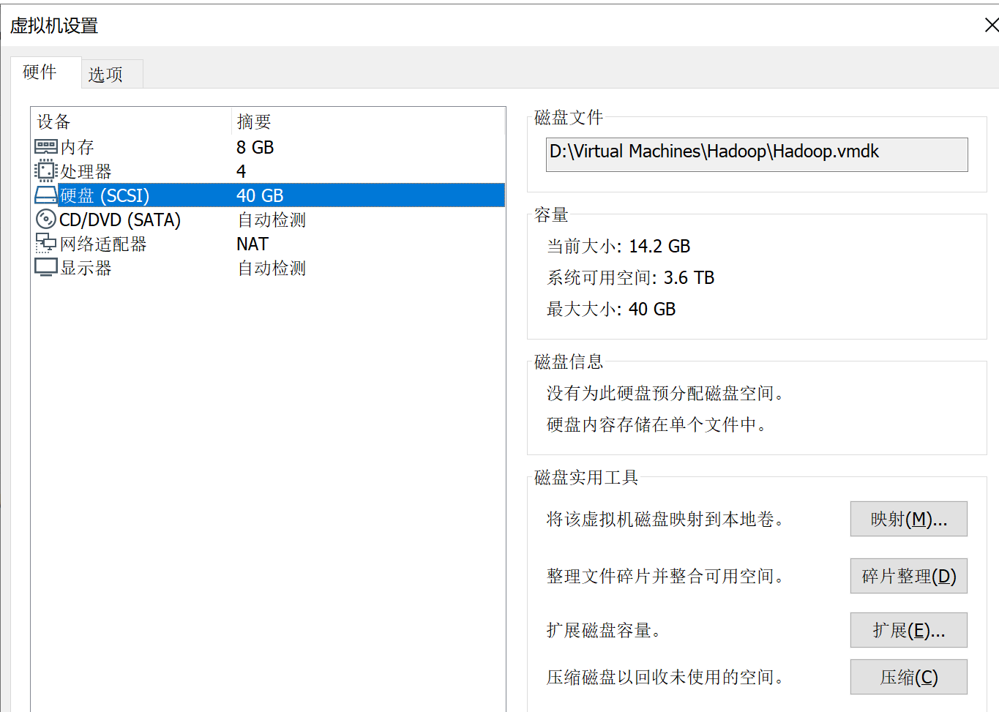

    * 内存页面修整

      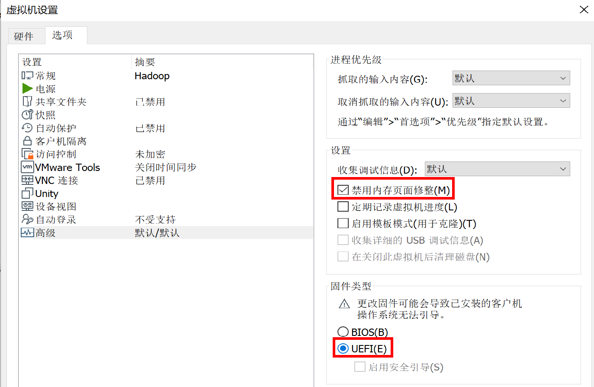

  * 首选项

    * 内存

      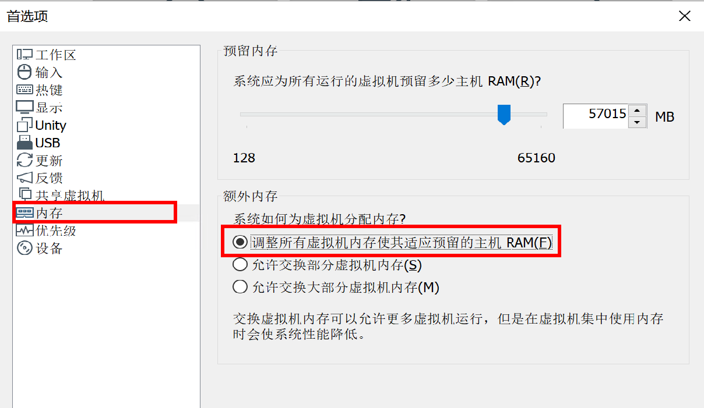

    * 优先级

      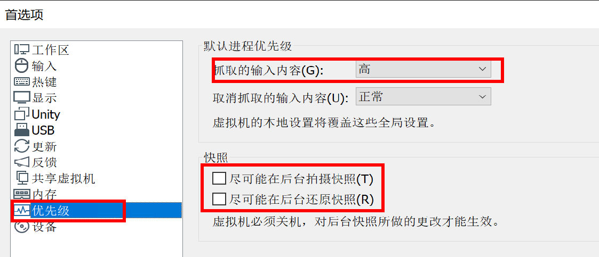

    * 设备

      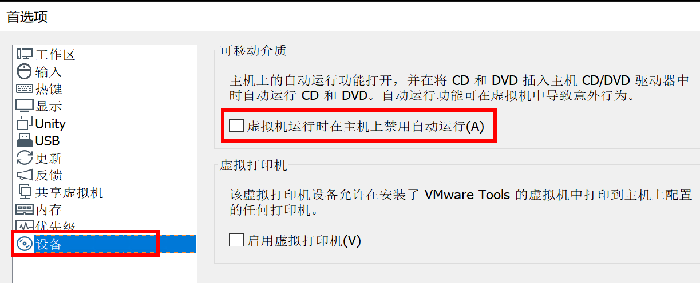

* ubuntu安装

  * 下载`Ubuntu18.04LTS`：[清华镜像](https://mirrors.tuna.tsinghua.edu.cn/ubuntu-releases/18.04/)

  * 使用`English`

  * 最小安装

  * 用户名、密码安装

    * 计算机名：`Hadoop`
    * 用户名：`haduser`

  * 安装`vmware tool`

  * 切换软件安装源

  * 更新软件

    ```bash
  sudo apt update
    sudo apt upgrade
    ```
  ```
  
  ```
  
* 安装htop：查看内存、cpu等
  
  ```bash
    sudo apt install htop
  ```
  
    
  
  * [安装中文拼音](https://blog.csdn.net/qq_39907831/article/details/78772093)

# Hadoop Single Node Cluster的安装

> Hadoop Single Node Cluster只以一台机器来建立Hadoop环境，我们仍然可以使用Hadoop命令，只是无法发挥多台机器的威力

* 安装配置：Hadoop Single Node Cluster只有一台服务器，所以所有功能都集中在这台服务器中

  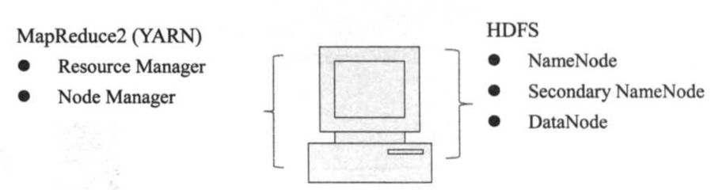

* 安装步骤

  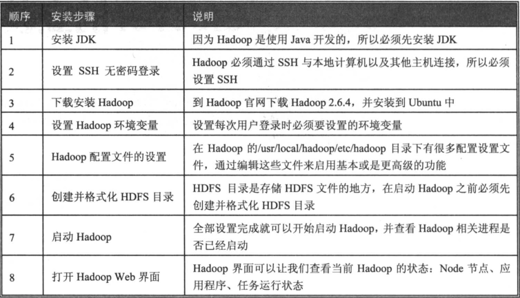

## 基础配置

* 安装JDK

  > 因为Hadoop是以Java开发的，所以必须先安装Java环境

  * 安装Java-8
  
    ```bash
  sudo apt install openjdk-8-jdk
    ```
  
  * 查看Java版本
  
    ```bash
    java -version
    ```
  
  * 查询Java安装路径
  
    ```bash
    update-alternatives --display java
    ```
    
  
* 设置SSH无密码登陆

  > Hadoop是由很多台服务器组成的，当我们启动Hadoop系统时，NameNode必须与DataNode连接并管理这些节点（DataNode）。此时系统会要求用户输入密码。为了让系统顺利运行而不手动输入密码，需要将SSH设置成无密码登陆

  * Hadoop使用`SSH`（Secure Shell）连接，这是目前较可靠、专为远程登录其他服务器提供的安全性协议。通过SSH会对所有传输的数据进行加密，利用SSH协议可以防止远程管理系统时信息外泄的问题
  
    

  * 安装SSH

    ```bash
sudo apt install ssh
    ```
  
  * 安装rsync

    ```bash
sudo apt install rsync
    ```

  * 产生SSH Key（秘钥）进行后续身份验证
  
    ```bash
ssh-keygen -t rsa
    ```
  
  * 查看产生的SSH Key：其中`id_rsa`和`id_rsa.pub`是密钥文件
  
    ```bash
    ll ~/.ssh
    ```
  
  * 将产生的Key放置到许可证文件中
  
    ```bash
    cat ~/.ssh/id_rsa.pub >> ~/.ssh/authorized_keys
    ```
  
  * 尝试ssh连接自己，看是否需要密码
  
    ```bash
    ssh hadoop
    ```
    

## 安装并配置Hadoop

* 下载安装
  * 下载Hadoop：[清华镜像](https://mirrors.tuna.tsinghua.edu.cn/apache/hadoop/common/)

  * 解压缩

    ```bash
  sudo tar -zxvf hadoop*
    ```

  * 移动hadoop到`usr/local/hadoop`

    ```bash
sudo mv hadoop* /usr/local/hadoop
    ```
  
  * 查看hadoop安装目录

    ```bash
  ll /usr/local/hadoop
    ```
  
  * 常用目录说明
  
    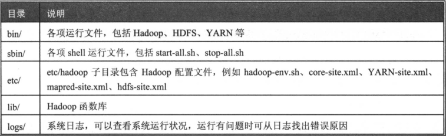
  
* 设置Hadoop环境变量

  * 编辑`~/.bashrc`

    ```bash
    sudo gedit ~/.bashrc
    ```

  * 在末尾添加

    ```bash
    # 设置JDK安装路径
    export JAVA_HOME=/usr/lib/jvm/java-8-openjdk-amd64 
    # 设置Hadoop的安装路径
    export HADOOP_HOME=/usr/local/hadoop 
    
    # /bin和/sbin是Hadoop运行文件目录，设置PATH可以让你在其他目录时仍然能够运行Hadoop命令
    export PATH=$PATH:$HADOOP_HOME/bin 
    export PATH=$PATH:$HADOOP_HOME/sbin 
    
    # 设置Hadoop其他环境变量
    export HADOOP_MAPRED_HOME=$HADOOP_HOME 
    export HADOOP_COMMON_HOME=$HADOOP_HOME 
    export HADOOP_HDFS_HOME=$HADOOP_HOME 
    export YARN_HOME=$HADOOP_HOME 
    export HADOOP_COMMON_HOME=$HADOOP_HOME 
    export HADOOP_HDFS_HOME=$HADOOP_HOME 
    export YARN_HOME=$HADOOP_HOME
    
    # 链接库的相关设置
    export HADOOP_COMMON_LIB_NATIVE_DIR=$HADOOP_HOME/lib/native 
    export HADOOP_OPTS="-Djava.library.path=$HADOOP_HOME/lib" 
    export JAVA_LIBRARY_PATH=$HADOOP_HOME/lib/native:$JAVA_LIBRARY_PATH
    ```

  * 让`~/.bashrc`生效

    ```bash
    source ~/.bashrc
    ```

* 修改Hadoop配置设置文件

  * 设置`hadoop-env.sh`配置文件：`hadoop-env.sh`是Hadoop的配置文件

    * 编辑`hadoop-env.sh`

      ```bash
      sudo gedit /usr/local/hadoop/etc/hadoop/hadoop-env.sh
      ```

    * 将原文件中`export JAVA_HOME=${JAVA_HOME}`修改为:

      ```bash
      # 修改JAVA_HOME设置
      export JAVA_HOME=/usr/lib/jvm/java-8-openjdk-amd64
      ```
  
  * 修改`core-site.xml`
    
    * 编辑`core-site.xml`
      
      ```bash
      sudo gedit /usr/local/hadoop/etc/hadoop/core-site.xml
      ```
  
    * 在之间，输入下列內容：设置HDFS的默认名称
  
      ```xml
      <property>
        <name>fs.default.name</name>
        <value>hdfs://localhost:9000</value>
      </property>
      ```
    
  * 修改`yarn-site.xml`：`Yarn`相关的配置设置
  
    * 编辑`yarn-site.xml`
    
      ```bash
      sudo gedit /usr/local/hadoop/etc/hadoop/yarn-site.xml
      ```
  
    * 在之间，输入下列內容:
    
      ```xml
	    <property>
    	  <name>yarn.nodemanager.aux-services</name>
    	  <value>mapreduce_shuffle</value>
      </property>
    <property>
  	    <name>yarn.nodemanager.aux-services.mapreduce.shuffle.class</name>
        <value>org.apache.hadoop.mapred.ShuffleHandler</value>
      </property>
      ```
  
  * 修改`mapred-site.xml`：用于设置监控Map与Reduce程序的`JobTracker`任务分配情况以及`TaskTracker`任务运行情况
    
    * 编辑`mapred-site.xml`
  
      ```bash
      sudo cp /usr/local/hadoop/etc/hadoop/mapred-site.xml.template /usr/local/hadoop/etc/hadoop/mapred-site.xml
      sudo gedit /usr/local/hadoop/etc/hadoop/mapred-site.xml
      ```
    * 在之间，输入下列內容：设置MapReduce的框架为yarn
      ```xml
      <property>
  	  <name>mapreduce.framework.name</name>
        <value>yarn</value>
      </property>
      ```

  * 设置`hdfs-site.xml`
  
    * 编辑`hdfs-site.xml`

      ```bash
      sudo gedit /usr/local/hadoop/etc/hadoop/hdfs-site.xml
      ```
  
    * 在之间，输入下列內容:
    
      ```xml
      <!--设置blocks副本备份数量-->
    	<property>
    	  <name>dfs.replication</name>
        <value>3</value>
      </property>
    	
    	<!--设置NameNode数据存储目录-->
      <property>
        <name>dfs.namenode.name.dir</name>
    	  <value>file:/usr/local/hadoop/hadoop_data/hdfs/namenode</value>
      </property>
      
      <!--设置DataNode数据存储目录-->
      <property>
      <name>dfs.datanode.data.dir</name>
        <value>file:/usr/local/hadoop/hadoop_data/hdfs/datanode</value>
      </property>  
      ```
    
  * 建立与格式化HDFS目录
    
    ```bash
    # 创建namenode数据存储目录
    sudo mkdir -p /usr/local/hadoop/hadoop_data/hdfs/namenode 
    # 创建datanode数据存储目录
    sudo mkdir -p /usr/local/hadoop/hadoop_data/hdfs/datanode 
    # 将Hadoop目录的所有者更改为hduser
    sudo chown hduser:hduser -R /usr/local/hadoop 
    # 将HDFS进行格式化
    hadoop namenode -format
    ```
  
* 启动Hadoop

  * 启动HDFS

    ```bash
    start-dfs.sh 
    ```
  * 启动YARN
    ```bash
    start-yarn.sh
    ```
  * 或者启动全部
    ```bash
    start-all.sh
    ```
  * 查看目前所执行的行程 
    ```bash
    # YARN相关进程：ResourceManager、NodeManager
    # HDFS相关进程：DataNode、NameNode、SecondaryNameNode
    jps
    ```

* 开启`Hadoop Resource­Manager Web`介面

  http://localhost:8088/
  
* 开启`NameNode HDFS Web` 界面
  http://localhost:50070/


# Hadoop Multi Node Cluster的安装

* Hadoop Multi Node Cluster由多台计算机组成

  * 有一台主要的计算机`master`，在HDFS担任`NameNode`角色，在`MapReduce2(YARN)`担任`ResourceManager`角色

  * 有多台辅助计算机`data1`、`data2`、`data3`，在HDFS担任`DataNode`角色，在`YARN`担任`NodeManager`角色

    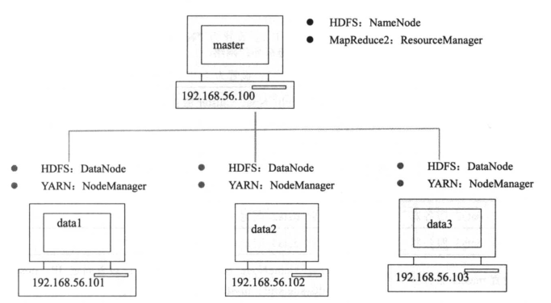

  * 规划说明

    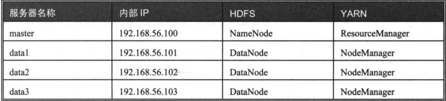

* 安装步骤

  

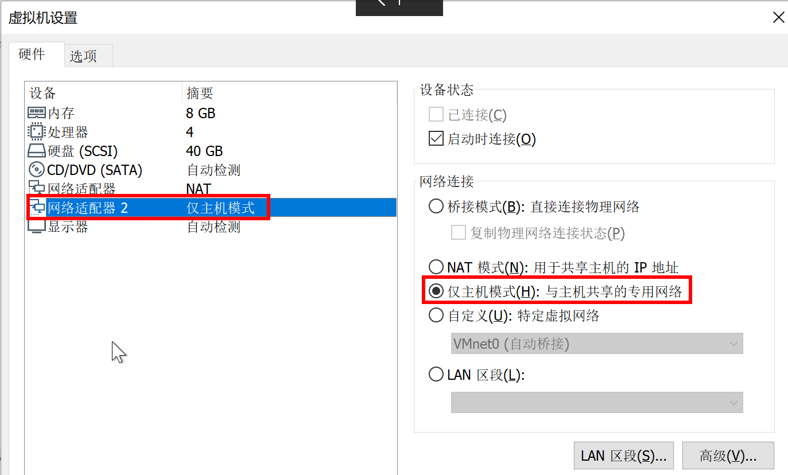

5.1.複製Single Node Cluster到data1

5.2.設定data1伺服器Step2.編輯網路設定檔設定固定IP:将ens改为eth https://blog.csdn.net/lzandwss/article/details/79471752

```
sudo gedit /etc/network/interfaces
```

輸入下列內容

```bash
# NAT interface
auto ens32 
iface ens32 inet dhcp

# host only interface
auto ens35 
iface ens35 inet static 
address 192.168.56.101 
netmask 255.255.255.0 
network 192.168.56.0 
broadcast
```

Step3.設定hostname

```
sudo gedit /etc/hostname
```

輸入下列內容:
Step4.設定hosts檔案

```
sudo gedit /etc/hosts
```

輸入下列內容:
Step5.修改core-site.xml

```
sudo gedit /usr/local/hadoop/etc/hadoop/core-site.xml
```

在之間，輸入下列內容:
Step6.修改yarn-site.xml

```
sudo gedit /usr/local/hadoop/etc/hadoop/yarn-site.xml
```
yarn.resourcemanager.resource-tracker.address master:8025 yarn.resourcemanager.scheduler.address master:8030 yarn.resourcemanager.address master:8050
在之間，輸入下列內容:
Step7.修改mapred-site.xml

```
sudo gedit /usr/local/hadoop/etc/hadoop/mapred-site.xml
```
mapred.job.tracker master:54311

在之間，輸入下列內容:
Step8.修改hdfs-site.xml

```
sudo gedit /usr/local/hadoop/etc/hadoop/hdfs-site.xml
```

在之間，輸入下列內容:删除namenode地址设置

关闭图形界面
sudo systemctl set-default multi-user.target
sudo reboot

开启图形界面命令：
sudo systemctl set-default graphical.target
sudo reboot

之后 : reboot


5.3.複製data1伺服器至data2、data3、master


輸入下列內容：sudo gedit /etc/network/interfaces

```
# interfaces(5) file used by ifup(8) and ifdown(8) auto lo iface lo inet loopback auto eth0 iface eth0 inet static address 192.168.0.102 netmask 255.255.255.0 network 192.168.0.0 gateway 192.168.0.1 dns-nameservers 192.168.0.1  
```

Step3.設定data2主機名稱
輸入下列內容:
sudo gedit /etc/hostname
```
data2
```


輸入下列內容

```
# interfaces(5) file used by ifup(8) and ifdown(8) auto lo iface lo inet loopback auto eth0 iface eth0 inet static address 192.168.0.103 netmask 255.255.255.0 network 192.168.0.0 gateway 192.168.0.1 dns-nameservers 192.168.0.1  
```

Step7.設定data3主機名稱
輸入下列內容:

```
data3
```


輸入下列內容

```
# interfaces(5) file used by ifup(8) and ifdown(8) auto lo iface lo inet loopback auto eth0 iface eth0 inet static address 192.168.0.100 netmask 255.255.255.0 network 192.168.0.0 gateway 192.168.0.1 dns-nameservers 192.168.0.1  
```

Step3.設定master主機名稱
輸入下列內容:

```
master
```


Step4.設定hdfs-site.xml

```
sudo gedit /usr/local/hadoop/etc/hadoop/hdfs-site.xml
```

輸入下列內容:去掉datanode目录，加上namenode目录

```
  dfs.replication 3 dfs.namenode.name.dir file:/usr/local/hadoop/hadoop_data/hdfs/namenode
```


Step5.設定master檔案

```
sudo gedit /usr/local/hadoop/etc/hadoop/master
```

輸入下列內容:

```
master
```


Step6.設定slaves檔案

```
sudo gedit /usr/local/hadoop/etc/hadoop/slaves
```

輸入下列內容:

```
data1 
data2 
data3
```


5.6.master連線至data1、data2、data3建立HDFS目錄master SSH連線至data1並建立HDFS目錄

```
ssh data1 sudo rm -rf /usr/local/hadoop/hadoop_data/hdfs sudo mkdir -p /usr/local/hadoop/hadoop_data/hdfs/datanode sudo chown hduser:hduser -R /usr/local/hadoop exit
```

master SSH連線至data2並建立HDFS目錄
master SSH連線至data3並建立HDFS目錄

```
ssh data3 sudo rm -rf /usr/local/hadoop/hadoop_data/hdfs sudo mkdir -p /usr/local/hadoop/hadoop_data/hdfs/datanode sudo chown hduser:hduser -R /usr/local/hadoop exit
```

5.7.建立與格式化NameNode HDFS 目錄


```
sudo rm -rf /usr/local/hadoop/hadoop_data/hdfs mkdir -p /usr/local/hadoop/hadoop_data/hdfs/namenode sudo chown -R hduser:hduser /usr/local/hadoop
```

Step2 格式化NameNode HDFS 目錄  hadoop namenode -format
5.8.啟動Hadoop啟動start-dfs.sh，再啟動 start-yarn.sh

```
start-dfs.sh start-yarn.sh
```

或

查看目前所執行的行程

```
jps
```

Hadoop Resource­Manager Web介面網址
5.9.開啟Hadoop Resource-Manager Web介面開啟HDFS Web UI網址

```
http://master:50070/
```

5.10.開啟Hadoop Resource-Manager Web介面


# Python Spark的介绍与安装

* scala下载2.12    http://downloads.typesafe.com/scala/

* 解压后   sudo mv scala   /usr/local/scala

* 添加环境变量   sudo vim ~/.bashrc

  export SCALA_HOME=/usr/local/scala

  export PATH=$PATH:$SCALA_HOME/bin 

* source ~/.bashrc

* 命令行 scala


spark下载：https://mirrors.tuna.tsinghua.edu.cn/apache/spark/

```
sudo mv spark* /usr/local/spark
```

```
  sudo vim ~/.bashrc

  export SPARK_HOME=/usr/local/spark

  export PATH=$PATH:$SPARK_HOME/bin 

 source ~/.bashrc
```

pyspark


cd /usr/local/spark/conf

cp log4j.properties.template log4j.properties

sudo vim log4j.properties

将INFO改为WARN


sudo cp /usr/local/hadoop/LICENSE.txt ~/wordcount/input


ll ~/wordcount/input
hadoop fs -mkdir -p /usr/hduser/wordcount/input
cd ~/wordcount/input
hadoop fs -copyFromLocal LICENSE.txt /usr/hduser/wordcount/input
 hadoop fs -ls /usr/hduser/wordcount/input
pyspark --master local[4]
textFile = sc.textFile("file:/usr/local/spark/README.md")
textFile.count()
textFile = sc.textFile("hdfs://master:9000/usr/hduser/wordcount/input/LICENSE.txt")
textFile.count()
HADOOP_CONF_DIR=/usr/local/hadoop/etc/hadoop pyspark --master yarn --deploy-mode client

cp /usr/local/spark/conf/spark-env.sh.template /usr/local/spark/conf/spark-env.sh
sudo gedit /usr/local/spark/conf/spark-env.sh
export SPARK_MASTER_IP=master
export SPARK_WORKER_CORES=1
export SPARK_WORKER_MEMORY=512m
export SPARK_WORKER_INSTANCES=4

sudo mkdir /usr/local/spark
sudo chown hduser:hduser /usr/local/spark
scp -r /usr/local/spark hduser@data1:/usr/local  (这块报错，因为hduser可以免密ssh，sudo不可以，所以命令不加sudo)

sudo gedit /usr/local/spark/conf/slaves

/usr/local/spark/sbin/start-all.sh

 pyspark --master spark://master:7077 --num-executors 1 --total-executor-cores 3 --executor-memory 512m

https://mirrors.tuna.tsinghua.edu.cn/anaconda/archive/
bash Anaconda2*.sh -b
sudo vim ~/.bashrc
export PATH=/home/hduser/anaconda2/bin:$PATH
export ANACONDA_PATH=/home/hduser/anaconda2
export PYSPARK_DRIVER_PYTHON=$ANACONDA_PATH/bin/ipython
export PYSPARK_PYTHON=$ANACONDA_PATH/bin/python


scp -r Anacon* hduser@data1:~/Downloads


mkdir -p ~/pythonwork/ipynotebook 
cd ~/pythonwork/ipynotebook 


PYSPARK_DRIVER_PYTHON=jupyter PYSPARK_DRIVER_PYTHON_OPTS="notebook" pyspark

PYSPARK_DRIVER_PYTHON=jupyter PYSPARK_DRIVER_PYTHON_OPTS="notebook" HADOOP_CONF_DIR=/usr/local/hadoop/etc/hadoop MASTER=yarn-client pyspark

PYSPARK_DRIVER_PYTHON=jupyter PYSPARK_DRIVER_PYTHON_OPTS="notebook" HADOOP_CONF_DIR=/usr/local/hadoop/etc/hadoop pyspark --master yarn --deploy-mode client

