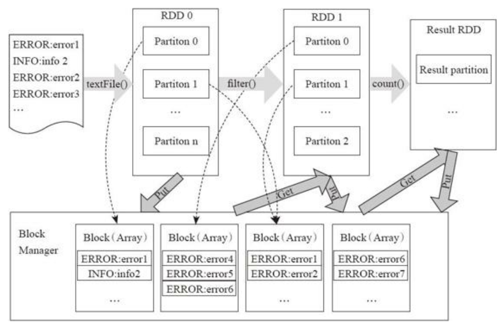

参考：《Spark大数据处理：技术、应用与性能优化》

[TOC]
# 第一章 Spark简介

## Spark是什么

* Spark是基于内存计算的大数据并行计算框架

  * 基于内存计算，提高了在大数据环境下数据处理的实时性

  * 保证了高容错性和高可伸缩性，允许用户将Spark部署在大量廉价硬件之上，形成集群

    **TODO：**==高容错性是如何保证的==

* Spark相比Hadoop MapReduce的优势

  > Spark是一个计算框架，而Hadoop中包含计算框架MapReduce和分布式文件系统HDFS，Hadoop更广泛地说还包括在其生态系统上的其他系统，如Hbase、Hive等
  >
  > Spark是MapReduce的替代方案，而且兼容HDFS、Hive等分布式存储层，可融入Hadoop的生态系统
  
  * 中间结果输出
    * 基于MapReduce的计算引擎通常会将中间结果输出到磁盘上，进行存储和容错——处于任务管道承接的考虑，当执行MapReduce任务时，往往会产生多个Stage，而这些串联的Stage又依赖于底层文件系统（HDFS）来存储每一个Stage的输出结果
    * Spark将执行模型抽象为通用的有向无环图（DAG）执行计算，==这可以将多Stage的任务串联或者并行执行==，而无须将Stage中间结果输出到HDFS中
  * 数据格式和内存布局
    * ==MapReduce Schema on Read==处理方式会引起较大的处理开销
    * Spark抽象出分布式内存存储结构弹性分布式数据集RDD，进行数据的存储
      * RDD能支持粗粒度写操作，但对于读取操作，RDD可以精确到每条记录，使得RDD可以用来作为分布式索引
      * Spark的特性是能够控制数据在不同节点上的分区，用户可以自定义分区策略，如Hash分区
      * SparkSQL在Spark的基础之上实现了==列存储==和列存储压缩
  * 执行策略
    * MapReduce在数据Shuffle之前花费了大量的时间来排序
    * Spark任务在Shuffle中不是所有情景都需要排序，所以支持==基于Hash的分布式聚合==，调度中采用更为通用的任务执行计划图（DAG），每一轮次的输出结果在内存缓存
  * 任务调度的开销
    * 传统的MapReduce系统是为了运行长达数小时的批量作业而设计的，在某种极端情况下，提交一个任务的延迟非常高
    * Spark采用了==事件驱动的类库AKKA==来启动任务，通过线程池复用线程来避免进程或线程启动和切换开销
  
* Spark的一站式解决方案的优势
  
  * 打造全栈多计算范式的高效数据流水线
  * 轻量级快速处理
  * 易于使用，Spark支持多语言
  * 与HDFS等存储层兼容
  
* Spark的缺陷
  
  * RDD模型适合的是粗粒度的全局数据并行计算，不适合细粒度的、需要异步更新的计算
  * 对于一些计算需求，如果要针对特定工作负载达到最优性能，还是需要使用一些其他的大数据系统
    * 图计算领域的`GraphLab`在特定计算负载性能上优于GraphX
    * 流计算中的`Storm`和`Flink`在实时性要求很高的场合要比Spark Streaming更胜一筹
  
# Spark集群的安装与部署

# Spark计算模型
>Spark依靠`Scala`强有力的函数式编程、Actor通信模式、闭包、容器、泛型，借助统一资源分配调度框架`Mesos`，融合了`MapReduce`和`Dryad`，最后产生了一个简洁、直观、灵活、高效地大数据分布式处理框架。
>
>Spark将数据（包括部分中间数据）放在内存，在内存中计算。用户将重复利用的数据缓存到内存，提高下次的计算效率，因此Spark尤其适合迭代型和交互型任务。Spark需要大量的内存，但性能可随着机器数目呈多线性增长

## Spark程序模型

* 程序示例

  ```scala
  // SparkContext的textFile函数从HDFS读取日志文件，输出变量RDD--file
  val file = sc.textFile("hdfs://xxx")
  // RDD中的filter函数过滤袋"ERROR"的行，输出errors(errors也是一个RDD)
  val errors = file.filter(line=>line.contains("ERROR"))
  // RDD的count函数返回"ERROR"的行数
  print(errors.count())
  ```

* RDD的操作与Scala集合类型没有太大差别，Spark目标——像编写单机程序一样编写分布式程序

* RDD的转换和存储角度看这个过程：用户程序对RDD通过多个函数进行操作，将RDD进行转换

  * `Block-Manager`管理RDD的物理分区，每个Block就是节点上对应的一个数据块，可以存储在内存或者磁盘
  * RDD中的`partition`是一个逻辑数据块，对应相应的物理块Block
  * 本质上一个RDD在代码中相当于是数据的一个元数据结构，存储着数据分区及其逻辑结构映射关系，存储着RDD之前的依赖转换关系

  

## 弹性分布式数据集

### RDD简介

* RDD（resilient distributed dataset，弹性分布式数据集）：逻辑集中的实体，在集群中的多台机器上进行了数据分区
  * 通过对多台机器上不同RDD分区的控制，就能够减少机器之间的数据重拍（data shuffle）
  * Spark提供了`partitionBy`运算符，能够通过集群中多台机器之间对原始RDD进行数据再分配来创建一个新的RDD
  * 通过RDD的依赖关系形成Spark的调度顺序，通过对RDD的操作形成整个Spark程序
* RDD特性
  * 两种创建方式
    * 从Hadoop文件系统（或与Hadoop兼容的其他）


  

  

  

  