参考：

1. 《Spark快速大数据分析》

2. [Spark官网](http://spark.apache.org)

3. [Spark中文文档](http://spark.apachecn.org/#/)

[TOC]

# Spark数据分析导论

## Spark是什么

* Spark是一个用来实现快速快速而通用的集群计算的平台
  * 速度：Spark扩展了广泛使用的MapReduce计算模型
  * 高效地支持更多计算模式：交互式查询和流处理
  * 能够在内存中进行计算——快，即使是必须在磁盘上进行的复杂计算，spark依然比MapReduce更加高效

## 一个大一统的软件栈

* spark的核心是一个对`由很多计算任务组成的、运行在多个工作机器或者是一个计算集群上的应用`进行调度、分发以及监控的计算引擎

  * 速度快
  * 通用——为各种不同应用场景专门设计的高级组件

* Spark组件密切结合的设计原理的优势

  * 软件栈中所有的程序库和高级组件都可以总下层的改进中获益
  * 运行整个软件栈的代价变小——只需要运行一套软件系统即可
  * 构建出无缝整合不同处理模型的应用

  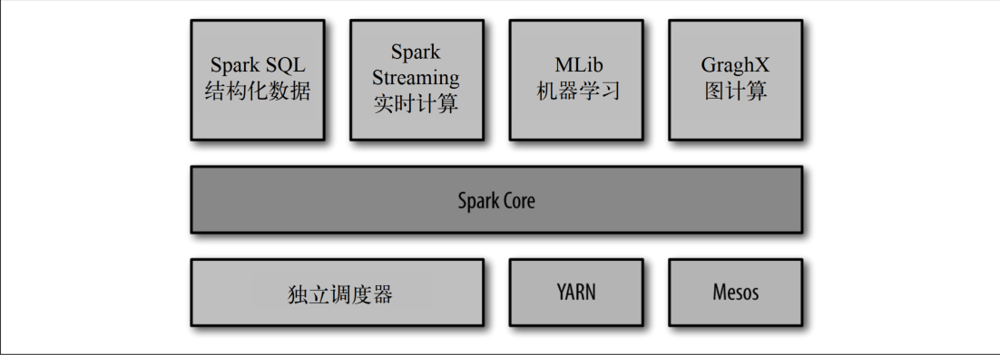

### Spark Core

* 实现Spark的基本功能
  * 任务调度
  * 内存管理
  * 错误恢复
  * 与存储系统交互
* Spark Core包含对`弹性分布式数据集（resilient distributed dataset，RDD）`的API定义
  * RDD表示分布在多个计算节点上可以并行操作的元素集合，是Spark主要的编程抽象
  * Spark Core提供了创建和操作这些集合的多个API

### Spark SQL

* Spark SQL是Spark用来操作结构化数据的程序包：通过Spark SQL，我们可以使用SQL或者Hive版本的SQL来查询数据

### Spark Streaming

* Spark Streaming 是对实时数据进行流式计算的组件
  * 生产环境中的网页服务器日志
  * 网络服务中用户提交的状态更新组成的消息队列

### MLlib

* MLlib提供了很多种机器学习算法
  * 包括分类、回归、聚类、协同过滤等
  * 模型评估、数据导入等额外的支持功能
  * 更底层的机器学习原语，包括一个通过的梯度下降优化算法

### GraphX

* GraphX是用来操作图（社交网络的朋友关系图）的程序库，可以进行并行的图计算

  * 扩展了Spark的RDD API——能用来创建一个顶点和边都包含任意属性的有向图
  * 针对图的各种操作：图分割的subgraph和操作所有顶点的mapVertices
  * 常用图算法（PageRank和三角计数）

### 集群管理器

* 底层上，Spark设计为可以高效地在一个计算节点到数千个计算节点之间伸缩计算
* Spark支持在各种集群管理器（cluster manager）上运行
  * Hadoop YARN
  * Apache Mesos
  * Spark自带的一个简易调度器——独立调度器

## Spark的用户和用途

## Soark简史

## Spark的版本和发布

## Spark的存储层次


# Spark下载与入门

## 下载Spark(TODO)

## Spark中Python和Scala的shell

* Spark带有交互式的shell，可以作即时数据分析
  * Spark shell可用来与分布式存储在许多机器的内存或者硬盘上的数据进行交互
  * 处理过程的分发由spark自动控制完成
  * 

## Spark核心概念简介

* 每个Spark应用都由一个驱动器程序（driver program）来发起集群上的各种并行操作

  * 驱动器程序包含应用的`main`函数
  * 定义了集群上的分布式数据集
  * spark shell就是一个驱动器程序

* 驱动器程序通过一个`SparkContext`对象来访问Spark，这个对象代表对计算集群的一个连接

  * `shell`启动时已经自动创建了一个`SparkContext`对象，是一个叫作`sc`的变量
  * 驱动器程序一般要管理多个执行器（executor）节点

  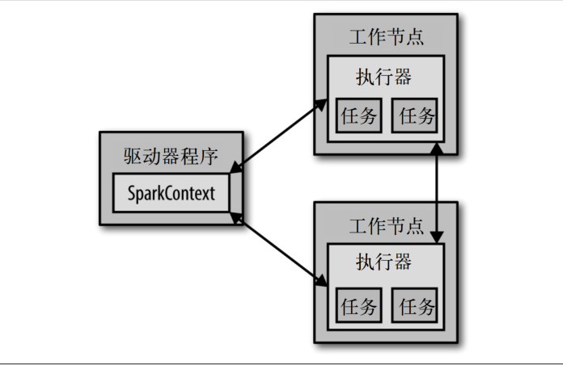

  

## 独立应用

* 初始化SparkContext

  * 完成了应用与Spark的连接后，导入Spark包
  * 创建`SparkConf`对象来配置你的应用
  * 基于这个`SparkConf`创建一个`SparkContext`对象
  * 创建`SparkConf`的最基本方法，只需要传递两个参数
    * 集群**URL**：告诉Spark如何连接到集群上
    * 应用名：当连接到一个集群时，这个值可以帮助我们在集群管理器的用户界面中找到你的应用

  ```python
  from pyspark import SparkConf, SparkContext
  conf = SparkConf().setMaster("local").setAppName("My App")
  sc = SparkConf(conf=conf)
  ```

* 构建独立应用

# RDD编程

> RDD(Resilient Distributed Dataset)：弹性分布式数据集，实质是**分布式**的元素集合；Spark中对数据的操作主要就是创建RDD、转化已有RDD以及调用RDD操作进行取值
>
> Spark中的RDD是一个不可变的分布式对象集合——每个RDD被分为多个分区，分区运行在集群中的不同节点上

## 创建RDD

* 读取一个外部数据集

  ```python
  from pyspark import SparkContext as sc
  lines = sc.testFile("README.md")
  ```

* 在驱动器程序里分发驱动器程序中的对象集合（比如list和set）

  * 把程序中一个已有的集合传给SparkContext的parallelize()方法

  * 除了开发原型和测试时，这种方法用的不多，毕竟这种方式需要把你的整个数据先放在一台机器的内存中

    ```python
    lines = sc.parallelize(["pandas", "i like pandas"])
    ```


## RDD的操作

* 转化(transformation)：由一个RDD生成一个新的RDD；例如map()和filter()
  ```python
pythonLines = lines.filter(lambda line: "Python" in line)
  ```
  * 通过转化操作，从已有的RDD中派生出新的RDD，Spark会使用谱系图（lineage graph）来记录这些不同RDD之间的依赖关系——Spark需要用这些信息来按需计算每个RDD，也可以依靠谱系图在持久化的RDD丢失部分数据时恢复所丢失的数据

  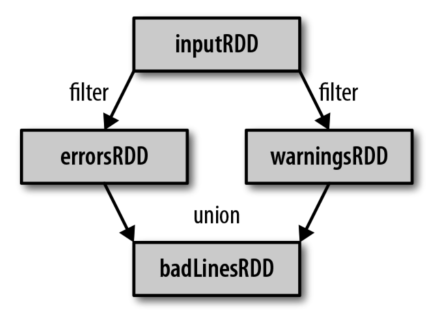

* 行动操作(action)：对RDD计算出一个结果，并把结果返回到驱动器程序中，或把结果存储到外部存储系统(如HDFS)，比如count()和first()

  ```python
pythonLinnes.first()
  ```

  * 如果把RDD筛选到一个很小的规模，并且想在本地处理这些数据时，使用`collect()`

* 转化和行动操作的区别在于Spark计算RDD的方式不同：定义和转化RDD时，Spark只会惰性计算这些RDD，只有第一次action操作中才会真正计算

  * 这种策略在大数据领域是很有道理的。如果执行一行就得到结果并存储起来，就会消耗很多存储空间，但又不是最终需要的

* 默认情况下，Spark的RDD会在每次对它们进行action操作时重新计算，如果需要在多个action操作中重用一个RDD，可以使用RDD.persist()让Spark把这个RDD缓存下来

  * 第一次对持久化的RDD计算之后，Spark会把RDD的内容保存到内存中(以分区方式存储到集群中的各机器上)，这样在之后的action中，就可以重用这些数据了
  
  * 也可以把RDD缓存到磁盘上而不是内存中
  
    ```python
    from pyspark import SparkContext as sc
    lines = sc.testFile("README.md")
    lines.persist
    lines.count()
    ```

## 向Spark传递函数

* 传递比较短的函数时，可以使用lambda表达式来传递

* 传递顶层函数或者是定义的局部函数

  ```python
  # lambda
  word = rdd.filter(lambda s: "error" in s)
  
  # 局部函数
  def containsError(s):
      return "error" in s
  word = rdd.filter(containsError)
  ```

  * 传递函数时需要小心：python会在不经意间把函数所在的对象也序列化传出去——当你传递的对象是某个对象的成员，或者包含了对某个对象中一个字段的引用时（例如self.field），Spark会把整个对象发到工作节点上，这可能比想传递的东西大的多

## 常见的转化操作和行动操作

### 针对各个元素的转化操作

* `map()`：接收一个函数，把这个函数用于RDD中的每个元素，将函数的返回结果作为结果RDD中对应元素的值

  ```python
  nums = sc.parallelize([1, 2, 3, 4])
  squared = nums.map(lambda x: x * x).collect()
  squared
  ```

* `filter()`：接收一个函数，并将RDD中满足该函数的元素放入新的RDD中返回

  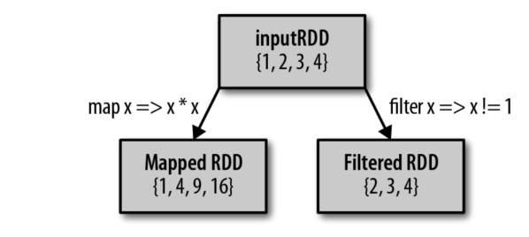

* `flatmap()`：接收一个函数，应用到了输入RDD的每个元素上，返回的不是一个元素，而是一个返回值序列的迭代器——得到的是一个包含各个迭代器可访问的所有元素的RDD

  ```python
  lines = sc.parallelize(["hello world", "hi"])
  words = lines.flatMap(lambda line: line.split(" "))
  words.collect() # 返回["hello", "world", "hi"]
  ```

  * `flatmap()`就是将`map`得到的多维转化为一维

  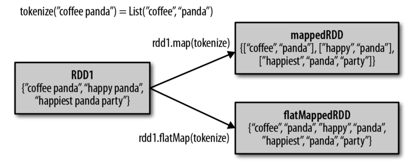

* `sample(withReplacement, fraction, [seed])`：对RDD采样，以及是否替换

  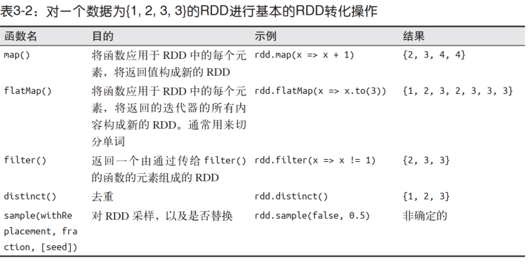

### 伪集合操作

* `rdd.distinct()`：数据去重——生成一个只包含不同元素的新RDD

  * `distinct()`操作的开销很大，需要将所有数据通过网络进行混洗（shuffle），以确保每个元素都只有一份

* `rdd1.union(rdd2)`：返回一个包含两个RDD中所有元素的RDD——如果输入的RDD中有重复数据，`union()`也会包含这些重复数据

* `rdd1.intersection(rdd2)`：返回两个RDD中都有的元素——运行时也会去掉所有重复的元素（单个RDD内的重复元素也会一起移除）；`intersection()`的性能差，因为需要通过网络混洗数据来发现共有的元素

* `rdd1.subtract(rdd2)`：返回一个由只存在于第一个RDD中而不存在于第二个RDD中的所有元素组成的RDD——和上面一样，需要数据混洗

  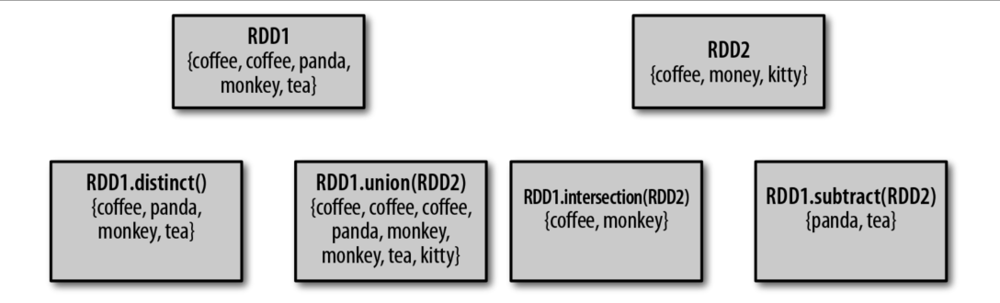

* `rdd1.cartesian(rdd2)`：计算两个RDD的笛卡尔积，返回所有可能的（a,b）对

  * 笛卡尔积在希望考虑所有可能的组合的相似度时比较有用
    * 比如计算各用户对各种产品的预期兴趣程度
    * 求一个RDD与其自身的笛卡尔积，可以用于求用户相似度的应用中
  * 大规模RDD的笛卡尔积开销巨大

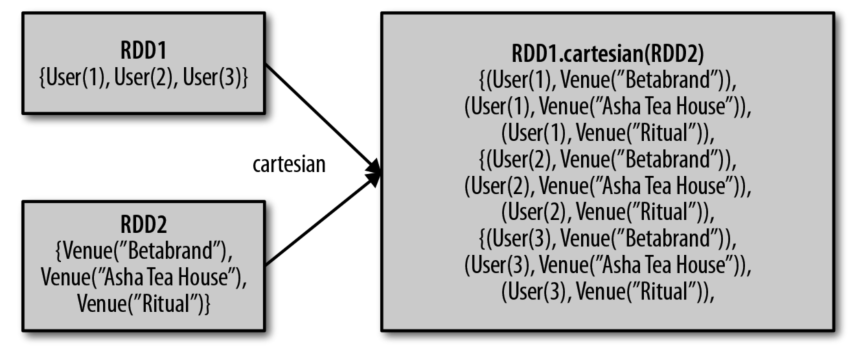

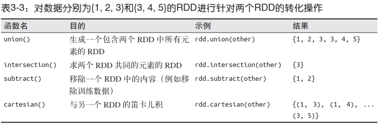

### 行动操作

* `reduce`：接收一个函数作为参数，这个函数要操作两个RDD的元素类型的数据并返回一个同样类型的新元素
* `aggregate()`：需要提供我们期待返回的类型的初始值
* `collect()`：把数据返回驱动器程序中，要求所有数据都必须能一同放入单台机器的内存中
* `take(n)`：返回RDD中的n个元素，并且尝试只返回尽量少的分区，因此该操作会得到一个不均衡的集合——返回元素的顺序与你预期的可能不一样
* `top(n)`：从RDD中获取前几个元素，会使用数据的默认顺序
* `foreach()`：对RDD中的所有元素应用一个行动操作，但是不把任何结果返回到驱动器程序中

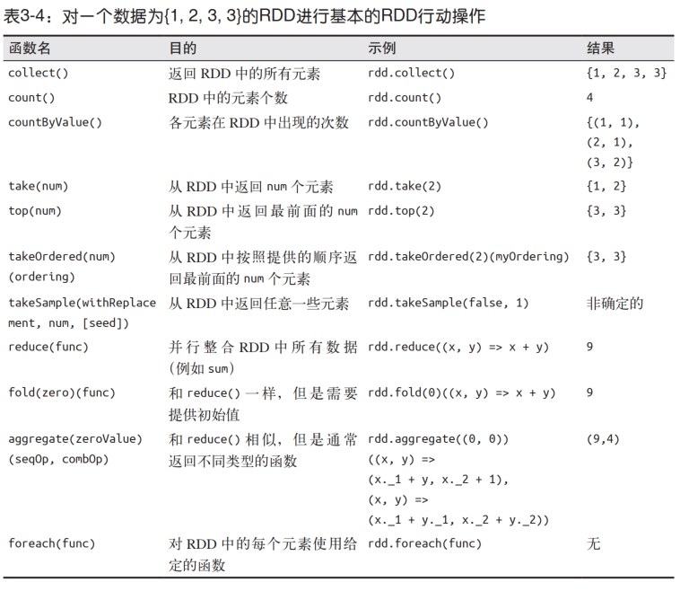

### 在不同RDD类型间转换

* 有些函数只能用于特定类型的RDD，比如`mean()`和`variance()`只能用在数值RDD上，而`join`只能用在键值对RDD上

## 持久化（缓存）

* 当我们让Spark持久化存储一个RDD时，计算出RDD的节点会分别保存它们所求出的分区数据
  * 如果一个由持久化数据的节点发生故障，Spark会在需要用到缓存的数据时重算丢失的数据分区
  * 如果希望节点故障的情况不会拖累我们的执行速度，也可以把数据备份到多个节点上
* 出于不同的目的，我们可以为RDD选择不同的持久化级别
  * 持久化级别默认值是以序列化后的对象存储在JVM堆空间中
  * 当我们把数据写到磁盘或者堆外存储上时，也总是使用序列化后的数据

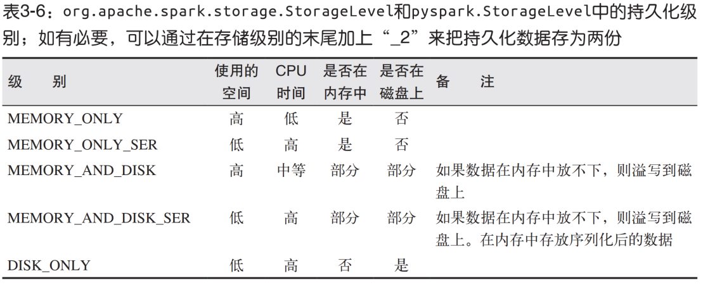

* 如果要缓存的数据太多，内存中放不下，Spark会自动利用最近最少使用（LRU）的缓存策略把最老的分区从内存中移除
  * 对于仅把数据存放在内存中的缓存级别，下一次要用到已经被移除的分区时，这些分区就需要重新计算
  * 对于使用内存与磁盘的缓存级别的分区来说，被移除的分区都会写入磁盘
  * 缓存不必要的数据会导致有用的数据被移出内存，带来更多重算的时间开销
  * RDD方法`unpersist()`可以手动把持久化的RDD从缓存中移除

# 键值对操作

> 键值对RDD通常用来进行聚合计算。一般要先通过一些初始ETL（抽取、转化、装载）操作来将数据转化为键值对形式。键值对RDD提供一些新的操作接口——统计每个产品的评论，将数据中键相同的分为一组，将两个不同的RDD进行分组合并等
>
> 让用户控制键值对RDD在各节点上分布情况的高级特性——分区；有时使用可控的分区方式把常被一起访问的数据放到同一个节点上，可以大大减少应用的通信开销，这会带来明显的性能提升

## 动机

* 键值对类型RDD有一些专有操作，这些RDD称为`pair RDD`
  * `pair RDD`是很多程序的构成要素，因为提供了并行操作各个键或跨节点重新进行数据分组的操作接口

## 创建Pair RDD

* 很多存储键值对的数据格式会在读取时直接返回由其键值对数据组成的`pair RDD`

* `map()`函数可以将一个普通的RDD转化为`pair RDD`

  ```python
  # 使用一句话中第一个单词作为键
  pairs = lines.map(lambda x: (x.split(" ")[0], x))
  ```

## Pair RDD的转化操作

# 数据存取与保存

# Spark编程进阶

## 简介


