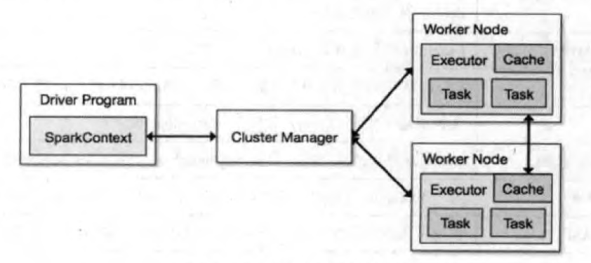

参考：《大数据Spark企业级实战版》

[TOC]
# Spark RDD与编程API

# Spark运行模式深入解析

## Spark运行模式概述

> Spark在单机上可以以本地模式运行，也可以以伪分布式模式运行；当以分布式的方式在Cluster集群中运行时，底层的资源调度可以使用Mesos或者Yarn，也可以使用Spark自带的Standalone模式

* `Application`：用户编写的Spark应用程序，其中包含一个`Driver`功能的代码和分布在集群中多个节点上运行的`Executor`代码
* `Driver`：运行`Application`的`main()`函数并创建`SparkContext`
  * 创建`SparkContext`的目的是为了准备Spark应用程序的运行环境
  * `SparkContext`负责与`ClusterManager`通信，进行资源的申请、任务的分配和监控等
  * 当`Executor`部分运行完毕后，Driver同时负责将`SparkContext`关闭
* `Executor`：某个`Application`运行在`Worker`节点上的一个进程，该进程负责运行某些`Task`，并且负责将数据存在内存或者磁盘上
  * TODO
* `Cluster Manager`：在集群上获取资源的外部服务
  * `Standalone`：Spark原生的资源管理，由`Master`负责资源的分配，可以在亚马逊的`EC2`上运行
  * `Apache Mesos`：与`Hadoop MapReduce`兼容性良好的一种资源调度框架
  * `Hadoop yarn`：`Yarn`中的`ResourceManager`
* `Worker`：集群中任何可以运行`Application`代码的节点，类似于`Yarn`中的`NodeManager`节点。
  * TOOD
* `Task`：被送到某个`Executor`上的工作单元
  * TODO
* `Job`：包含多个`Task`组成的并行计算，往往由`Spark Action`触发产生。
* `Stage`：每个`Job`会被拆分成很多组`Task`，作为一个`TaskSet`，其名称为`Stage`
  * `Stage`的划分和调度由下面的`DAGScheduler`负责
  * `Stage`有非最终的`Stage`（即`Shuffle map Stage`）和最终的`Stage`（即`Result Stage`）两种——`Stage`的边界就是发生Shuffle的地方
* `RDD`：Spark的基本计算单元，可以通过一系列算子进行操作（主要有Transformation和Action操作）
  * `RDD`是`Spark`最核心的东西，表示已被分区、被序列化的、不可变的、有容错机制的，并且能够被并行操作的数据集合
  * `RDD`存储级别可以是内存，也可以是磁盘，可通过`spark.storage.StorageLevel`
* 共享变量：
* 宽依赖（`ShuffleDependency`）：与`Hadoop MapReduce`中`Shuffle`的数据依赖相同，宽依赖需要计算好所有父`RDD`对应分区的数据，然后再节点之间进行`Shuffle`
* 窄依赖（`NarrowDependency`）：指某个具体的RDD，其分区`partition a`最多被子RDD中的一个分区`partition b`依赖
  * TD
* `DAGScheduler`：根据`Job`构建基于`Stage`的`DAG`，并提交`Stage`给`TaskScheduler`——划分的依据是RDD之间的依赖关系
* `TaskScheduler`：将`Taskset`提交给`Worker`（集群）运行，每个`Executor`运行什么`Task`就是在此处分配的

### Spark的运行模式列表

### Spark的基本工作流程

* Spark的Application在运行时，首先在Driver程序中会创建SparkContext，将其作为调度的总入口，在其初始化过程中会分别创建DAGScheduler（进行Stage调度）和TaskScheduler（进行Task调度）两个模块。

  * DAGScheduler：基于Stage的调度模块，为每个Spark Job计算具有依赖关系的多个Stage任务阶段，然后将每个Staeg划分为具体的一组任务（通常会考虑数据的本地性等），以TaskSet的形式提交给底层的TaskScheduler模块来具体执行

  * TaskScheduler：负责具体启动任务，监控和汇报任务运行情况。而任务运行所需要的资源需要向Cluster Manager申请。

    

Spark 基本运行流程

## Standalone模式

资源调度是Spark框架自己实现的，其节点类型分为Master节点和Worker节点，其中Driver运行在Master节点中，并且有常驻内存的Master进程守护，Worker节点上常驻Worker守护进程，负责与Master通信，通过ExecutorRunner来控制运行在当前节点上的CoarseGrainedExecutorBackend。每个Worker上存在一个或者多个CoarseGrainedExecutorBackend进程。每个进程包含一个Executor对象，该对象持有一个线程池，每个线程可以执行一个Task