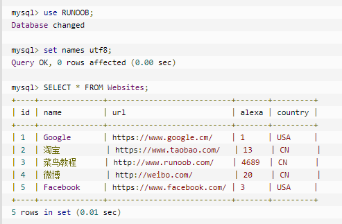

typora-copy-images-to: pic
[TOC]

# SQL简介

## 数据库基础

- 数据库（database——DB）：保存有组织的数据的容器
- RDBMS（Relational Database Management System）：关系型数据库管理系统
  - RDBMS 是 SQL 的基础，同样也是所有现代数据库系统的基础，比如 MS SQL Server、IBM DB2、Oracle、MySQL 以及 Microsoft Access。
  - RDBMS 中的数据存储在被称为**表**的数据库对象中。
    - 表（table）：某种特定类型数据的结构化清单
    - 表是相关的数据项的集合，它由列和行组成。
      - 数据类型（datatype）：每个表的列都有相应的数据类型，限制（或容许）该列中存储的数据
      - 列（column）：表中的一个字段——所有表都是由一个或多个列组成的
      - 行（row）：表中的一个记录
        - 表中的数据是按行存储的
        - 所保存的每个记录存储在自己的行内
      - 主键（primary key）：一列（或一组列），其值能够唯一区分表中每个行——订单ID、编号等
        - 任意两行都不具有相同的主键值
        - 每个行都必须具有一个主键值（主键值不允许NULL值）
- 模式（schema）：关于数据库和表的布局及特性的信息，例如
  - 数据在表中如何存储
  - 数据如何分解
  - 各部分信息如何命名

## SQL

- SQL是用于**访问和处理数据库**的标准的计算机语言
  - SQL（Structured Query Language）：结构化查询语言
  - SQL可以访问和处理数据库
  - SQL 是一种 ANSI（American National Standards Institute 美国国家标准化组织）标准的计算机语言
- SQL的优点
  - 几乎所有重要的DBMS都支持SQL
  - 简单易学
  - 灵活使用，可以进行非常复杂和高级的数据库操作

## MySQL

> 数据的所有存储、检索、管理和处理实际上是由数据库软件——DBMS（数据库管理系统）完成的。MySQL是一种DBMS——一种数据库软件

* MySQL的优点
  * 成本：MySQL是开放源代码的，一般可以免费使用（甚至可以免费修改）
  * 性能：MySQL执行很快
  * 可信赖：很多大公司使用MySQL
  * 简单：MySQL容易安装和使用
* DBMS
  * 基于共享文件系统的DBMS：桌面用途，通常不用于高端或者更关键的应用
    * Microsoft Acess
    * FileMaker
  * 基于客户机-服务器的DBMS
    * 服务器部分：负责所有数据访问和处理的一个软件，运行在`数据库服务器`上
    * 客户机：用户通过客户机向服务器提出请求

# 使用MySQL

## 连接


# 创建和操作表

## 创建表

* CREATE TABLE创建表，必须给出下列2种信息

  * 新表的名字
  * 列的名字和定义，用逗号分隔

* 创建表实例

  ```MYSQL
  CREATE TABLE table_name IF NOT EXISTS
    (
  	  column_name1 int NOT NULL AUTO_INCREMENT,
        column_name2 char(50) NOT NULL,
        column_name3 char(50) NULL,
        column_name4 int NOT NULL DEAULT 1,
        PRIMARY KEY (column_name1)
    )ENGINE=InnoDB;
  ```
  
  * 表名紧跟在CREATE TABLE关键字后面；实际表定义括在圆括号之中，各列之间用逗号分隔
  * PRIMARY KEY关键字指定表的主键：主键值必须唯一，只能使用NOT NULL的列
    * 主键使用单个列，则它的值必须唯一
    * 主键使用多个列，则这些列的组合值必须唯一
  * NULL和NOT NULL
    * NULL为默认设置，如果不指定，默认该列允许没有值
    * NOT NULL指该列不接受没有值的行——在插入或更新行时，该列必须有值
  * AUTO_INCREMENT：本列每当增加一行时自动增量
    * 每个表只允许一个AUTO_INCREMENT列
    * 本列必须被索引（通过使它成为主键）
    * last_insert_id()函数可以获得最后一个AUTO_INCREMENT的值
  * 如果在插入行时没有给出值，MYSQL使用DEAFULT关键字指定此时使用的默认值
    * 与大多数DBMS不一样，MYSQL不允许使用函数作为默认值，只支持常量
    * 大多数情况下应使用默认值，而不是NULL列，特别是对于计算或数据分组的列
  * 引擎类型：具体管理和处理数据的内部引擎——CREATE TABLE时该引擎具体创建表，而在使用SELECT语句或进行其他数据库处理时，该引擎在内部处理你的请求，多数情况下，此引擎都隐藏在DBMS内
    * InnoDB是一个可靠的事物处理引擎，不支持全文本搜索
    * MEMORY在功能上等同于MyISAM，但由于数据存储在内存（不是磁盘）中，速度很快（特别适合于临时表）
    * MyISAM是一个性能极高的引擎，支持全文本搜索，但不支持事物处理
  
* 数据类型

  * 数值类型
  
    |     类型      | 大小  |   范围（有符号）   | 范围（无符号） |      用途      |
    | :-----------: | :---: | :----------------: | :------------: | :------------: |
    |    TINYINT    | 1字节 |     (-128,127)     |    (0,255)     |    小整数值    |
    |   SMALLINT    | 2字节 |   (-32768,32767)   |   (0,65535)    |    大整数值    |
    |   MEDIUMINT   | 3字节 | (-8388608,8388607) |  (0,16777215)  |    大整数值    |
    | INT或INTERGER | 4字节 |                    |                |    大整数值    |
    |    BIGINT     | 8字节 |                    |                |   极大整数值   |
    |     FLOAT     | 4字节 |                    |                | 单精度浮点数值 |
    |    DOUBLE     | 8字节 |                    |                | 双精度浮点数值 |
    |    DECIMAL    |       |                    |                |     小数值     |
  
  * 日期和时间类型
  
    |   类型    | 大小  |                  范围                   |        格式         |           用途           |
    | :-------: | :---: | :-------------------------------------: | :-----------------: | :----------------------: |
    |   DATE    | 3字节 |          1000-01-01~9999-12-31          |     YYYY-MM-DD      |          日期值          |
    |   TIME    | 3字节 |        '-838:59:59'~'838:59:59'         |      HH:MM::SS      |     时间值或持续时间     |
    |   YEAR    | 1字节 |                1901~2155                |        YYYY         |          年份值          |
    | DATATIME  | 8字节 | 1000-01-01 00:00:00~9999-12-31 23:59:59 | YYYY-MM-DD HH:MM:SS |      混合日期和时间      |
    | TIMESTAMP | 4字节 | 1970-01-01 00:00:00/2038-1-19 11:14:07  |   YYYYMMDD HHMMSS   | 混合日期和时间值，时间戳 |
  
  * 字符串类型
  
    |    类型     |       大小       |             用途              |
    | :---------: | :--------------: | :---------------------------: |
    |    CHAR     |    0-255字节     |          定长字符串           |
    |   VARCHAR   |   0-65535字节    |          变长字符串           |
    |  TINYBLOB   |    0-255字节     | 不超过255个字符的二进制字符串 |
    | MEDIUMBLOB  |  0-16777215字节  | 二进制形式的中等长度文本数据  |
    |    BLOB     |   0-65535字节    |    二进制形式的长文本shuju    |
    |  LONGBLOG   | 0-4294967295字节 |   二进制形式的极大文本数据    |
    |  TINYTEXT   |    0-255字节     |         短文本字符串          |
    | MEDIUMBTEXT |  0-16777215字节  |       中等长度文本数据        |
    |    TEXT     |   0-65535字节    |          长文本字节           |
    |  LONGTEXT   | 0-4294967295字节 |         极大文本数据          |
  

## 更新、删除和重命名表

* 更新表：使用ALTER TABLE语句

  * 给表添加一个列

    ```mysql
    ALTER TABLE table_name ADD column_name data_type
    ```

  * 删除表的一列

    ```mysql
    ALTER TABLE table_name DROP column column_name
    ```

* 删除表：使用DROP TABLE语句删除整个表

  * 删除表没有确认，也不能撤销

  * 执行删除表操作将永久删除该表

    ```mysql
    DROP TABLE table_name
    ```

* 重命名表：使用RENAME TABLE语句可以重命名一个表

  ```mysql
  RENAME TABLE table_name TO new_table_name
  ```

# 数据插入

* 插入完整的行
  * 指定表名和被插入到新行中的值使用INSERT插入一个完整的行

  ```mysql
  INSERT INTO table_name(column_name1,column_name2,column_name3,...)
  VALUES (value1, value2, value3,...)
  ```

  * 在表名后的括号里明确给出列名，省略时默认插入所有列名数值
    * VALUES以指定的次序匹配指定的列名，不一定按各个列出现在实际表中的次序——优点是即使表的结构改变，INSERT依然能正确运行
  * INSERT LOW_PRIORITY INTO指示降低INSERT的优先级，同样适用于UPDATE和DELETE语句
    * 数据库经常被多个客户访问，对处理什么请求以及用什么次序处理进行管理是MySQL的任务
    * INSERT操作可能很耗时（特别是有很多索引需要更新时），而且可能降低等待处理的SELECT语句的性能

* 插入多个行：单条INSERT语句处理多个插入比使用多条INSERT语句快
  ```mysql
  INSERT INTO table_name(column_name1,column_name2,column_name3,...)
  VALUES (value1, value2, value3,...),
  	   (value1, value2, value3,...),
         ....;
  ```

* 插入检索出的数据：将一条SELECT语句的结果插入表中

  ```mysql
  INSERT INTO table_name1(column_name1,column_name2,column_name3,...)
  SELECT column_name1,column_name2,column_name3,... from table_name2;
  ```

  * 两个表的列名不要求相同，Mysql使用的是列的位置

# 更新和删除数据

* 更新数据：使用UPDATE语句更新特定行

  ```mysql
  UPDATE IGNORE table_name SET column_name1=value1, column2_name2=value2,... WHERE...;
  ```

  * SET命令：将新值赋给被更新的列
  * WHERE子句限制更新哪行
  * IGNORE关键字（可不填）
    * UPDATE语句更新多行，并在更新这些行中的一行或多行时出现一个错误，则整个UPDATE操作取消（错误发生前更新的所有行被恢复到它们原来的值）
    * 使用IGNORE关键字即使发生错误也继续进行更新
  * 为了删除某个列的值，可设置它为NULL（假如表定义允许NULL值）

* 删除数据：使用DELETE语句删除特定行

  ```
  DELETE FROM table_name WHERE ....;
  ```

  * DELETE语句从表中删除行，甚至是删除表中所有行，但是DELETE不删除表本身
  * 更快的删除：如果想从表中删除所有行，不要使用DELETE，可以使用TRUNCATE TABLE语句，它完成相同的工作，但速度更快（TRUNCATE 实际是删除原来的表并重新创建一个表，而不是逐行删除表中的数据）

# 检索数据

## SQL SELECT语句

> SELECT：从数据库中选取数据，结果被存储在一个结果表中（称为结果集）
>
> * 想选择什么
> * 从什么地方选择

- 语法：

  - 从表中检索单个列

    ```mysql
    SELECT column_name FROM table_name
    ```

  - 从表中检索某几列：列名之间必须以逗号分隔

    ```mysql
    SELECT column_name1, column_name2.... FROM table_name
    ```

  - 检索表中所有列：虽然使用通配符使自己省事，但检索不需要的列通常会**降低**检索和应用程序的**性能**

    ```mysql
    SELECT * FROM table_name
    ```

- 注意：

  - 查询结果的**数据顺序**没有特殊意义
  - 多条SQL语句必须以**分号**分隔
  - SQL语句不区分大小写，但习惯——SQL关键字使用大写，而对所有列和表名使用小写

## SQL SELECT DISTINCT语句

> SELECT DISTINCT：返回唯一不同的值

- 语法

  - `Distinct`关键字**应用于所有列**而不仅是前置它的列
  - 如下，必须两个列不同才视为两行不同

  ```mysql
  SELECT DISTINCT column_name1, column_name2
  FROM table_name;
  ```

- DISTINCT关键字应用于**选择的所有列**，而不是紧跟的列（与后面的`DESC`相反）

## SQL LIMIT限制结果

> LIMIT子句：返回前几行

* 返回前几行

  ```mysql
  SELECT column_name from table_name LIMIT num;
  ```

* 指定要检索的开始行和行数

  ```mysql
  SELECT column_name from table_name LIMIT num offset num_start;
  ```

  * 检索出来的第一行为行0——计数从0开始
  * 行数不够时返回能返回的那么多行

## SQL ORDER BY排序检索数据

> ORDER BY子句：取一个或多个列的名字，据此对输出进行排序

* 按照单列进行排序：默认**升序**

  ```mysql
  SELECT columns_name1, column_name2 from table ORDER BY column_name
  ```

* 按照多个列排序

* 指定排序方向`DESC`、`ASC`

  * 单列降序排序

    ```mysql
  SELECT columns_name1, column_name2 from table ORDER BY column_name DESC
    ```
    
  * 多列排序，`DESC`只应用到直接位于其前面的列名；如果想在多个列上进行降序排序，必须对每个列指定`DESC`关键字
  
* `ORDER BY`子句的位置

  * `ORDER BY`子句应该位于`FROM`子句之后
  * `ORDER BY`子句应该位于`LIMIT`子句之前

## 使用完全限定的表名

> 完全限定的名字来引用列——同时使用表名和列字
>
> 完全限定的名字来引用表——同时使用库名和表名

# 过滤数据

## SQL WHERE子句

- `WHERE`子句：提取那些满足指定的搜索条件的记录

  ```mysql
  SELECT column_name, column_name
  FROM table_name
  WHERE column_name operator value;
  ```

  - SQL使用**单引号**来环绕文本值（大部分数据库系统也接受双引号）
  - 在同时使用`ORDER BY`和`WHERE`子句时，应该让`ORDER BY`位于`WHERE`之后，否则将会产生错误
  - `IS NULL`：检查具有`NULL`值的列——`NULL`与字段包含0、空字符串或仅仅包含空格不同

- `WHERE`子句中的运算符

  |           运算符           |            描述            |
  | :------------------------: | :------------------------: |
  |             =              |            等于            |
  |           <>, !=           |           不等于           |
  |            >, <            |         大于和小于         |
  |           >=, <=           |     大于等于和小于等于     |
  |        BETWEEN  AND        |        在某个范围内        |
  |            LIKE            |        搜索某种模式        |
  | IN(value1, value2, value3) | 指定针对某个列的多个可能值 |

  - `BETWEEN`匹配范围中所有的值，包括指定的**开始值**和**结束值**
  - MySQL在执行字符匹配时默认**不区分大小写**

## 组合WHERE子句

> 操作符（operator）用来联结或改变WHERE子句中的子句的关键字，也称为逻辑操作符（logistical operator）

* `AND`操作符：指示检索满足所有给定条件的行

  ```mysql
  SELECT columns_name1, column_name2, column_name3 
  FROM table_name
  WHERE conditon1 AND condition2
  ```

* `OR`操作符：指示检索满足任一条件的行

  ```mysql
  SELECT columns_name1, column_name2
  FROM table_name
  WHERE conditon1 OR condition2
  ```

* 计算次序 ：`AND`操作符优先级高，最好使用**圆括号**明确地分组对应的操作符

* `IN`操作符：可以完成与`OR`相同的功能

  * `IN`计算的次序更容易管理
  * `IN`操作符一般比`OR`操作符清单**执行更快**
  * `IN`可以包含其他`SELECT`语句

* `NOT`操作符：否定它之后所跟的任何条件

## 用通配符进行过滤

### LIKE操作符

* 通配符（wildcard）：用来匹配值的一部分的特殊字符
* 百分号（%）通配符：表示任何字符出现任意次数——不能匹配`NULL`
  * M%：模糊查询信息为M开头的
  * %M%：表示查询包含M的所有内容
* 下划线（_）通配符：只匹配单个字符
  * %M_：表示查询以M在倒数第二位的所有内容

### 使用通配符的技巧

> MySQL的通配符很有用，但通配符搜索的处理一般时间更长

* 不要过度使用通配符——如果其他操作符能达到相同目的，应该使用其他操作符
* 尽量不要把通配符用在搜索模式的开始处，这样是最慢的

## 用正则表达式进行搜索

# 汇总数据

## 聚集函数

* 聚集函数（aggregate function）：运行在行组上，计算和返回单个值的函数

  |  函数   |       说明       |
  | :-----: | :--------------: |
  |  AVG()  | 返回某列的平均值 |
  | COUNT() |  返回某列的行数  |
  |  MAX()  | 返回某列的最大值 |
  |  MIN()  | 返回某列的最小值 |
  |  SUM()  |  返回某列值之和  |

  > MySQL还支持一系列的标准偏差聚集函数，可以自行查阅

### AVG()函数

* `AVG()`通过对表中行数技术并计算特定列值之和，求得该列的平均值

  * `AVG()`只能用来确定特定数值列的平均值

  * `AVG()`函数忽略列值为`NULL`的值

    ```mysql
    SELECT AVG(column_name) AS alias FROM TABLE_NAME
    ```

### COUNT()函数

# 分组数据——GROUP BY

## 创建分组

* 分组：允许把数据分为多个逻辑组，以便对每个组进行聚集计算
* `GROUP BY`：指示MySQL分组数据，然后对每个组而不是整个结果集进行聚集
  * `GROUP BY`子句可以包含任意数目的列——能对分组进行嵌套，为数据分组提供更细致的控制
  * 如果在`SELECT`中使用表达式，则必须在`GROUP BY`子句中指定相同的表达式，不能使用别名
  * `GROUP BY`子句中的每个列都必须在`SELECT`的列中
  * `GROUP BY`子句必须出现在`WHERE`子句之后，`ORDER BY`子句之前

## 过滤分组


# 使用MySQL

## 语法

- 数据库表：一个数据库通常包含一个或多个表
  - 每个表有一个名字标识
  - 表包含带有数据的记录（行）
- 使用数据库示例
  - use RUNNOOB：选择数据库
  - set names utf8：设置使用的字符集
  - SELECT* FROM Websites：读取数据表的信息
  - SQL对**大小写不敏感**：SELECT与select是相同的
  - 大多数数据库系统要求在每条SQL语句的末端使用分号用来分隔每条SQL语句
  - 在处理SQL语句时，其中所有空格都被忽略——SQL语句可以分成多行，更容易阅读和调试



- DML和DDL
  - 数据定义语言（DDL）：创建或删除表格，或者定义索引（键），规定表之间的链接，以及施加表间的约束
    - CREATE DATABASE：创建新数据库
    - ALTER DATABASE：修改数据库
    - CREATE TABLE：创建新表
    - ALTER TABLE：变更（改变）数据库表
    - DROP TABLE：删除表
    - CREATE INDEX：创建索引（搜索键）
    - DROP INDEX：删除索引
  - 数据操作语言（DML）：查询和更新指令
    - SELECT：从数据库表中获取数据
    - UPDATE：更新数据库表中的数据
    - DELETE：从数据库表中删除数据
    - INSERT INTO：向数据库表中插入数据

# 管理事物处理

# 改善性能

> 位于https://dev.mysql.com/doc/的MySQL文档有许多提示和技巧（甚至有用户提供的评论和反馈），可以时常进行查看

* MySQL是用一系列的默认设置预先配置的，这些设置开始通常是很好的。但过一段时间可能需要**调整内存分配**、**缓冲区大小**，为查看当前设置，可使用命令

  ```mysql
  SHOW VARIABLES;
  SHOW STATUS;
  ```

* MySQL是一个多用户多线程，即经常同时执行多个任务；如果这些任务中的某一个执行缓慢，则所有请求都会执行缓慢

  * 如果遇到显著的性能不良，可使用命令显示所有活动进程（以及它们的线程ID和执行时间）

    ```mysql
    SHOW PROCESSLIST;
    ```

  * 用`KILL`命令终结某个特定的进程（需要管理员登录）

* 应该尝试联结、并、子查询等，找出最佳的方法

* 使用`EXPLAIN`语句让MySQL解释它将如何执行一条`SELECT`语句

* 使用正确的数据类型

* 存储过程执行比一条一条执行MySQL语句快

* 不要检索比需求还多的数据

* 
