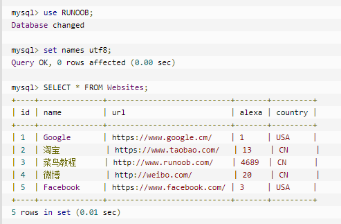

参考   [菜鸟教程](https://www.runoob.com/sql/sql-tutorial.html)和《MySQL必知必会》

[TOC]

# SQL简介

* 数据库基础
  * 数据库（database）：保存有组织的数据的容器

  * RDBMS（Relational Database Management System）：关系型数据库管理系统
    * RDBMS 是 SQL 的基础，同样也是所有现代数据库系统的基础，比如 MS SQL Server、IBM DB2、Oracle、MySQL 以及 Microsoft Access。
    * RDBMS 中的数据存储在被称为**表**的数据库对象中。
      * 表（table）：某种特定类型数据的结构化清单
      * 表是相关的数据项的集合，它由列和行组成。

* SQL是用于**访问和处理数据库**的标准的计算机语言
  * SQL（Structured Query Language）：结构化查询语言
  * SQL可以访问和处理数据库
  * SQL 是一种 ANSI（American National Standards Institute 美国国家标准化组织）标准的计算机语言

# SQL语法及常用语句

## 语法

* 数据库表：一个数据库通常包含一个或多个表
  * 每个表有一个名字标识
  * 表包含带有数据的记录（行）
* 使用数据库示例
  * use RUNNOOB：选择数据库
  * set names utf8：设置使用的字符集
  * SELECT* FROM Websites：读取数据表的信息
  * SQL对**大小写不敏感**：SELECT与select是相同的
  * 大多数数据库系统要求在每条SQL语句的末端使用分号用来分隔每条SQL语句



* DML和DDL
  * 数据定义语言（DDL）：创建或删除表格，或者定义索引（键），规定表之间的链接，以及施加表间的约束
    * CREATE DATABASE：创建新数据库
    * ALTER DATABASE：修改数据库
    * CREATE TABLE：创建新表
    * ALTER TABLE：变更（改变）数据库表
    * DROP TABLE：删除表
    * CREATE INDEX：创建索引（搜索键）
    * DROP INDEX：删除索引
  * 数据操作语言（DML）：查询和更新指令
    * SELECT：从数据库表中获取数据
    * UPDATE：更新数据库表中的数据
    * DELETE：从数据库表中删除数据
    * INSERT INTO：向数据库表中插入数据

## SQL SELECT语句

* SELECT：从数据库中选取数据，结果被存储在一个结果表中（称为结果集）
  * SELECT column_name FROM table_name：从表中检索单个列
  * SELECT column_name1, column_name2 FROM table_name：从表中检索某几列
  * SELECT * FROM table_name：检索表中所有列

## SQL SELECT DISTINCT语句

* SELECT DISTINCT：返回唯一不同的值
  * SELECT DISTINCT *column_name*1, *column_name*2
    FROM *table_name*;
  * DISTINCT关键字应用于**选择的所有列**，而不是紧跟的列（与后面的DESC相反）

## SQL WHERE子句

* WHERE子句：提取那些满足指定标准的记录

  - SELECT *column_name*,*column_name*
    FROM *table_name*
    WHERE *column_name operator value*;
  - SQL使用单引号来环绕文本值（大部分数据库系统也接受双引号）
  - 在同时使用ORDER BY和WHERE子句时，应该让ORDER BY位于WHERE之后，否则将会产生错误
  - IS NULL：检查具有NULL值的列

* WHERE子句中的运算符

  |      运算符       |            描述            |
  | :---------------: | :------------------------: |
  |         =         |            等于            |
  |        <>         |           不等于           |
  |        >,<        |         大于和小于         |
  |       >=,<=       |     大于等于和小于等于     |
  |   BETWEEN  AND    |        在某个范围内        |
  |       LIKE        |        搜索某种模式        |
  | IN(...,....,....) | 指定针对某个列的多个可能值 |

  - like模糊查询
    - %表示多个字值，_下划线表示一个字符
    - M%：模糊查询信息为M开头的
    - %M%：表示查询包含M的所有内容
    - %M_：表示查询以M在倒数第二位的所有内容
  - BETWEEN匹配范围中所有的值，包括制定的开始值和结束值

## SQL AND & OR运算符

* AND & OR语句：用于基于一个以上的条件对记录进行过滤
  * 两个条件同时满足，AND运算符显示一条记录
  * 两个条件中的其中一个条件满足，OR运算符显示一条记录
  * 计算次序：在处理OR操作符前，优先处理AND操作符；最好加括号

## SQL ORDER BY子句

* ORDER BY子句：用于对结果集进行排序
  * 对结果集按照一个列或者多个列进行排序
  * 默认按照**升序**对记录进行排序，如果需要按照降序对记录进行排序，可以使用**DESC**关键字
    * 对多列排序时，DESC或ASC关键字**只对紧跟着的第一个列名有效**，其他不受影响，仍然是默认的升序
    * ORDER BY A DESC， B：A降序，B升序
    * ORDER BY A，B DESC：A升序，B降序
  * SELECT *column_name*,*column_name*
    FROM *table_name*
    ORDER BY *column_name*,*column_name* ASC|DESC;
  * 按照多列排序时，先对第一列排序，然后再按照第二列排序

## SQL INSERT INTO语句

* INSERT INTO：用于向表格中插入新的行
  * INSERT INTO *table_name* (*column_name1*, *column_name2*, ...) VALUES (*value1*, *value2*, ....), (*value1*, *value2*, ....), ...;
    * 如果是要插入所有列数据，可以省略列名

## SQL UPDATE语句

* UPDATE：用于修改表中的数据
  * UPDATE *table_name* SET *column_name* = *new_value* WHERE *column_name* = *value*;

## SQL DELETE语句

* DELTE：用于删除表中的行
  * DELETE FROM *table_name* WHERE *column_name* = value;
  * 在不删除表的情况下删除所有的行
    * DELETE FROM *table_name*

# SQL高级教程

## SQL TOP

* TOP：用于规定要返回的记录的数目
  * 语法：SELECT TOP number|percent column_name(s) FROM table_name
  * 在MySQL中是LIMIT：SELECT column_name(s) FROM table_name LIMIT number

## SQL LIKE

* LIKE：用于在WHERE子句中搜索列中的指定模式
  * 语法：SELECT column_name(s) FROM table_name WHERE column_name LIKE pattern

## SQL 通配符

* 通配符：在搜索数据库中的数据时，通配符可以替代一个或多个字符

  * SQL通配符必须与LIKE运算符一起使用

    |           通配符           |            描述            |
    | :------------------------: | :------------------------: |
    |             %              |     替代一个或多个字符     |
    |             _              |       仅替代一个字符       |
    |         [charlist]         |   字符列中的任何单一字符   |
    | [^charlist]或者[!charlist] | 不在字符列中的任何单一字符 |

    

## SQL IN

* IN：在WHERE子句中规定多个值
  ```SQL
  SELECT column_name(s)
  FROM table_name
  WHERE column_name IN (value1,value2,...)
  ```

## SQL BETWEEN

## SQL Alias（别名）

* Alias：为列名称和表名称指定别名

  * 表的SQL 别名语法，AS可忽略

    ```SQL
    SELECT column_name(s)
    FROM table_name
    [AS] alias_name
    ```

  * 列的SQL别名用法，AS可忽略

    ```SQL
    SELECT column_name [AS] alias_name
    FROM table_name
    ```

## SQL JOIN

* JOIN：用于根据两个或多个表中的列之间的关系，从这些表中查询数据

  ```SQL
  SELECT column_name(s)
  FROM table_name1
  INNER JOIN table_name2
  ON Persons.Id_P = Orders.Id_P
  ORDER BY table_name1.column_name=table_name2.column_name
  ```

  * (INNER) JOIN：如果表中有至少一个匹配，则返回行
  * LEFT JOIN：即使右表中没有匹配，也从左表返回所有的行
  * RIGHT JOIN：即使左表中没有匹配，也从右表中返回所有的行
  * FULL JOIN：只要其中一个表中存在匹配，就返回行

## SQL UNION

## SQL SELECT INTO

## SQL CREATE DB

* CREATE DATABASE：用于创建数据库

  * 语法

    ```SQL
    CREATE DATABASE database_name
    ```

## SQL CREATE Table

* CREATE TABLE：用于创建数据库中的表

  * 语法

    ```SQL
    CREATE TABLE table_name
    (
    column_name1 data_type,
    column_name2 data_type,
    column_name3 data_type,
    ....
    )
    ```

  * 数据类型

    |   数据类型    | 描述 |
    | :-----------: | :--: |
    | integer(size)  int(size) smallint(size) tinyint(size) | 仅容纳整数，在括号内规定数字的最大位数（可以忽略） |
    | decimal(size, d) numeric(size, d) | 容纳带有小数的数字；'size'规定数字的最大位数，'d'规定小数点右侧的最大位数 |
    | char(size) |      |
    |               |      |
    |               |      |
    |               |      |

    

## SQL Constrains

## SQL NOT Null

## SQL Unique

## SQL Primary Key

## SQL Foreign Key

## SQL Check

## SQL Default

## SQL Create Index

## SQL Drop

## SQL Alter

## SQL Increment

## SQL View

## SQL Date

## SQL Nulls

## SQL isnull()

## SQL 数据类型

## SQL 服务器

# SQL函数


# 检索数据

* LIMIT语句：SELECT语句返回所有匹配的行，LIMIT语句返回前几行
  * SELECT column_name FROM table_name LIMIT num：显示满足匹配的前num行
  * SELECT column_name FROM table_name LIMIT num1，num2：num1表示从第num1行开始检索；num2表示要检索的行数
  * 上式容易混淆，可以写成LIMIT num1 OFFSET num2
  * 注意
    * 第一行为0，而不是1
    * 在行数不够时，将只返回它能够返回的那么多行
* 完全限定的表名
  * SELECT table_name.column_name FROM table_name;


# 排序检索数据

* ORDER BY子句：用于对结果集进行排序
  * 对结果集按照一个列或者多个列进行排序
  * 默认按照升序对记录进行排序，如果需要按照降序对记录进行排序，可以使用**DESC**关键字
    * 对多列排序时，DESC或ASC关键字只对紧跟着的第一个列名有效，其他不受影响，仍然是默认的升序
    * ORDER BY A DESC， B：A降序，B升序
    * ORDER BY A，B DESC：A升序，B降序
  * SELECT *column_name*,*column_name*
    FROM *table_name*
    ORDER BY *column_name*,*column_name* ASC|DESC;
  * 按照多列排序时，先对第一列排序，然后再按照第二列排序

# 过滤数据

* WHERE子句：提取那些满足指定标准的记录
  * SELECT *column_name*,*column_name*
    FROM *table_name*
    WHERE *column_name operator value*;
  * SQL使用单引号来环绕文本值（大部分数据库系统也接受双引号）
  * 在同时使用ORDER BY和WHERE子句时，应该让ORDER BY位于WHERE之后，否则将会产生错误
  * IS NULL：检查具有NULL值的列
  
* WHERE子句中的运算符

  |      运算符       |            描述            |
  | :---------------: | :------------------------: |
  |         =         |            等于            |
  |        <>         |           不等于           |
  |        >,<        |         大于和小于         |
  |       >=,<=       |     大于等于和小于等于     |
  |   BETWEEN  AND    |        在某个范围内        |
  |       LIKE        |        搜索某种模式        |
  | IN(...,....,....) | 指定针对某个列的多个可能值 |
  * like模糊查询
    * %表示多个字值，_下划线表示一个字符
    * M%：模糊查询信息为M开头的
    * %M%：表示查询包含M的所有内容
    * %M_：表示查询以M在倒数第二位的所有内容
  * BETWEEN匹配范围中所有的值，包括制定的开始值和结束值
# 数据过滤

* AND && OR语句
  * 两个条件同时满足，AND运算符显示一条记录
  * 两个条件中的其中一个条件满足，OR运算符显示一条记录
  * 计算次序：在处理OR操作符前，优先处理AND操作符；最好加括号
* NOT操作符：否定它之后所跟的任何条件
  * SELECT * FROM table_name WHERE NOT

# 用正则表达式进行搜索


# 创建计算字段

* 计算字段并不实际存在于数据库表中，是运行时在SELECT语句内创建的
* Concat()函数：拼接字段
  * SELECT Concat(column_name1,column_name2) FROM table_name;
* 使用别名（alias）：用关键字AS赋予
  * SELECT （）AS alias FROM
* 执行算术计算


# SQL函数

* 使用函数

  * 用于处理文本串（如删除或填充值，转换值为大写或小写）的文本函数

    * 常用文本处理函数

      |    函数     |       说明        |
      | :---------: | :---------------: |
      |   Left()    | 返回串左边的字符  |
      |   Right()   | 返回串右边的字符  |
      |  Length()   |   返回串的长度    |
      |  Locate()   | 找出串的一个子串  |
      |   Lower()   |  将串转换为小写   |
      |   Upper()   |  将串转换为大写   |
      |   LTrim()   | 去掉串左边的空格  |
      |   RTrim()   | 去掉串右边的空格  |
      |  Soundex()  | 返回串的Soundex值 |
      | SubString() |  返回子串的字符   |

      

  * 用于在数值数据上进行算术操作（如返回绝对值，进行代数运算）的数值函数

    * 常用数值处理函数
  
      |  函数  |        说明        |
      | :----: | :----------------: |
      | Abs()  | 返回一个数的绝对值 |
      | Sin()  | 返回一个角度的正弦 |
      | Cos()  | 返回一个角度的余弦 |
      | Tan()  | 返回一个角度的正切 |
      | Exp()  | 返回一个数的指数值 |
      | Mod()  |  返回除操作的余数  |
      |  Pi()  |     返回圆周率     |
      | Rand() |   返回一个随机数   |
      | Sqrt() | 返回一个数的平方根 |
  
  * 用于处理日期和时间值并从这些值中提取特定成分（例如：返回两个日期之差，检查日期有效性等）的日期和时间函数
  
    * 日期和时间采用相应的数据类型和特殊的格式存储，以便能快速和有效地排序或过滤，并且节省物理存储空间
  
    * 日期和时间处理函数
  
      |     函数      |              说明              |
      | :-----------: | :----------------------------: |
      |   AddDate()   |    增加一个日期（天、周等）    |
      |   AddTime()   |    增加一个时间（使、分等）    |
      |     Now()     |       返回当前日期和时间       |
      |   CurDate()   |          返回当前日期          |
      |   CurTime()   |          返回当前时间          |
      |    Date()     |     放回日期时间的日期部分     |
      |    Time()     |     返回日期时间的时间部分     |
      |    Year()     |     返回一个日期的年份部分     |
      |    Month()    |     返回一个日期的月份部分     |
      |     Day()     |     返回一个日期的天数部分     |
      |  DateDiff()   |        计算两个日期之差        |
      |  Data_Add()   |     高度灵活的日期运算函数     |
      | Data_Format() |  返回一个格式化的日期或时间串  |
      |  DayOfWeek()  | 对于一个日期，返回对应的星期几 |
      |    Hour()     |     返回一个时间的小时部分     |
      |   Minute()    |     返回一个时间的分钟部分     |
      |   Second()    |      返回一个时间的秒部分      |
  
    * 日期格式必须为'yyyy-mm--dd'

# 聚集函数

## 聚集函数

* 聚集函数（aggregate function）：运行在行组上，计算和返回单个值的函数

  |  函数   |       说明       |
  | :-----: | :--------------: |
  |  AVG()  | 返回某列的平均值 |
  | COUNT() |  返回某列的行数  |
  |  MAX()  | 返回某列的最大值 |
  |  MIN()  | 返回某列的最小值 |
  |  SUM()  |  返回某列值之和  |

  * AVG()函数自动忽略列值为NULL的值

# 分组数据

* 创建分组
  * GROUP BY
    * GROUP BY 用于结合聚合函数，根据一个或多个列队结果集进行分组
    * SELECT column_name, aggregate_function(column_name)
      FROM table_name
      WHERE column_name operator value
      GROUP BY column_name;
    * GROUP BY子句必须出现在WHERE子句之后，ORDER BY子句之前
* 过滤分组：规定包括哪些分组，排除哪些分组
  * HAVING子句：过滤分组
    * HAVING子句非常类似于WHERE，基本上所有类型的WHERE子句都可以用HAVING来替代，唯一的差别是WHERE过滤行，而HAVING过滤分组

# 使用子查询

* 子查询（subquery）：嵌套在其他查询中的查询

# 联结表


