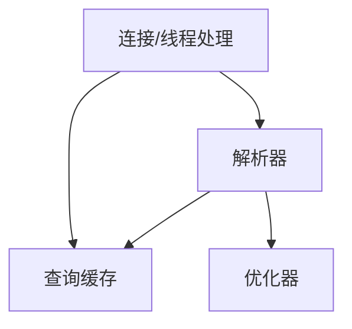

参考：《高性能MySQL》——

[TOC]

# MySQL架构与历史

> MySQL的架构可以在多种不同场景中应用并发挥好的作用。MySQL并不完美，却足够灵活，能适应高要求的环境。
>
> MySQL最大的特性是它的存储引擎架构——将查询处理（Query Processing）及其他系统任务（Sever Task）和数据的存储/提取相分离。这种处理和存储分离的设计可以在使用时根据性能、特性，以及其他需求来选择数据存储的方式。

## MySQL逻辑架构

* 逻辑架构图
  * 最上层是连接/线程处理：大多数基于网络的客户端/服务器的工具或者服务都有类似的架构——连接处理、授权认证、安全等
  * 第二层是MySQL的核心服务功能，包括查询解析、分析、优化、缓存以及所有的内置函数，所有跨存储引擎的功能都在这一层实现：存储过程、触发器、视图等
  * 第三层是存储引擎——负责MySQL中数据的存储和提取
    * 和`GNU/Linux`下的各种文件系统一样，每个存储引擎都有它的优势和劣势
    * 服务器通过`API`与存储引擎进行通信，这些接口屏蔽了不同存储引擎之间的差异，使得这些差异对上层的查询过程透明
    * 存储引擎API包含几十个底层函数，用于执行诸如“开始一个事物”或者“根据主键提取一行记录”等操作
    * 存储引擎不会去解析SQL，不同存储引擎之间也不会相互通信，而只是简单地响应上层服务器的请求

### 连接管理与安全性

# MySQL基准测试

# 服务器性能剖析

# Schema与数据类型优化

# 创建高性能的索引

# 查询性能优化

## 为什么查询速度会慢

## 慢查询基础：优化数据访问

> 查询性能低下最基本的原因是访问的数据太多，对于低效查询，可以通过下面两个步骤分析：
>
> * 确认应用程序是否在检索大量超过需要的数据——这通常意味着访问了太多的行，有时候也可能是访问了太多的列
> * 确认MySQL服务器是否在分析大量超过需要的数据行

### 是否向数据库请求了不需要的数据

> 有些查询会请求超过实际需求的数据，然后这些多余的数据会被应用程序丢弃，这会给MySQL服务器带来额外的负担，并增加网络开销，另外也会消耗应用服务器的CPU和内存资源

* 查询不需要的记录

