# 线性表的基本概念

* 线性表（List）定义：零个或多个数据元素的有限序列
  * 序列：元素之间是有顺序的
  * 有限：元素个数是有限的

* 若将线性表记为$\left( {{a_1}, \cdots ,{a_{i - 1}},{a_i},{a_{i + 1}}, \cdots ,{a_n}} \right)$，则表中$a_{i-1}$领先于$a_i$，$a_i$领先于$a_{i+1}$，称$a_{i-1}$是$a_i$的直接先驱元素，$a_{i+1}$是$a_i$的直接后继元素

  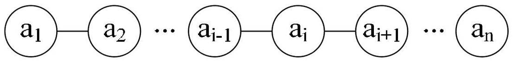

  * 线性表的长度：线性表元素的个数n（n≥0），当n=0时，称为空表

  * 在较复杂的线性表中，一个数据元素可以由若干个数据项组成

    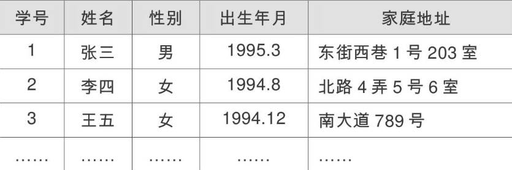

# 线性表的抽象数据类型

* ADT

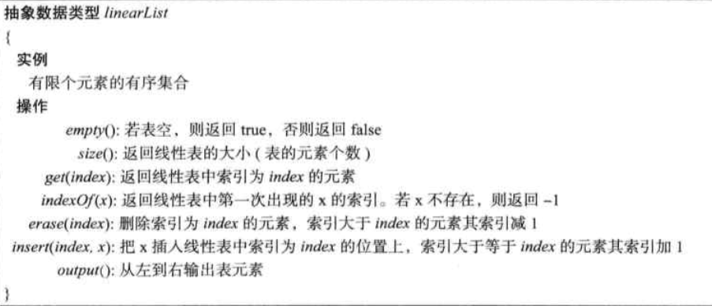

* 抽象类：包含纯虚函数的类，无法实例化，只能被继承，子类实现虚函数方法才可以实例，纯虚函数用数字0作为初始值来说明——C++中纯虚函数就是借口的概念

  ```C++
  virtual int func(int x) = 0;
  ```

* 线性表的抽象类

  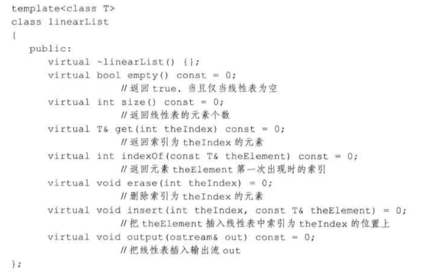

# 线性表的顺序存储结构

* 线性表的顺序存储结构：用一段地址连续的存储单元依次存储线性表的数据元素

  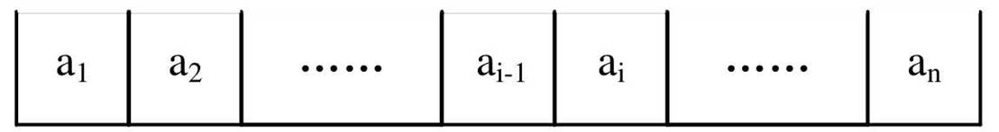

* 由于线性表的每个元素的类型都相同，所以可以用一维数组实现顺序存储结构

* 地址计算方法

  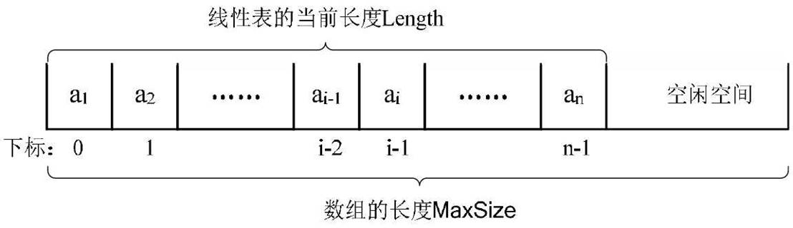

  * 存储器中的每个存储单元都有自己的编号，称之为地址

  * 假设每个数据元素需要占据`c`个存储单元，那么

    * 线性表中第`i+1`个数据元素的存储位置和第`i`个数据元素的存储位置满足下列关系

    $$
    LOC\left( {{a_{i + 1}}} \right) = LOC\left( {{a_i}} \right) + c
    $$

    * 线性表中第`i`个数据元素的存储位置由第1个数据元素推算

  $$
  LOC\left( {{a_i}} \right) = LOC\left( {{a_1}} \right) + \left( {i - 1} \right) * c
  $$

  ​			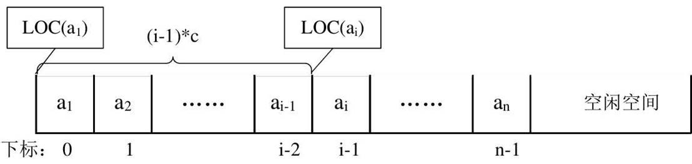

  * 通过上述公式，可以随时算出线性表中任意位置的地址，且是相同时间，用时间复杂度表示存取时间性能为O(1)，称具有这一特点的存储结构为随机存取结构

* 变长一维数组：假设一维数组`a`，线性表元素存储在`a[0:n-1]`，要增加或减少数组长度，首先要建立一个具有新长度的数组，然后把数组`a`的元素复制到这个新数组，最后改变`a`的值，使它能够引用新数组，时间复杂度$O(n)$

  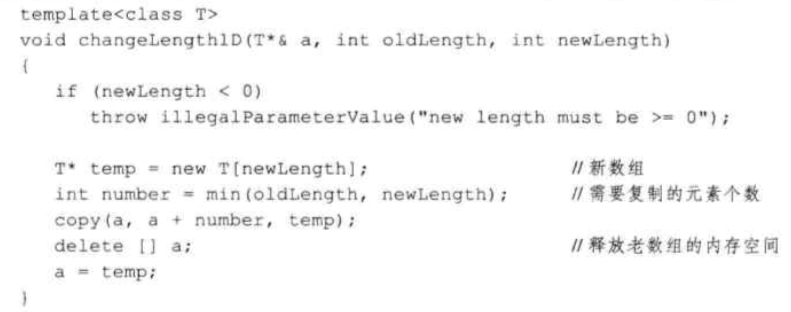

* 线性表顺序存储结构可以通过抽象类`linearList`的派生类`arrayList`需要三个属性
  * 存储空间的起始位置

  * 线性表的最大存储容量：数组容量——`arrayLength`

  * 线性表的当前长度——`listSize`

    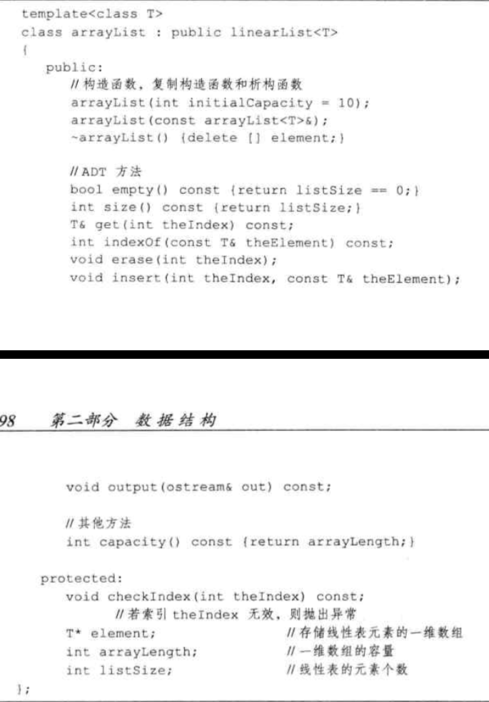

* `arrayList`的构造函数和复制构造函数

  * 构造函数创建了一个长度为`initialCapacity`的数组

  * 复制构造函数是复制一个对象，当一个对象穿值给一个函数，或者一个函数返回一个对象时，都需要调用复制构造函数

    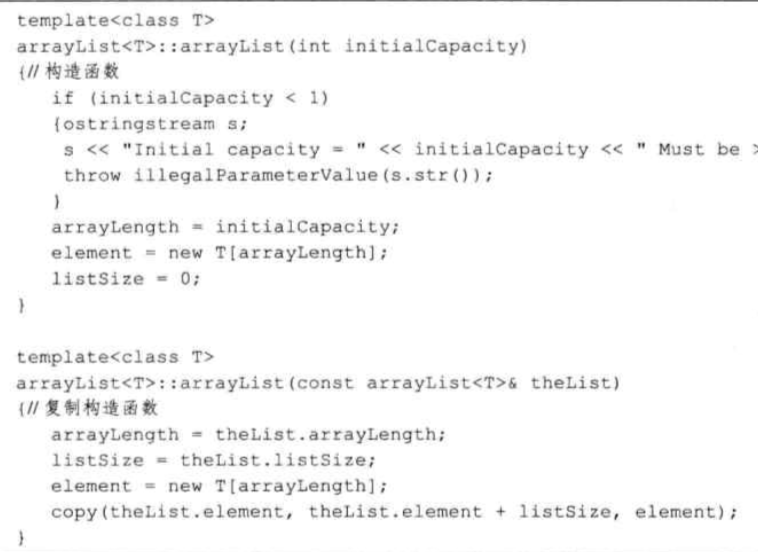

* `arrayList`实例化

  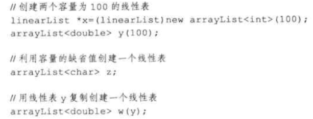

* 

# 顺序存储结构的插入与删除

* 获得元素操作

  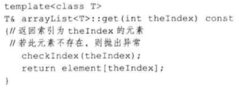

* 插入操作
  * 如果插入位置不合理，抛出异常

  * 如果线性表长度大于等于数组长度，则抛出异常或动态增加容量

  * 从最后一个元素开始向前遍历到第`i`个位置，分别将他们都向后移动一个位置

  * 将要插入元素填入位置i处

  * 表长加1

    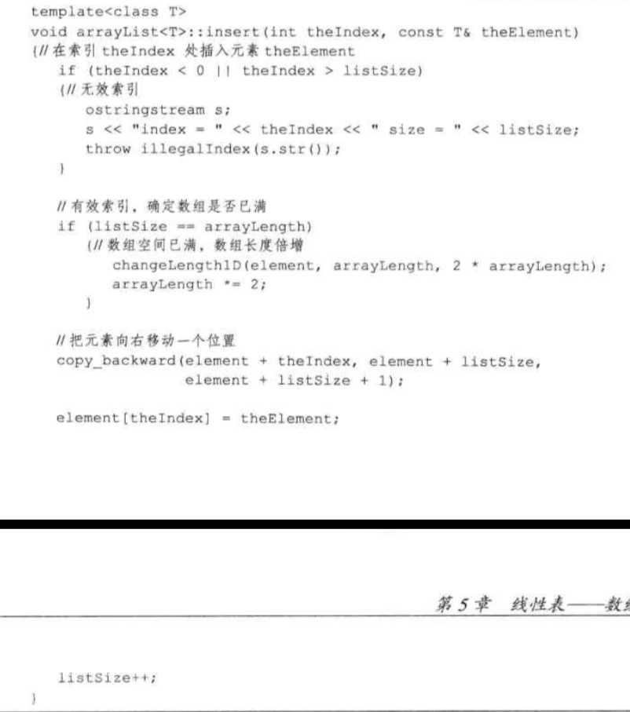

* 删除操作
  * 如果删除位置不合理，抛出异常

  * 取出删除元素

  * 从删除元素位置开始遍历到最后一个元素位置，分别将它们都向前移动一个位置

  * 表长减1

    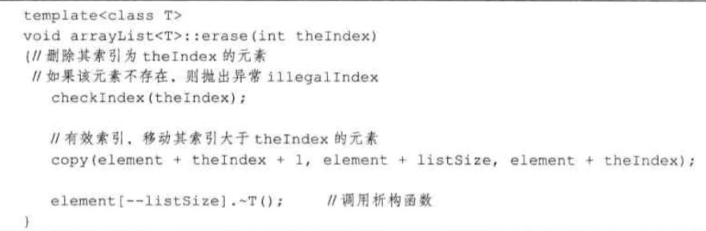

* 线性表的顺序存储结构，在存、读数据时，不管是哪个位置，时间复杂度都是`O(1)`；而插入或删除时，时间复杂度都是`O(n)`；说明它适合元素个数不太变化，而更多是存取数据的应用

* C++迭代器：一个指针，指向对象的一个元素，可以用来逐个访问对象的所有元素

* 线性表顺序存储结构的优缺点

  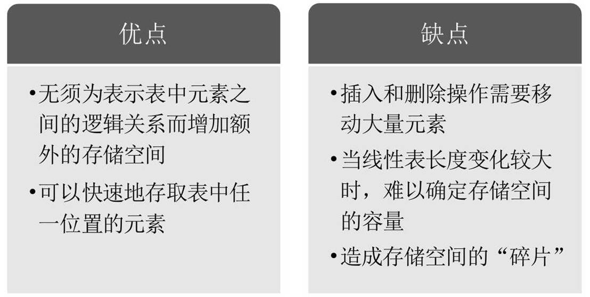

# 线性表的链式存储结构

* 结构特点：用一组任意的存储单元存储线性表的数据元素，这组存储单元可以是连续的，也可以是不连续的

  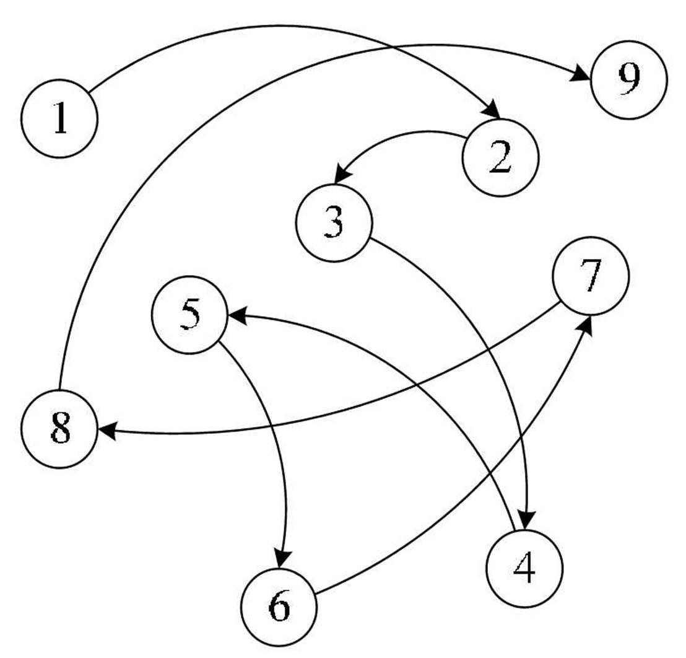

* 定义：为了表示每个数据元素$a_i$与其直接后继数据元素$a_{i+1}$之间的逻辑关系，对数据元素$a_i$来说，除了存储其本身的信息之外，还需存储一个指示其直接后继的信息（即直接后继的存储位置）
  * 数据域：存储数据元素信息的域

  * 指针域：存储直接后继位置的域

  * 指针（链）：指针域中存储的信息

  * 结点（Node）：两部分信息组成数据元素$a_i$的存储映像

  * n个结点链链接成一个链表，即为线性表的链式结构；因为此链表的每个结点中只包含一个指针域，所以叫做单链表

    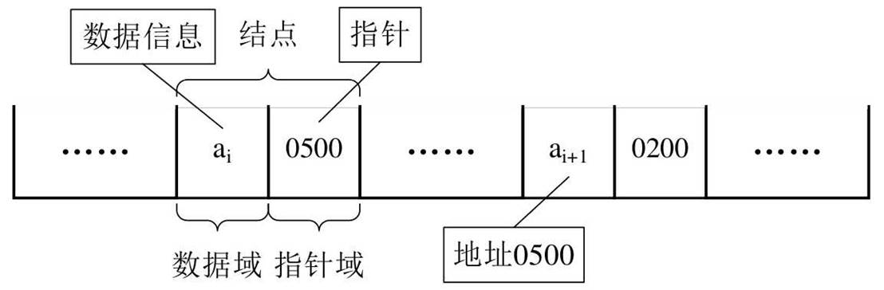

  * 头指针：链表中第一个结点的存储位置

  * 线性链表的最后一个结点指针为“空”NULL

    

  * 在单链表的第一个结点前附设一个结点，称为头结点；头结点的数据域可以不存储任何信息，也可以存储线性表的长度等附加信息，头结点的指针域存储指向第一个结点的指针

    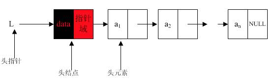

  * 链表中可以没有头结点，但不能没有头指针。头结点的存在使得空链表与非空链表处理一致，也方便对链表的开始结点的插入或删除操作

  * 空链表：头结点的指针域为“空”

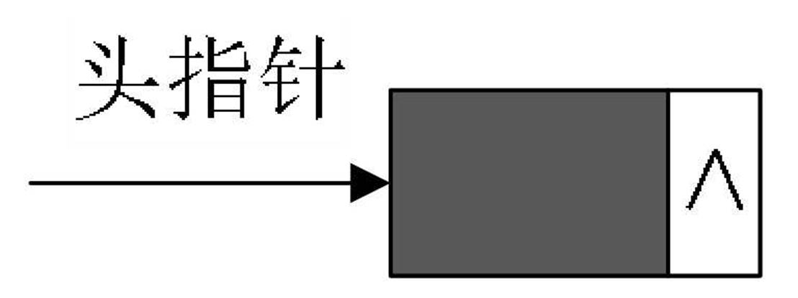

* 头指针与头结点的异同

  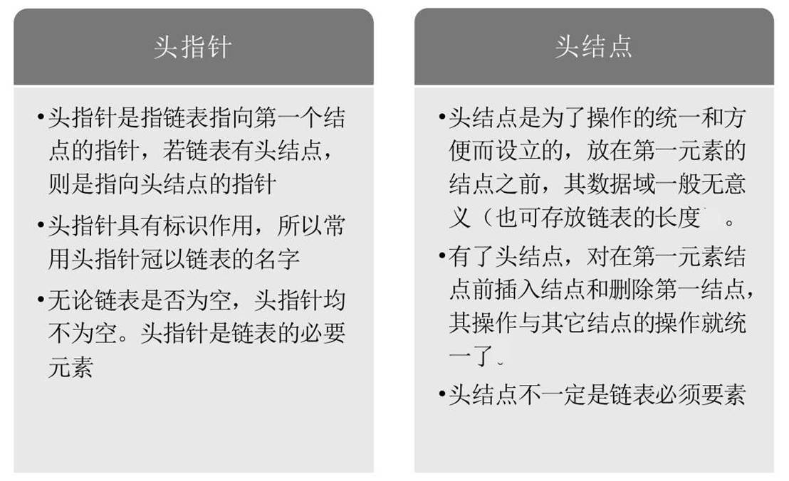

* 线性表链式存储结构代码描述

  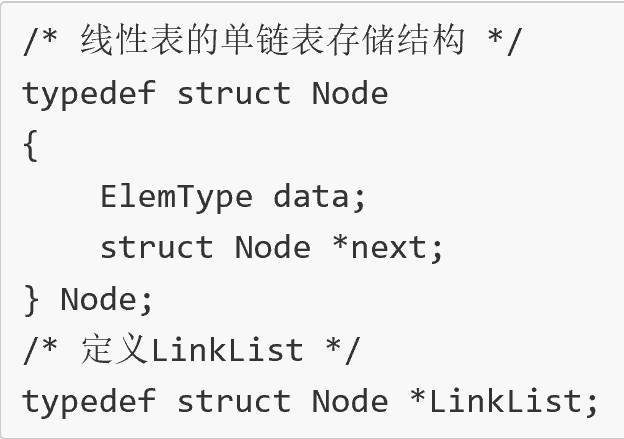

# 单链表的读取

* 获得链表第i个数据的算法思路
  * 声明一个结点p指向链表第一个结点，初始化j从1开始
  * 当j<i时，就遍历链表，让p的指针就向后移动，不断指向下一结点，j累加1
  * 若到链表末尾p为空，则说明第i个元素不存在

  * 否则查找成功，返回结点p的数据

    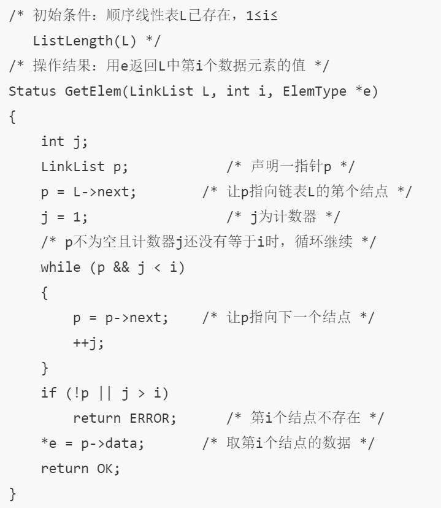

* 最坏情况的时间复杂度是O(n)，最好情况的时间复杂度是O(1)

# 单链表的插入与删除

* 插入：假设结点s要出入到结点p和q之间，p->next=q（未知），只需让p的后继结点改成s的后继结点，再把结点s变成p的后继结点

  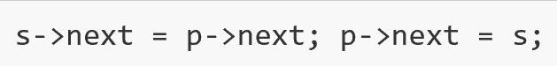

  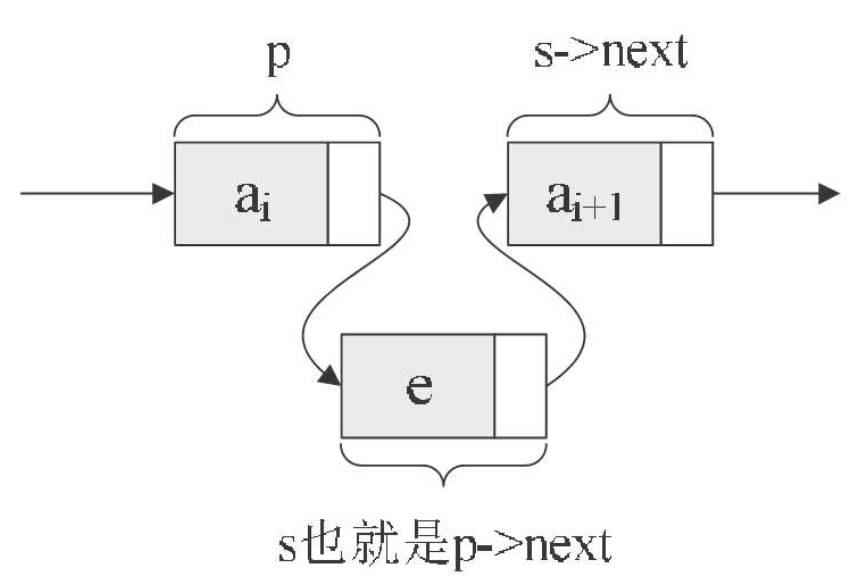

* 单链表第i个数据插入结点的算法思路
  * 声明一结点p指向第一个结点，初始化j从1开始

  * 当j<i时，就遍历链表，让p的指针向后移动，不断指向下一结点，j累加1

  * 若到链表末尾p为空，则说明第i个元素不存在

  * 否则查找成功，在系统中生成一个空结点s

  * 将数据元素e赋值给一个空结点s

  * 将数据元素e赋值给s->data

  * 单链表的插入标准语句s->next=p->next;p->next=s

  * 返回成功

    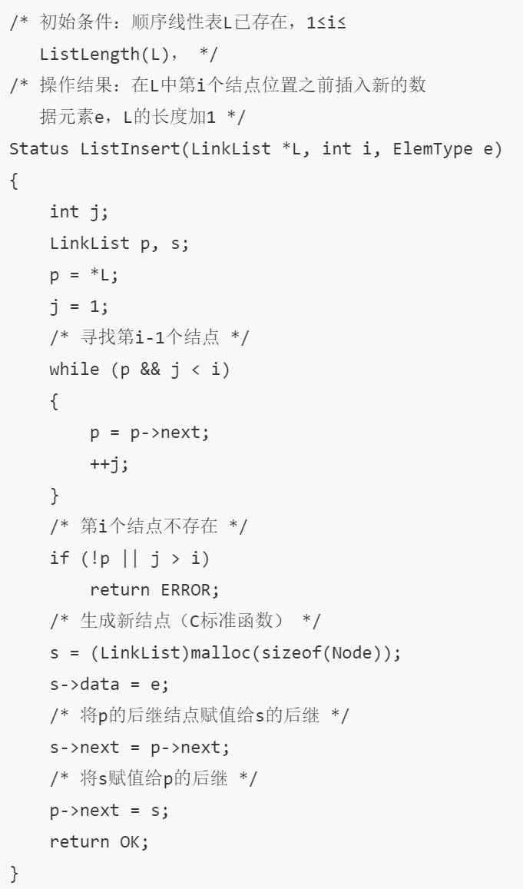

* 单链表的删除：结点p、q、q->next，要删除q

  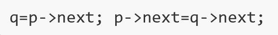

  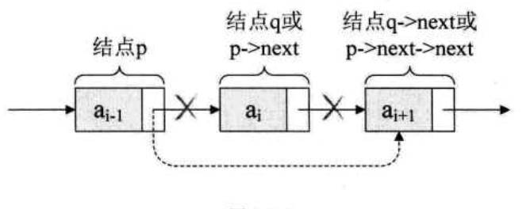

  * 声明一结点p指向链表第一个结点，初始化j从1开始
  * 当j<i时，就遍历链表，让p的指针向后移动，不断指向下一结点，j累加1
  * 若到链表末尾p为空，则说明第i个元素不存在
  * 否则查找成功，将预删除的结点p->next赋值给q
  * 单链表的删除标准语句p->next=q->next
  * 将q结点中的数据赋值给e，作为返回
  * 释放q结点
  * 返回成功

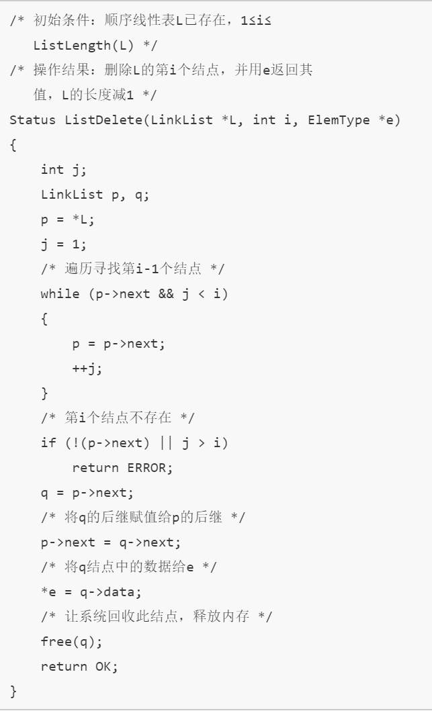

* 单链表插入和删除算法由两个部分组成：遍历查找第i个元素；插入和删除元素，时间复杂度是O(n)
  * 对于顺序存储结构，删除和插入每次都是O(n)
  * 对于链式存储，只有第一次是O(n)，之后都是O(1)
  * 对于插入或删除数据越频繁的操作，单链表的效率优势越是明显

# 单链表的整表创建

* 顺序存储结构和链式存储结构创建的不同
  * 顺序存储结构的创建，本质上就是数组的初始化，声明一个类型和大小的数组并赋值的过程
  * 单链表的创建的过程是一个动态生成链表的过程，即从“空表”的初始状态，依次建立各元素结点，并逐个插入链表

* 单链表整表创建的算法思路
  * 声明一结点p和计数器变量I
  * 初始化一空链表L
  * 让L的头结点的指针指向NULL，即建立一个带头结点的单链表
  * 循环：
    * 生成一新结点赋值给p
    * 随机生成一数字赋值给p的数据域p->data
    * 将p插入到头结点与前一新结点之间

* 创建单链表的代码描述
  * 头插法：使用插队的方法，始终让新结点在第一的位置

    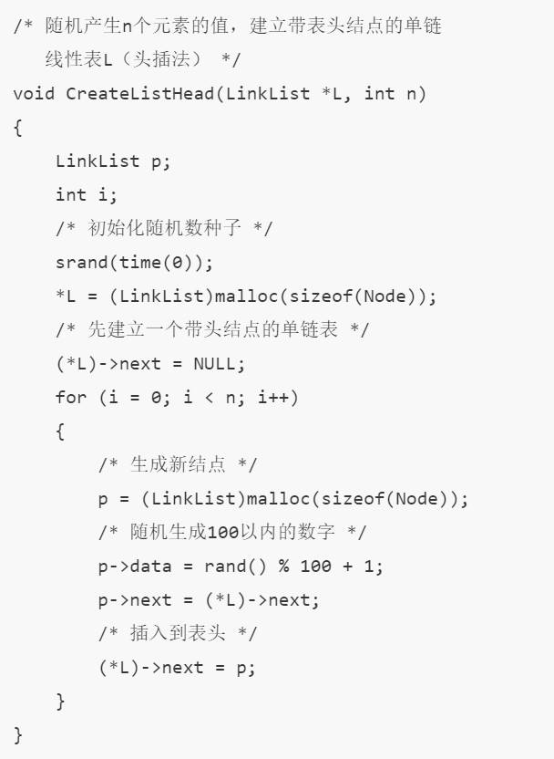

  * 尾插法：每次新结点都插在终端结点的后面

    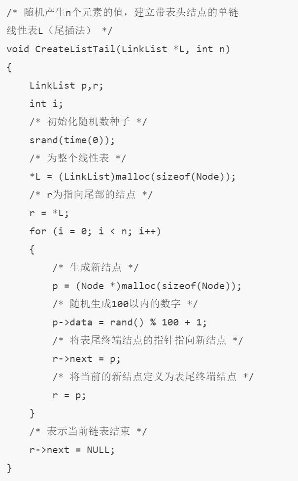

# 单链表的整表删除

* 单链表整表删除的算法思路
  * 声明一结点p和q
  * 将第一个结点赋值给p
  * 循环
    * 将下一结点赋值给q
    * 释放p
    * 将q赋值给p

* 代码实现

  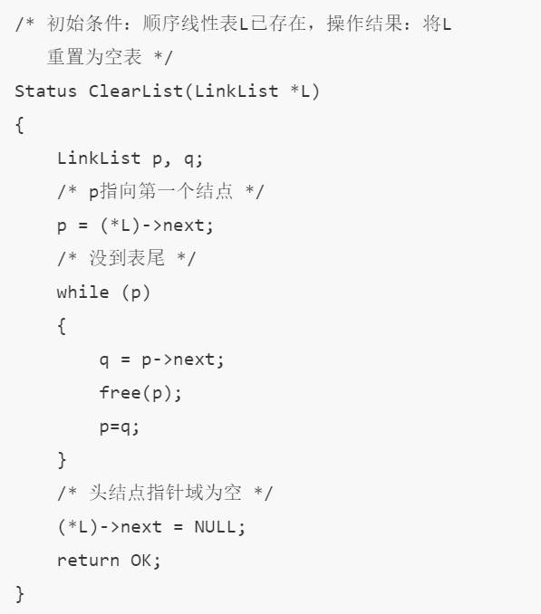

 

# 单链表结构与顺序存储结构优缺点

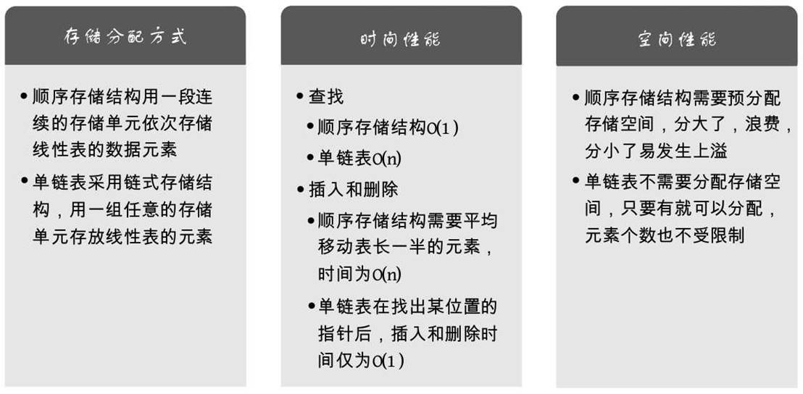

* 若线性表需要频繁查找，很少进行插入和删除操作时，宜采用顺序存储结构；若需要频繁插入和删除时，宜采用单链表结构

* 当线性表中的元素个数变化较大或者根本不知道有多少时，最好用单链表结构，这样就不需要考虑存储空间的大小问题

#  循环链表

* 单链表中由于每个结点只存储了向后的指针，到了尾标志就停止了向后链的操作，当中某一结点无法找到它的前驱结点

* 定义：将单链表中终端节点的指针端由空指针改为指向头结点，就使整个单链表形成一个环，这种头尾相接的单链表称为单循环链表

  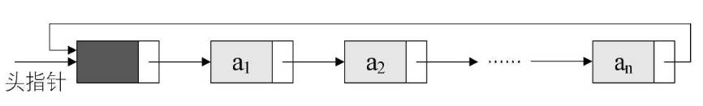

* 循环链表和单链表的主要差异就在于循环的判断条件上，原来是判断p->next是否为空，现在则是p->next不等于头结点，则循环未结束

# 双向链表

* 定义：在单链表的每个结点中，再设置一个指向其前驱结点的指针域

  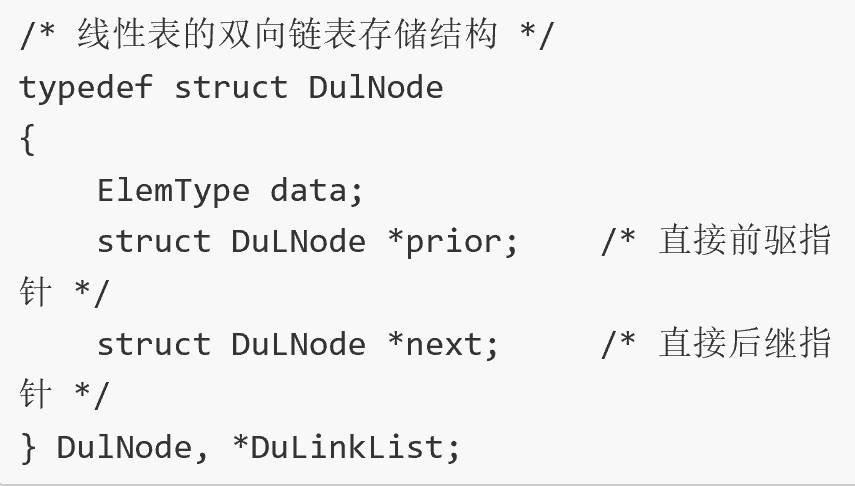

  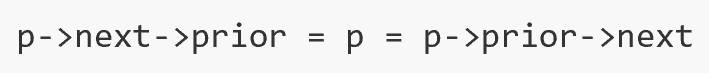

* 循环链表的双向链表

  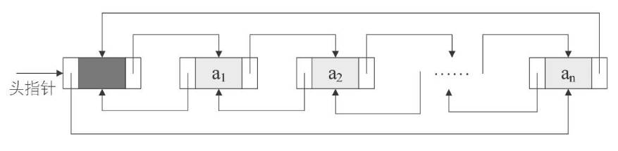

* 插入操作：将结点s插入到p和p->next
  * 先搞定s的前驱和后继

  * 再搞定后结点的前驱

  * 最后解决前结点的后继

    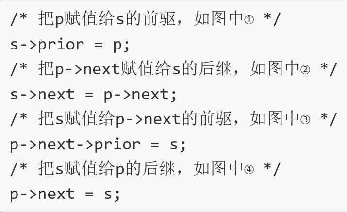

* 删除操作：删除结点p

  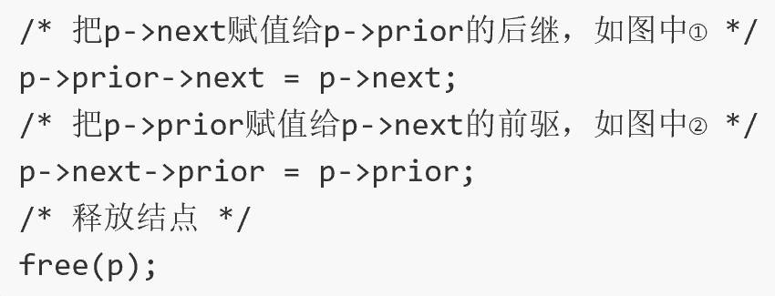

# 总结回顾


 