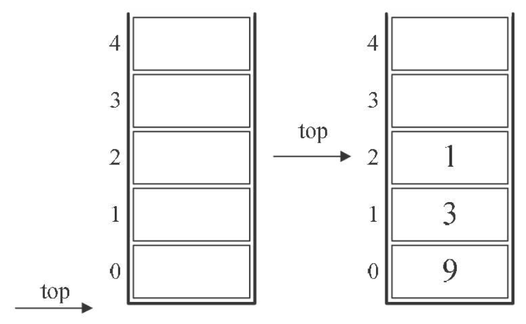

# 栈的定义

- 栈（stack）定义：限定仅在表尾进行插入和删除操作的线性表

  - 允许插入和删除的一端称为栈顶（top），另一端称为栈底（bottom）

  - 不含任何数据元素的栈称为空栈

  - 栈又称为后进先出（Last In First Out）的线性表，简称LIFO结构

  - 栈的插入操作，叫做进栈，也称压栈、入栈

  - 栈的删除操作，叫做出栈，也有叫做弹栈

    

- 栈的抽象数据类型

  - 插入称为push，删除称为pop

  - 栈本身是线性表，所以线性表的顺序存储和链式存储，对于栈来说，也是同样适用的

    

# 栈的顺序存储结构及实现

- 栈的顺序存储结构：简称为顺序栈，用数组来实现，下标为0的一端作为栈底

  - 定义一个top变量来指示栈顶元素在数组中的位置，top必须小于存储栈的长度StackSize

  - 当栈存在一个元素时，top等于0

  - 通常把空栈的判定条件定位top等于-1

    

- 栈的结构定义

  

- 进栈操作

  

  

- 出栈操作

  

-   栈的顺序存储结构的出栈和进栈都没有循环语句，因此时间复杂度均是O(1)

# 两栈共享空间

- 栈的顺序存储由于只准栈顶进出元素，所以不存在线性表插入和删除时需要移动元素的问题，但是必须事先确定数组存储空间大小，万一不够用，需要编程手段来扩展数组的容量，非常麻烦

- 假设有两个相同类型的栈，可以用一个数组来存储两个栈：一个栈的栈底为数组的始端，即下标为0，另一个栈底为数组的末端，即下标为n-1；如果两个栈增加元素，就是两端点向中间延伸

  

  - top1等于-1时，栈1为空；top2等于n时，栈2为空

  - top1+1 == top2为栈满

    

- 两栈共享的push方法，除了要插入元素值参数外，还需要判断是栈1还是栈2的栈号参数stackNumber

  

- 两栈共享空间的pop方法

  

-   当两个栈的空间需求有相反关系时，即一个栈增长时另一个栈在缩短，使用这样的数据结构比较好

# 栈的链式存储结构及实现

- 栈的链式存储结构：简称为链栈，把栈顶放在单链表的头部，通常对于链栈不需要头结点

  

- 链栈的结构代码

  

- 进栈操作

  

  

- 出栈操作

  

  

-   链栈的进栈push和出栈pop操作都很简单，没有任何循环操作，时间复杂度均为O(1)

-   顺序栈与链栈的异同

    -   时间复杂度上是一样的，均为O(1)

    -   空间性能

        -   顺序栈需要事先确定一个固定的长度，可能存在内存空间浪费的问题，但优势是存取定位很方便

        -   链栈需要每个元素都有指针域，增加了内存开销，但对于栈的长度无限制

# 栈的应用——递归

- 斐波那契数列

  - 数字序列1，1，2，3，5，8，13…..

  - 特点：前面相邻两项之和，构成了后一项

  - 数学公式$F(n) = \left\{ \begin{matrix} 0,n = 0 \\ 1,n = 1 \\ F(n - 1) +
    F(n - 2),\mathrm{n} > 1 \\ \end{matrix} \right.\$

  - 递归代码

    

    

-   递归定义：把一个直接调用自己或通过一系列的调用语句间接地调用自己的函数，称作递归函数

    -   每个递归定义必须至少有一个条件，满足时递归不再进行，即不再引用自身而是返回值退出

    -   迭代和递归的区别

        -   迭代使用的是循环结构，递归使用的是选择结构

        -   迭代能使程序的结构更清晰、更简洁、更容易让人理解，从而减少读懂代码的时间

        -   大量的递归调用会建立函数的副本，会耗费大量的时间和内存

        -   迭代则不需要反复调用函数和占用额外的内存

-   上述为递归如何执行前行和退回阶段。退回的顺序是前行顺序的逆序。

    -   在退回过程中，可能要执行某些动作，包括恢复在前行过程中存储起来的某些数据

    -   在前行阶段，对于每一层递归，函数的局部变量、参数值以及返回地址都被压入栈中

    -   在
        退回阶段，位于栈顶的局部变量、参数值和返回地址被弹出，用于返回调用层次中执行代码的其余部分，也就是恢复了调用的状态

# 栈的应用——四则运算表达式求值

- 括号是成对出现的，可以用栈结构，碰到左括号将其进栈，出现右括号时，让栈顶的括号出栈，期间让数字运算

- 后缀（逆波兰，RPN）表示法定义：不需要括号的后缀表达法——所有的符号都是在要运算数字的后面出现

  - 规则：从左到右遍历表达式的每个数字和符号，遇到是数字就进栈，遇到是符号，就将处于栈顶两个数字出栈进行运算

  - 要计算“9+(3-1)\*3+10/2”，则表示为"9 3 1 - 3 \* + 10 2 / +"

    - 初始化一个空栈

    - 前三个都是数字，进栈

      

    - 接下来是“-”，将栈中的1出栈作为减数，3出栈作为被减数，计算3-1得到2，再将2进栈

      

    - 再将3进栈

    - 后面是“\*”，将栈顶的3和2出栈，相乘，得到6，进栈

      

    - 下面是“+”，6和9出栈，相加，得到15，进栈

    - 接下来是数字，10和2进栈

    - 接下来是“/”，栈顶的2作为除数，10作为被除数，相除，得到5，进栈

      

    - 最后是“+”，15与5出栈并相加，得到20，进栈

    - 结果是20出栈，栈变空

- 表达式转化为后缀表达式

  - 规则：从左到右遍历表达式中的每个数字和符号，若是数字就输出，若是符号则判断其与栈顶符号的优先级，是右括号或优先级低于栈顶符号则栈顶元素依次出栈并输出，并将当前符号进栈，一直到最终输出后缀表达式为止

  - 将中缀表达式“9+（3-1）\*3+10/2”转化为后缀表达式“9 3 1 - 3 \* + 10 2 / +”

    - 初始化一空栈

    - 第一个字符是数字9，输出9，后面是符号“+”，进栈

      

    - 第三个字符是“（”，依然是符号，因其只是左括号，还未配对，故进栈

    - 第四个字符是数字3，输出，接着是“-”，进栈

      

    - 接下来是数字1，输出，后面是符号“）”，栈顶依次出栈，并输出，直到“（”出栈为止

    - 接下来是数字3，输出，接下来是符号“\*”，优先级高于栈顶“+”，所以“\*”进栈

      

    - 之后是符号“+”，优先级低于栈顶“\*”，因此栈中元素出栈并输出（没有比“+”更低的优先级，所以全部出栈），之后“+”进栈

    - 接着数字10，输出，后是符号“/”,所以“/”进栈

      

    - 最后是数字2，输出，之后全部出栈并输出

      

