# 队列的定义

- 队列（quene）定义：只允许在一端进行插入操作，而在另一端进行删除操作的线性表

  - 队列是一种先进先出（First In First Out）的线性表，简称FIFO

  - 允许插入的一端称为队尾，允许删除的一端称为队头

    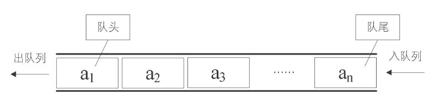

# 队列的抽象数据类型

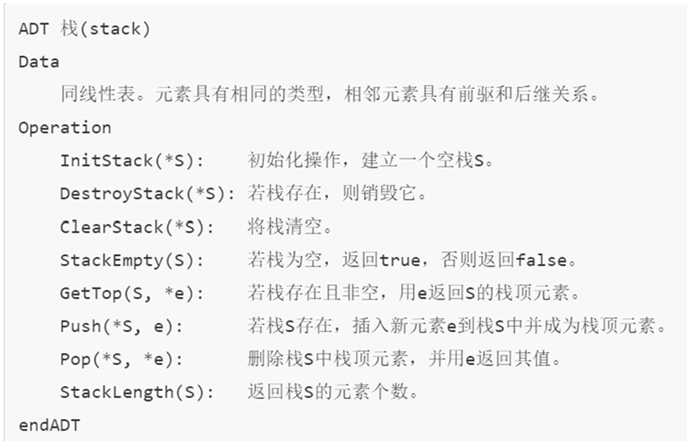

# 循环队列

- 顺序存储入列：在队尾追加一个元素，不需要移动任何元素，时间复杂度为O(1)

  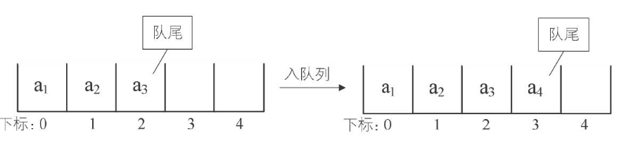

- 顺序存储出列：队列中的所有元素都得向前移动，时间复杂度为O(n)

  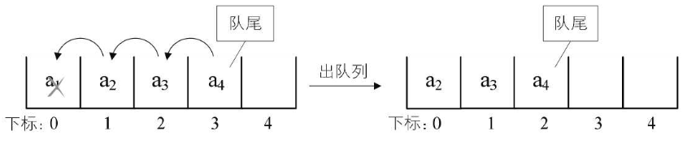

- 引入两个指针，front指针指向队头元素，rear指针指向队尾元素的下一位置

  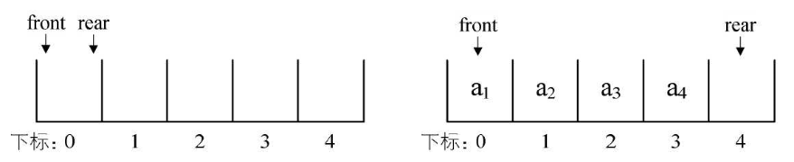

- 有一种情况是font在数组3的位置，再插入元素时，rear向后移，溢出了，称为假溢出，因为front前面还有空间

- 循环队列：队列的头尾相接的顺序存储结构

  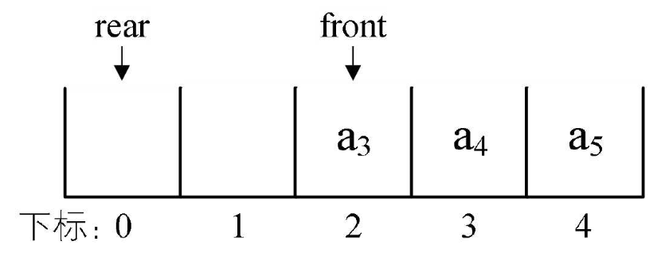

- 循环队列的顺序存储结构代码

  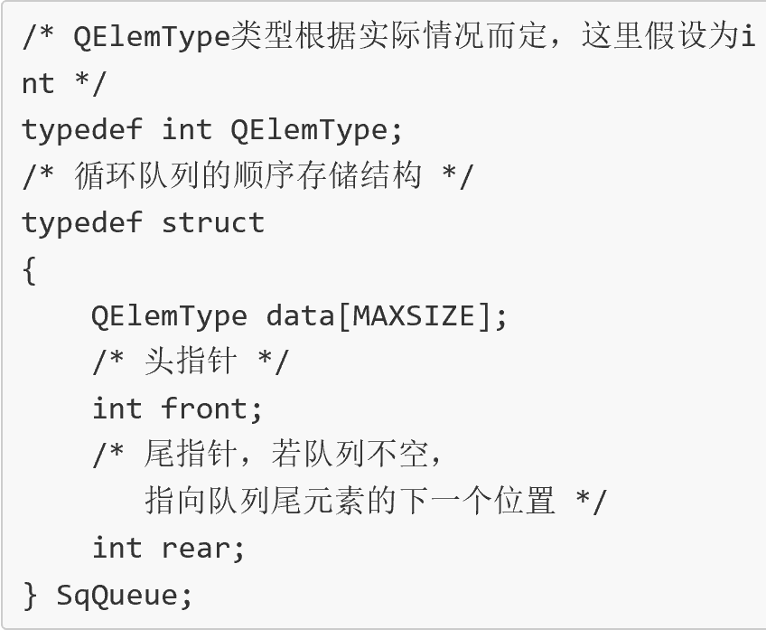

 

# 队列的链式存储结构及实现

- 队列的链式存储结构：其实就是线性表的单链表，只不过它只能尾进头出，简称链队列

  - 队头指针指向链队列的头结点，而队尾指针指向终端结点

    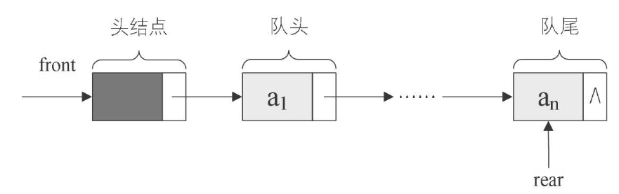

- 空队列时，front和rear都指向头结点

  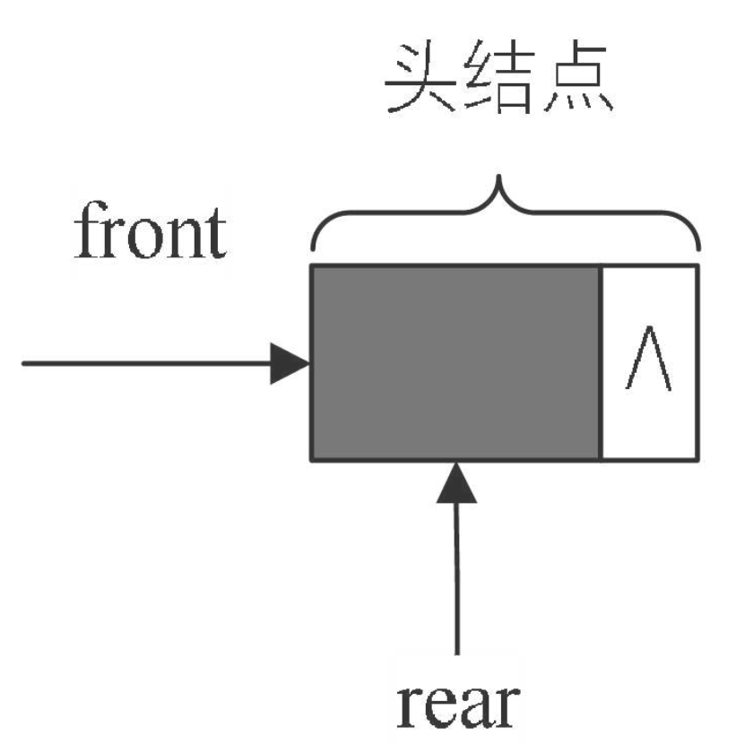

- 链队列的结构

  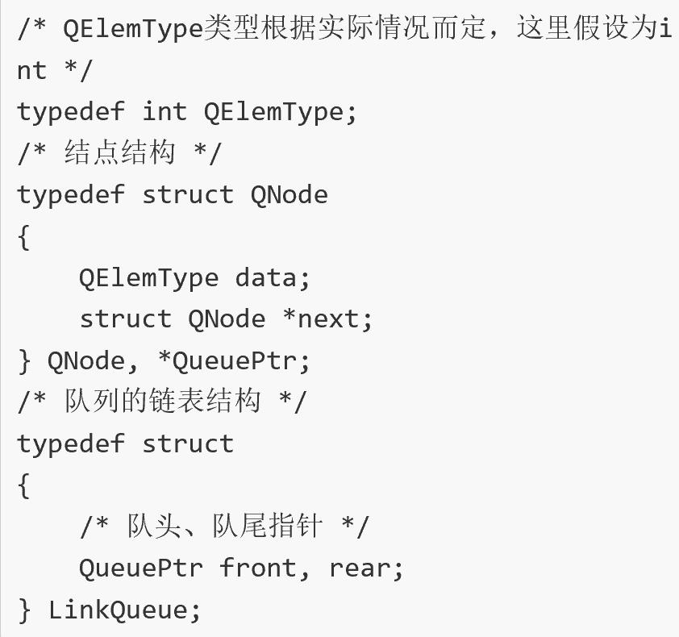

- 入队操作

  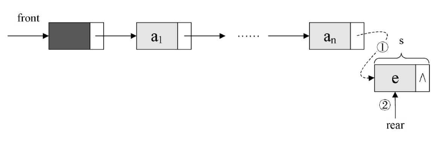

  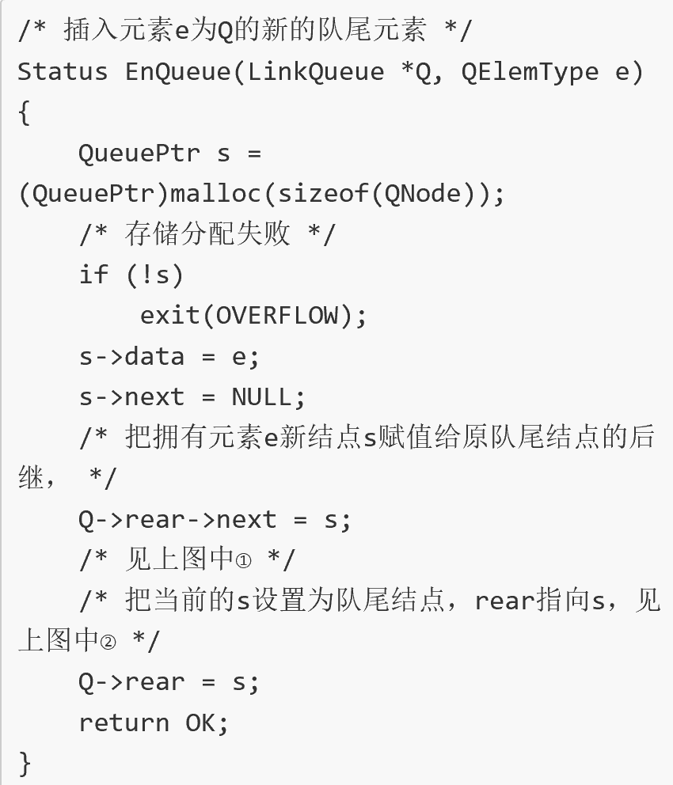

- 出队操作

  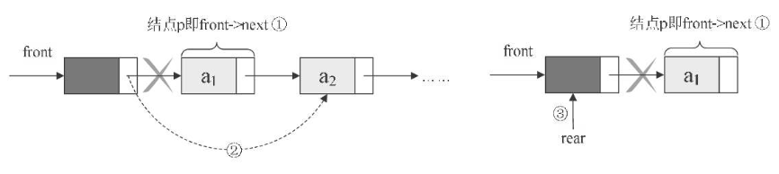

  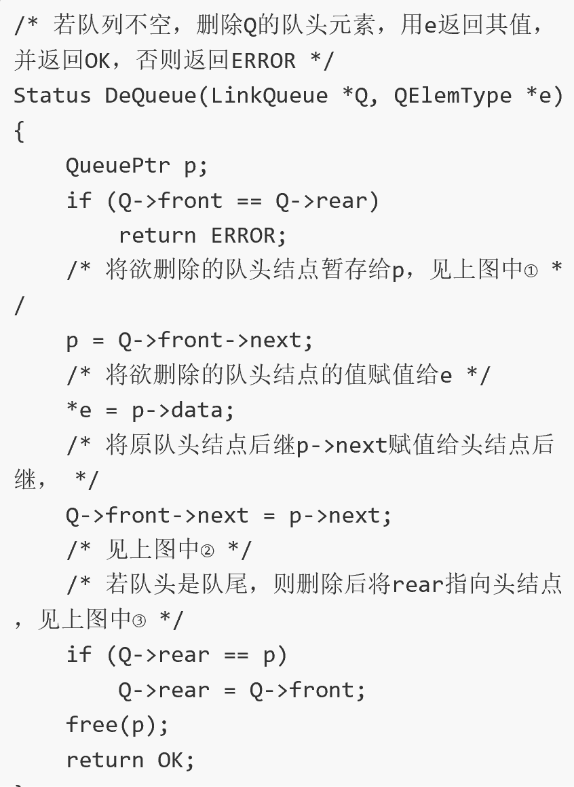

-   循环队列与链队列的比较

    -   时间上都是O(1)，不过循环队列（顺序结构）是事先申请好空间，使用期间不释放，而对于链队列，每次申请和释放结点

    -   空间上，循环队列必须有一个固定的长度，所以就有了存储元素个数和空间浪费的问题，而链队列不存在这个问题，尽管需要一个指针域，会产生一些空间上的开销

**总结回顾**

- 栈和队列都是特殊的线性表

  -   栈（stack）是限定仅在表尾进行插入和删除操作的线性表

  -   队列（quene）是只允许在一端进行插入操作，而在另一端进行删除操作的线性表

- 对于栈来说，如果是两个相同数据类型的栈，则可以用数组的两端作栈顶的方法来让两个栈共享数据，可以最大化地利用数组的空间

- 对于队列来说，为了避免数组插入和删除时需要移动数据，于是引入了循环队列，使得队头和队尾可以在数组中循环变化：解决了移动数据的时间损耗，使得本来插入和删除时O(n)的时间复杂度变成了O(1)

  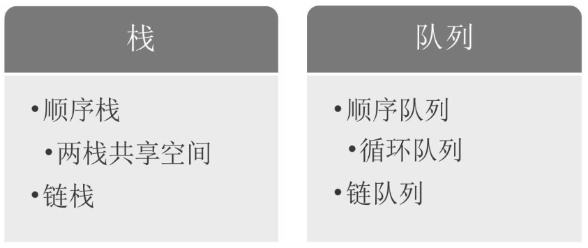
