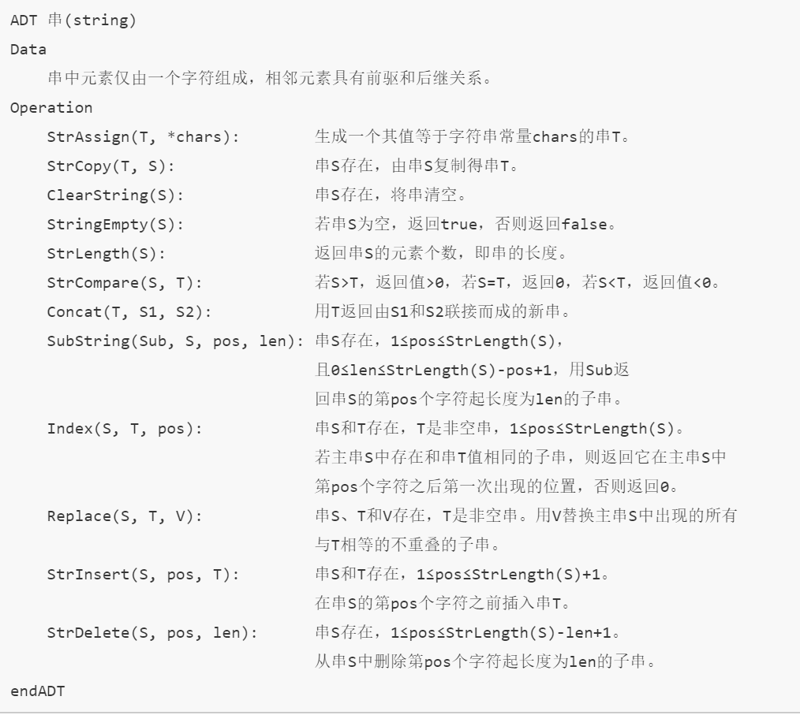
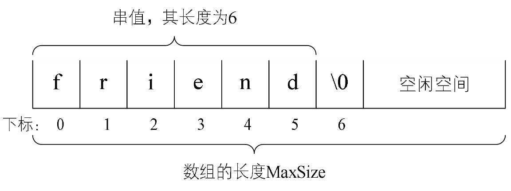
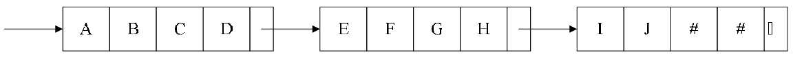
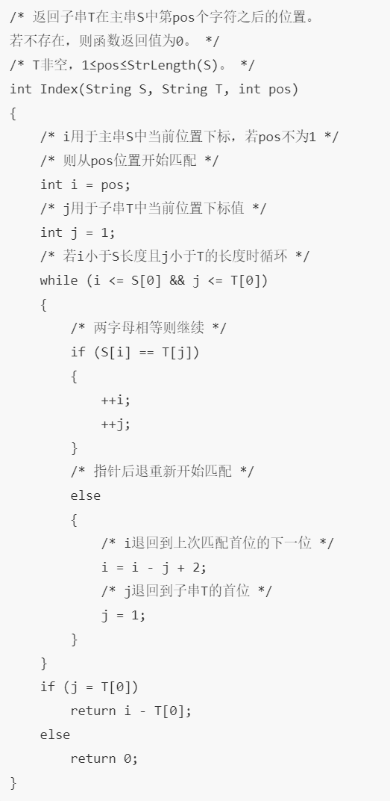

# 串的基本概念

-   定义：串（string）是由零个或多个字符组成的有限序列，又名叫字符串

    -   一般记为$\left. \ s = "a_{1}a_{2}\cdots a_{n}"(n \geq 0 \right)$

    -   串中的字符数目n称为串的长度

    -   零个字符的串称为空串（null string），长度为0

    -   空格串：只包含空格的串

    -   串中任意个数的连续字符组成的子序列被称为该串的子串，相应地，包含子串的串称为主串

- 串的比较：通过组成串的字符之间的编码来进行的

  -   计算机符号编码演变

      -   计算机常用的是ASCⅡ编码，即由7位二进制数表示一个字符，总共可以表示128个字符，后来发现不够，于是扩展由8位二进制数表示一个字符，一共可以表示256个字符

      -   但是256个字符无法满足各种语言的需求，有了Unicode编码，由16位的二进制数表示一个字符，可以表示约65万个字符，为了和ASCⅡ码兼容，Unicode的前256个字符与ASCⅡ码完全相同

  -   当串的长度以及它们各个对应位置的字符都相等时，才是相等

  -   比较大小，给定两个串，$s = "a_{1}a_{2}\cdots a_{n}"$，$t =
      "b_{1}b_{2}\cdots b_{m}"$
      -   n\<m，且$$a_{i} = b_{i}$$，则s\<t

          -   “lover”与“love”，前面字符都相同，长的字符大

      -   存在某个k≤min(m,n)，使得$$a_{k} < b_{k}$$，则s\<t

          -   “happen”与“happy”，第五个字符“e”\<“y”，所以“happy”大

- 串的抽象数据类型

  

# 串的存储结构

- 串的顺序存储结构：用一组地址连续的存储单元来存储串中的字符序列，按照预定义的大小，为每个定义的串变量分配一个固定长度的存储区，“\\0”表示串的终结

  

- 串值的存储空间可在程序执行过程中动态分配而得；比如在计算机中存在一个自由存储区，叫做“堆”，这个堆可由C语言的动态分配函数malloc()和free()来管理

- 串的链式存储结构：与线性表相似，每个节点可以存放一个字符，也可以存放多个字符，最后一个结点未占满时，可以用“\#”或其他串值字符填满

  

-   串的链式存储结构除了在连接串与串操作时有一定方便之外，总的来说不如顺序存储灵活，性能也不如顺序存储结构好

# 朴素的模式匹配算法

- 子串在主串的定位操作叫做串的模式匹配

- 假如要从主串S="goodgoole"中，找到T=“google”的位置

  - 对主串的每一个字符作为子串开头，与要匹配的字符串进行匹配。对主串做大循环，每个字符开头做T的长度的小循环，直到匹配成功或全部遍历完成为止

  - 实现代码：假设主串S和要匹配的子串T的长度存在S[0]和T[0]中

    

-   时间复杂度

    -   最好的情况是一开始就匹配成功，时间复杂度为O(1)

    -   稍差的情况是匹配的子串在主串的最后，前面匹配时主串第一个就不匹配，子串就不需要循环；时间复杂度为O(m+n)，n为主串的长度，m为子串的长度根据等概率原则，平均是(n+m)/2次查找，时间复杂度为O(m+n)

    -   最差的情况是每次不成功的匹配都发生在串T的最后一个字符，因此时间复杂度为O([n-m+1]\*m)

# KMP模式匹配算法

*TODO*

# 总结

-   串的本质上是一种线性表的扩展，但对于线性表关注一个个元素来说，对串这种结构更多的是关注它子串的应用问题，如查找、替换等操作。