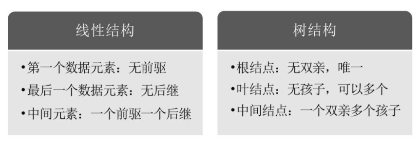
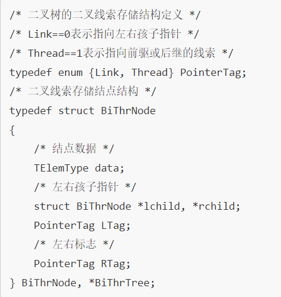
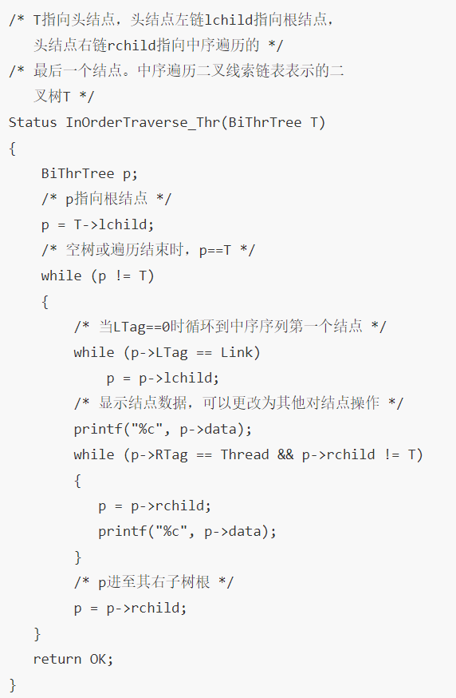

# 树的基本概念

- 树（Tree）定义：是n（n≥0）个结点的有限集。

  - n=0时称为空树

  - 在任意一颗非空树中：

    - 有且只有一个特定的称为根（root）的结点

    - 当n＞1时，其余结点可分为m（m＞0）个互不相交的有限集T1、T2、…Tm，其中每一个集合本身又是一棵树，并且称为根的子树（SubTree）

      

      

- 结点分类

  - 树的结点包含一个数据元素及若干指向其子树的分支

  - 结点的度（Degree）：结点拥有的子树

    -   度为0的结点称为叶结点（Leaf）或终端结点

    -   度不为0的结点称为非终端结点或分支结点

  - 除根结点之外，分支结点也称为内部结点

  - 树的度是树内各结点的度的最大值

    

-   结点间关系

    -   结点的子树的根称为该结点的孩子（Child）；相应地，该结点称为孩子的双亲（Parent）

    -   同一个双亲的孩子之间互称兄弟（Sibling）

- 结点的祖先是从根到该结点所经分支上的所有结点，对于H来说，D、B、A都是它的祖先；反之，以某结点为根的子树中的任一结点都称为该结点的子孙

  

- 树的其他相关概念

  - 结点的层次（level）从根开始定义起，根为第一层，根的孩子为第二层；其双亲在同一层的结点互为堂兄弟

  - 树中结点的最大层次称为树的深度（Depth）或高度

    

- 如果将树中结点的各子树看成从左至右是有次序的，不能互换的，则称该树为有序树，否则称为无序树

- 森林（Forest）是m（m≥0）棵互不相交的树的集合

- 线性表与树的结构的区别

  

# 树的抽象数据类型

# 树的存储结构

- 双亲表示法：以一组连续空间存储树的结点，在每个结点中，附设一个指示器指示其双亲结点到链表中的位置

  - data是数据域，存储结点的数据信息；parent是指针域，存储该结点的双亲在数组中的下标

    

- 结构定义代码

  

- 根结点的位置域设置为-1

  

  

-   可以根据结点的parent指针很容易找到它的双亲结点，时间复杂度为O(1)，直到parent为-1时，表示找到了树结点的根；如果想知道结点的孩子是什么，只能遍历整个结构才行

*TODO*

-   孩子表示法

    -   每个结点有多个指针域，其中每个指针指向一颗子树的根节点，把这种方法叫做多重链表表示法

    -   TODO

# 二叉树的基本概念

- 二叉树（Binary
  Tree）：n（n≥0）个结点的有限结点，该集合或者为空集（称为空二叉树），或者由一个根结点和两棵互不相交的、分别称为根结点的左子树和右子树的二叉树组成

  

- 二叉树的特点

  - 每个结点最多有两棵子树，所以二叉树中不存在度大于2的结点

    -   注意：不是只有两棵子树，而是最多有两棵子树；没有子树或者有一棵子树都是可以

  - 左子树和右子树是有顺序的，次序不能任意颠倒

  - 即使树中某结点只有一棵子树，也要区分它是左子树还是右子树，下图是两棵不同的树

    

- 二叉树的五种基本形态

  -   空二叉树

  -   只有一个根结点

  -   根结点只有左子树

  -   根结点只有有右子树

  -   根结点既有左子树又有右子树

- 特殊二叉树

  - 斜树：所有的结点都只有左子树的二叉树叫左斜树；所有结点都是只有右子树的二叉树叫右斜树，统称斜树

    -   每一层都只有一个结点

    -   结点的个数与二叉树的深度相同

    -   线性表结构可以理解为是树的一种极其特殊的表现形式

  - 满二叉树：在一棵二叉树中，如果所有分支结点都存在左子树和右子树，并且所有叶子都在同一层上

    
    
    - 叶子只能出现在最下一层
    
    - 非叶子结点的度一定是2
    
    - 在同样深度的二叉树中，满二叉树的结点个数最多，叶子数最多
    
  - 完全二叉树：对一棵具有n个结点的二叉树按层序编号，如果编号为i（1≤i≤n）的结点与同样深度的满二叉树中编号为i的结点在二叉树中位置完全相同

    
    - 满二叉树一定是一棵完全二叉树，但完全二叉树不一定是满的

    -   叶子结点只能出现在最下两层

    -   最下层的叶子一定集中在左部连续位置

    -   倒数二层，若有叶子结点，一定都在右部连续位置

    -   若结点度为1，则该结点只有左孩子，即不存在只有右子树的情况

    -   同样结点数的二叉树，完全二叉树的深度最小

    -   如何判断某二叉树是否是完全二叉树：看着树的示意图，默默给每个结点按照满二叉树的结构逐层顺序编号，如果编号出现空档，就说明不是完全二叉树

# 二叉树的性质

- 二叉树的第i层上至多有$2^{i-1}$个结点（i≥1）

- 深度为k的二叉树至多有$2^k-1$个结点（k≥1）

- 对任何一棵二叉树T，如果其终端结点数为n0，度为2的结点数为n2，则n0=n2+1

- 具有n个结点的完全二叉树的深度为$|log_2n+1|$（|x|表示不大于x的最大整数）

- 如果对一棵有n个结点的完全二叉树（其深度为[log2n]+1）的结点按层序编号（从第1层到第[log2n]+1层，每层从左到右），对任一结点i（1≤i≤n）有：

  - 如果i=1，则结点i是二叉树的根，无双亲；如果i＞1，则其双亲是结点[i/2]

  - 如果2i＞n，则结点i无左孩子（结点i为叶子结点）；否则其左孩子是结点2i

  - 如果2i+1＞n，则结点i无右孩子；否则其右孩子是结点2i+1

    

# 二叉树的存储结构

- 二叉树的顺序存储结构：用一维数组存储二叉树中的结点，并且结点的存储位置，也就是数组的下标要能体现结点之间的逻辑关系

  - 完全二叉树的顺序存储

    

    
    
  - 一般的二叉树的顺序存储：尽管层序编号不能反映其逻辑关系，但是可以将其按完全二叉树编号，只是，把不存在的结点设置为“\^”；下图中浅颜色的结点并不存在

  

  

- 考虑一种极端的情况，一棵深度为k的右斜树，只有k个结点，却需要分配2k-1个存储单元空间，显然是对存储空间的浪费，所以，顺序存储结构一般只用于完全二叉树

  

- 二叉链表：二叉树每个结点最多有两个孩子，所以链表中有一个数据域和两个指针域

  - data是数据域

  - lchild和rchild都是指针域，分别存放指向左孩子和右孩子的指针

    

- 二叉链表的结点结构定义代码

  

  

# 遍历二叉树

- 二叉树的遍历（traversing binary
  tree）：从根结点出发，按照某种次序依次访问二叉树中所有结点，使得每个结点被访问一次且仅被访问一次

- 二叉树遍历方法

  - 前序遍历：若二叉树为空，则空操作返回；否则先访问根结点，然后前序遍历左子树，再前序遍历右子树

    - 例：下图遍历顺序为ABDGH-CEIF

      

- 中序遍历：若树为空，则空操作返回；否则从根结点开始（注意并不是先访问根结点），中序遍历根结点的左子树，然后是访问根结点，最后中序遍历右子树

  - 例：下图遍历顺序为GDHBAE-ICF

    

- 后序遍历：若树为空，则空操作返回；否则从左到右先叶子后结点的方式遍历访问左右子树，最后访问根结点

  - 例：下图遍历顺序为GHDBIEFCA

    

- 层序遍历：若树为空，则空操作返回；否则从树的第一层，也就是根结点开始访问，从上而下逐层遍历，在同一层中，按从左到右的顺序对结点逐个访问

  - 例：下图遍历访问顺序为ABCDEFGHI

    

- 前序遍历算法：二叉树的定义是采用递归的方式，实现遍历算法也可以采用递归

  - 代码

    

- 假设有一棵二叉树T，已经用二叉链表结构存储在内存当中，调用PreOrderTraverse（T）函数去先序遍历

  

- 调用PreOrderTraverse（T），T根结点不为null，所以执行printf，打印字母A

  

- 调用PreOrderTraverse（T-\>lchild）；访问A结点的左孩子B，不为null，执行printf显示字母B

  

- 再次递归调用PreOrderTraverse（T-\>lchild）；访问B结点的左孩子D，执行printf显示字母D

  

- 再次递归调用PreOrderTraverse（T-\>lchild）；访问D结点的左孩子H，执行printf显示字母H

  

- 再次递归调用PreOrderTraverse（T-\>lchild）；访问H结点的左孩子，此时因为H结点无左孩子，所以T==null，返回此函数；此时递归调用PreOrderTraverse（T-\>rchild）；访问了H结点的右孩子K，执行printf显示字母K

  

- 再次递归调用PreOrderTraverse（T-\>lchild）；访问K结点的左孩子，K结点无左孩子，返回，调用PreOrderTraverse（T-\>rchild）；访问了K结点的右孩子，也是null，返回；此函数执行完毕，返回到上一级递归的函数（即打印H结点时的函数），也执行完毕，返回到打印结点D时的函数，调用PreOrderTraverse（T-\>rchild）；访问了D结点的右孩子，不存在，此函数完毕，返回到B结点；调用PreOrderTraverse（T-\>rchild）；访问B结点的右孩子E，执行printf打印字母E

  

- 调用函数访问E的左右孩子；由于结点E没有左右孩子，返回结点B时的函数，此函数执行完毕；再返回到最初的PreOderTraverse，递归调用PreOrderTraverse（T-\>rchild）；访问结点A的右孩子，打印字母C

  

- 之后类似前面的递归调用，依次打印

- 中序遍历算法

  - 代码

    

- 后序遍历算法

  - 代码

    

- 推导遍历结果：已知一棵二叉树的前序遍历序列为ABCDEF，中序遍历序列为CBAEDF，请问这棵二叉树的后序遍历结果？

  - 根据前序遍历序列可知A为根结点

  - 再根据中序序列可得，C和B是A的左子树的结点，E、D、F是A的右子树的结点

    

- 先看前序排列，ABC，所以B是A的左孩子，C是B的孩子，但不确定是左孩子还是右孩子；再看中序序列是CB，C在B的前面打印，说明C是B的左孩子

  

- 前序中EDF，所以D是A结点的右孩子；E和F是D的子孙，有两种可能：E是D的左孩子，F是D的右孩子；另一种可能是E是D的左孩子或者右孩子，F是E的左孩子或者右孩子；再看中序EDF，可以得出，E和F都是D的孩子

  

-   二叉树遍历的性质

    -   已知前序遍历和中序遍历序列，可以唯一确定一棵二叉树

    -   已知后序遍历和中序遍历序列，可以唯一确定一棵二叉树

    -   已知前序和后序遍历，是不能确定一棵二叉树的

>    

>   **二叉树的建立**

- 扩展二叉树：为了能让每个结点确认是否有左右孩子，对二叉树进行扩展——即将二叉树中每个结点的空指针引出一个虚节点，其值为一特定值，比如“\#”

  

- 前序实现上图的代码，二叉树的建立，也利用递归的原理

  

# 线索二叉树

- 上述方法建立二叉树，会发现许多指针域都是“\^”，也就是空指针域，大大浪费了内存

- 线索二叉树（Threaded Binary
  Tree）：指向前驱和后继的指针称为线索，加上线索的二叉链表称为线索链表

  - 例

    - 将二叉树进行中序遍历后，将所有的空指针域中的rchild，改为指向它的后继结点

      

- 将二叉树中的所有空指针域中的lchild，改为指向当前结点的前驱

  

- 空心箭头实线为前驱，虚线黑箭头为后继；线索二叉树等于时把一棵二叉树转变成了一个双向链表；对二叉树以某种次序遍历使其变为线索二叉树的过程称作是线索化

- 线索化的过程就是在遍历的过程中修改空指针的过程

  

- 问题：如何知道某一结点的lchild是指向它的左孩子还是指向前驱？rchild是指向右孩子还是指向后继？

- 解决方案：在每个结点再增设两个标志域ltag和rtag

  - ltag为0时指向该结点的左孩子，为1时指向该结点的前驱

  - rtag为0时指向该结点的右孩子，为1时指向该结点的后继

    

    

- 线索二叉树结构实现

  

- 中序遍历线索化的递归函数

  

  

- 对线索二叉树的遍历等于操作一个双向链表结构

  - 在二叉树线索链表上添加一个头结点，并令其lchild域的指针指向二叉树的根结点，其rchild域的指针指向中序遍历时访问的最后一个结点；

  - 令二叉树的中序序列的第一个结点，lchild域指针和最后一个结点的rchild域指针均指向头结点

    

# 树、森林与二叉树的转换

- 树转换为二叉树

  - 步骤

    -   加线；在所有兄弟结点之间加一条连线

    -   去线；对树中每个结点，只保留它与第一个孩子结点的连线，删除它与其他孩子结点之间的连线

    -   层次调整；以树的根节点为轴心，将整棵树顺时针旋转一定的角度，使之结构层次分明。注意：第一个孩子是二叉树结点的左孩子，兄弟转换过来的孩子是结点的右孩子

  - 例

    

# 赫夫曼树及其应用

-   结点的路径长度：从树中一个结点到另一个结点之间的分支构成两个结点之间的路径，路径上的分支数目称作路径长度

-   树的路径长度：从树根到每一结点的路径长度之和

-   结点的带权路径长度：每个结点带权，从该结点到树根之间的路径长度与结点上权的乘积

-   树的带权路径长度：树中所有叶子结点的带权路径长度之和

-   赫夫曼树：带权路径长度WPL最小的二叉树

-   赫夫曼树的构建

    -   根据给定的n个权值$$\left\{ w_{1},w_{2},\cdots,w_{n}
        \right\}$$构成n颗二叉树的集合$$\left. \ F = \{ T_{1},T_{2},\cdots,T_{n}
        \right\}$$，其中每棵二叉树Ti中只有一个带权为wi的根节点，其左右子树均为空

    -   在F中选取两棵根节点的权值最小的树作为左右子树构造一棵新的二叉树，且置新的二叉树的根结点的权值为其左右子树上根结点的权值之和

    -   在F中删除这两棵树，同时将新得到的二叉树加入F中

    -   重复2和3步骤，直到F中只含一棵树为止，这棵树便是赫夫曼树