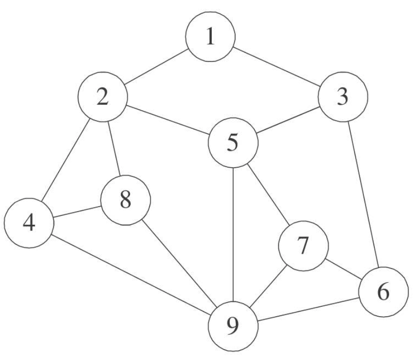
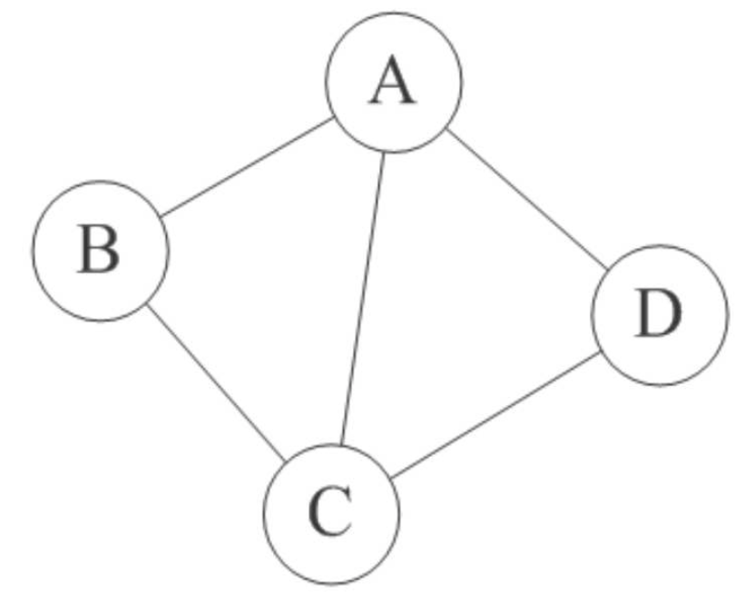
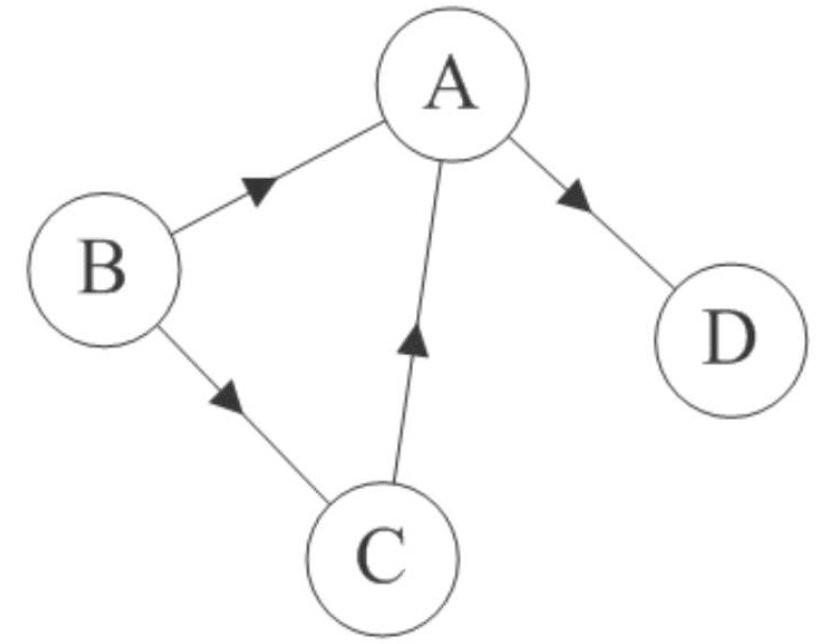
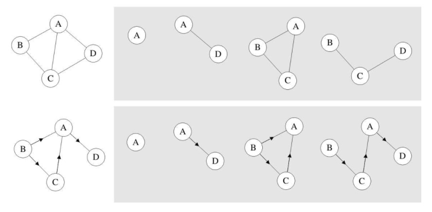

# 图的基本概念

- 图（Graph）定义：由顶点的有穷非空集合和顶点之间边的集合组成，通常表示为：G（V，E）

  - G表示一个图

  - V是图G中顶点的集合

  - E是图中边的集合

  - 图中，任意两个顶点之间都可能有关系，顶点之间的逻辑关系用边来表示，边集可以是空的

    

- 无向边（Edge）：若顶点vi到vj之间的边没有方向，用无序偶对（vi，vj）来表示

- 无向图（Undirected graphs）：图中任意两个顶点之间的边都是无向边

  

- 有向边（弧，Arc）：若从顶点vi到vj的边有方向，用有序偶对\<vi,vj\>表示，vi称为弧尾（Tail），vj称为弧头（Head）

- 有向图（Directed graphs）：图中任意两个顶点之间的边都是有向边

  

- 简单图：在图中，不存在顶点到其自身的边，且同一条边不重复出现

- 无向完全图：任意两个顶点之间都存在边

- 有向完全图：任意两个顶点之间都存在方向互为相反的两条弧

- 有很少条边或弧的图称为稀疏图，反之称为稠密图

- 图的边或弧具有与它相关的数字，与图的边或弧相关的数叫做权（weight），带权的图通常称为网（Network）

- 假设有两个图$$\left. \ G = (V,\{ E\} \right)$$和$$\left. \ G^{'} = (V',\{
  E'\} \right)$$，如果$$V^{'} \subseteq V$$且$$E^{'} \subseteq
  E$$，则称$$G^{'}$$为G的子图（Subgraph）

  

-   无向图G=(V,{E})，如果边(v,v')∈E，则称顶点v和v'互为邻接点（Adjacent），即v和v'相邻接

-   顶点v的度（Degree）是和v相关联的边的数目，记为TD(v)

-   有向图G=(V,{E})，如果弧\<v,v'\>∈E，则称顶点v邻接到顶点v'

-   以顶点v为头的弧的数目称为v的入度（InDegreee），记为ID(v)；以v为尾的弧的数目称为v的出度（OutDegree），记为OD（v）；顶点v的度为TD（v）=ID（v）+OD（v）

-   无向图G=(V,{E})中从顶点v到顶点v'的路径(PATH)是一个顶点序列$\left( v =
    v_{i,0},v_{i,1},\cdots,v_{i,m} = v^{'} \right)$，其中$\left( {{v_{i,j - 1}},{v_{i,j}}) \in E,1 \le j \le m} \right.$
    
-   有向图的路径也是有向的