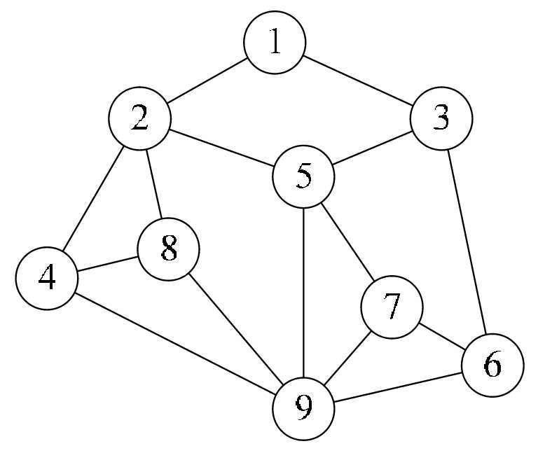
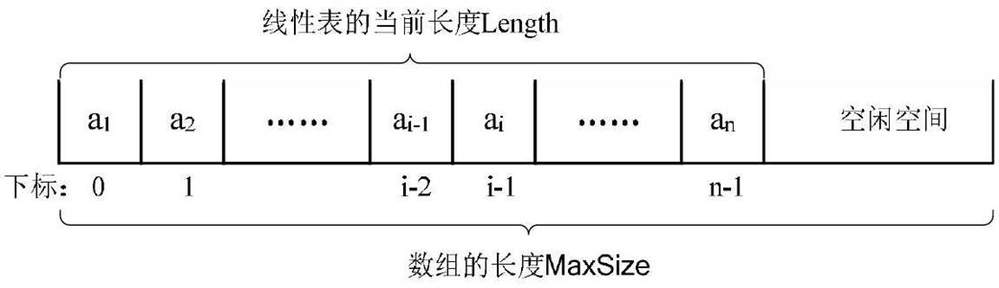

[TOC]

# 数据结构绪论

> 数据结构定义：是一门研究非数值计算的程序设计问题中的操作对象，以及它们之间的关系和操作等相关问题的学科

 

## 基本概念和术语

* 数据：描述客观事物的符号，是计算机中**可以操作**的对象，是能被计算机**识别**，并输入给计算机处理的符号集合；
  * 可以输入到计算机中
  * 能被计算机程序处理

* 数据元素：组成数据的、有一定意义的基本单位，在计算机中通常作为整体处理，也被称为**记录**

* 数据项：一个数据元素可以由若干个数据项（属性、特征）组成；数据项是数据不可分割的最小单位

* 数据对象：性质相同的数据元素的集合，是数据的子集
  * 性质相同：数据元素具有相同数量和类型的数据项

* 举例说明：我们要研究某一类人之间的关系
  * 人就是数据
  * 研究对象是公司职员，则公司职员的集合就是数据对象
  * 职员A、职员B就是数据元素
  * 公司职员的上班时间、下班时间等等（特征）就是数据项

* 数据结构：相互之间存在一种或多种**特定关系**的数据元素的集合
  * 结构：不同数据元素之间不是独立的，而是存在特定的关系，将这些**关系**称为结构

## 逻辑结构与物理结构

* 逻辑结构：数据对象中数据元素之间的相互关系
  
  > 逻辑结构是针对具体问题，为了解决某个问题，在对问题理解的基础上，选择一个合适的数据结构表示数据元素之间的逻辑关系
  
  * 集合结构：集合结构中的数据元素除了同属于一个集合外，它们之间没有其他关系
  
    
  
  * 线性结构：线性结构中的数据元素之间是**一对一**的关系
  
    
  
  * 树形结构：树形结构中的数据元素是一种**一对多**的层次关系
  
    
  
  * 图形结构：图形结构的数据元素是**多对多**的关系
  
    
  
* 物理结构（存储结构）：数据的逻辑结构在计算机中的**存储**形式；数据的存储结构应正确反映数据元素之间的逻辑关系
  * 顺序存储：把数据元素存放在地址连续的存储单元里，其数据间的逻辑关系和物理关系是一致的（如：数组）

    

  * 链式存储结构：把数据元素存放在任意的存储单元里，这组存储单元可以是连续的，也可以是不连续的；数据元素的存储关系并不能反映其逻辑关系，因此需要用一个指针存放数据元素的地址，通过地址找到相关联数据元素的位置

 

* 逻辑结构是面向问题的，物理结构是面向计算机的，其基本目标是将数据及其逻辑关系存储到计算机的内存中；

## 抽象数据类型

* 数据类型：一组**性质相同**的值的集合及定义在此集合上的**一些操作**的总称
  * 内存有限，所以对数据进行分类，对不同的类型开辟不同的内存大小
  * 在C语言中，按照取值的不同，可以分为两类
    * 原子类型：是不可以再分解的基本类型，包括整型、实型、字符型等
    * 结构类型：由若干个类型组合而成，是可以再分解的（如：整型数组是由若干整型数据组成）

* 抽象数据类型（Abstract Data Type，ADT）：指一个数字模型及定义在该模型上的一组操作
  * 抽象数据类型的定义仅取决于它的一组逻辑特性，而与其在计算机内部如何表示和实现无关
  * 抽象的意义在于数据类型的数学抽象特性
  * 抽象数据类型体现了程序设计中问题分解、抽象和信息隐藏的特性

 # 算法

> 算法定义：解决特定问题求解步骤的描述，在计算机中表现为指令的**有限序列**，并且每条指令表示一个或多个操作

* 算法的特性：输入、输出、有穷性、确定性和可行性
  * 有穷性：算法在执行**有限**的步骤之后，自动结束而不会出现无限循环，并且每一个步骤在可接受的时间内完成
  * 确定性：算法的每一步骤都具有确定的含义，不会出现二义性（相同的输入只能有唯一的输出）
  * 可行性：算法的每一步都必须是可行的，每一步都能通过执行有限次数完成

* 算法设计的要求
  * 正确性
  * 可读性
  * 健壮性：当输入数据不合法时，算法也能做出相关处理，而不是产生异常或莫名其妙的结果
  * 时间效率高和存储量低

* 算法效率的度量方法：事后统计方法（有很多缺陷，放弃）和**事前分析估算**方法
  * 事前分析估算方法：在计算机程序编程前，依据统计方法对算法进行估算（抛开计算机硬件与软件的因素，一个程序的运行时间依赖于算法的好坏和问题的输入规模）
  * 判断一个算法的效率时，函数中的常数和其他次要项常常可以忽略，而更应该关注主项（**最高阶项**）的阶数

 

## 算法时间复杂度

> 定义：进行算法分析时，语句总的执行次数`T(n)`是关于问题规模`n`的，进而分析`T(n)`随`n`的变化情况并确定`T(n)`的数量级

* 算法的时间复杂度，也就是算法的时间度量，记作：`T(n)=O(f(n))`，表示随问题规模`n`的增大，算法执行时间的增长率和`f(n)`的增长率相同，称作算法的渐进时间复杂度，简称为时间复杂度。其中`f(n)`是问题规模`n`的某个函数
* 推导大O阶方法
  * 用常数1取代运行时间中的所有加法常数
  * 在修改后的运行次数函数中，只保留最高阶项
  * 如果最高阶项存在且不是1，则去除与这个项相乘的常数，得到的结果就是大O阶
* 常见的时间复杂度

* 常用的时间复杂度所耗费的时间从小到大依次是：

## 最坏情况与平均情况

* 最坏情况运行时间：是一种保证，那就是运行时间将不会更坏了。应用中，这是一种最重要的需求，通常，除非特别指定，我们提到的运行时间都是最坏情况的运行时间

* 平均运行时间：是所有情况中最有意义的，因为它是期望的运行时间

## 算法空间复杂度

* 定义：通过计算算法所需的存储空间实现，算法空间复杂度的计算公式记作：`S(n)=O(f(n))`，其中`n`为问题的规模，`f(n)`为语句关于n所占存储空间的函数

* 可以通过空间换取时间

 # 线性表

## 线性表的基本概念

* 线性表（List）定义：零个或多个数据元素的有限序列
  * 序列：元素之间是有顺序的
  * 有限：元素个数是有限的

* 若将线性表记为，则表中领先于，领先于，称是的直接先驱元素，是的直接后继元素

* 线性表的长度：线性表元素的个数n（n≥0），当n=0时，称为空表

* 在较复杂的线性表中，一个数据元素可以由若干个数据项组成

## 线性表的抽象数据类型

 

 

## 线性表的顺序存储结构

* 线性表的顺序存储结构：用一段地址连续的存储单元依次存储线性表的数据元素

*    由于线性表的每个元素的类型都相同，所以可以用一维数组实现顺序存储结构

*    线性表顺序存储结构需要三个属性

     *    存储空间的起始位置
     *    线性表的最大存储容量：数组长度
     *    线性表的当前长度

* 地址计算方法

  

  * 存储器中的每个存储单元都有自己的编号，称之为地址

  * 假设每个数据元素需要占据c个存储单元，那么
    * 线性表中第i+1个数据元素的存储位置和第i个数据元素的存储位置满足下列关系
    
    * 线性表中第i个数据元素的存储位置由第1个数据元素推算
    
      
    
       
  * 通过上述公式，可以随时算出线性表中任意位置的地址，且是相同时间，用时间复杂度表示存取时间性能为O(1)，称具有这一特点的存储结构为随机存取结构

## 顺序存储结构的插入与删除

*  获得元素操作

* 插入操作
  * 如果插入位置不合理，抛出异常

  * 如果线性表长度大于等于数组长度，则抛出异常或动态增加容量

  * 从最后一个元素开始向前遍历到第i个位置，分别将他们都向后移动一个位置

  * 将要插入元素填入位置i处

  * 表长加1

*  删除操作

   * 如果删除位置不合理，抛出异常
   * 取出删除元素
   * 从删除元素位置开始遍历到最后一个元素位置，分别将它们都向前移动一个位置
   * 表长减1

*  线性表的顺序存储结构，在存、读数据时，不管是哪个位置，时间复杂度都是O(1)；而插入或删除时，时间复杂度都是O(n)；说明它适合元素个数不太变化，而更多是存取数据的应用

*  线性表顺序存储结构的优缺点

## 线性表的链式存储结构

*  结构特点：用一组任意的存储单元存储线性表的数据元素，这组存储单元可以是连续的，也可以是不连续的

* 定义：为了表示每个数据元素与其直接后继数据元素之间的逻辑关系，对数据元素来说，除了存储其本身的信息之外，还需存储一个指示其直接后继的信息（即直接后继的存储位置）

  *  数据域：存储数据元素信息的域

  *  指针域：存储直接后继位置的域

  *  指针（链）：针域中存储的信息

  *  结点（Node）：两部分信息组成数据元素的存储映像

  *  n个结点链链接成一个链表，即为线性表的链式结构；因为此链表的每个结点中只包含一个指针域，所以叫做单链表

     

  *  头指针：链表中第一个结点的存储位置

  *  线性链表的最后一个结点指针为“空”NULL

     

  *  在单链表的第一个结点前附设一个结点，称为头结点；头结点的数据域可以不存储任何信息，也可以存储线性表的长度等附加信息，头结点的指针域存储指向第一个结点的指针

     

  *  链表中可以没有头结点，但不能没有头指针。头结点的存在使得空链表与非空链表处理一致，也方便对链表的开始结点的插入或删除操作

  *  空链表：头结点的指针域为“空”

*  头指针与头结点的异同

*  线性表链式存储结构代码描述

 

## 单链表的读取

*  获得链表第i个数据的算法思路

   *  声明一个结点p指向链表第一个结点，初始化j从1开始

* 当j<i时，就遍历链表，让p的指针就向后移动，不断指向下一结点，j累加1

* 若到链表末尾p为空，则说明第i个元素不存在

* 否则查找成功，返回结点p的数据

*  最坏情况的时间复杂度是O(n)，最好情况的时间复杂度是O(1)

 

## 单链表的插入与删除

* 插入：假设结点s要出入到结点p和q之间，p->next=q（未知），只需让p的后继结点改成s的后继结点，再把结点s变成p的后继结点

  

  

  *   单链表第i个数据插入结点的算法思路
     *  声明一结点p指向第一个结点，初始化j从1开始

     *  当j<i时，就遍历链表，让p的指针向后移动，不断指向下一结点，j累加1
     *  若到链表末尾p为空，则说明第i个元素不存在
     *  否则查找成功，在系统中生成一个空结点s
     *  将数据元素e赋值给一个空结点s
     *  将数据元素e赋值给s->data
     *  单链表的插入标准语句s->next=p->next;p->next=s
     *  返回成功

* 单链表的删除：结点p、q、q->next，要删除q

  

  

  *  算法思路：

     *  声明一结点p指向链表第一个结点，初始化j从1开始
     *  当j<i时，就遍历链表，让p的指针向后移动，不断指向下一结点，j累加1
     *  若到链表末尾p为空，则说明第i个元素不存在
     *  否则查找成功，将预删除的结点p->next赋值给q
     *  单链表的删除标准语句p->next=q->next
     *  将q结点中的数据赋值给e，作为返回
     *  释放q结点
     *  返回成功

*  单链表插入和删除算法由两个部分组成：遍历查找第i个元素；插入和删除元素

*  时间复杂度是O(n)

   *  对于顺序存储结构，删除和插入每次都是O(n)

*  对于链式存储，只有第一次是O(n)，之后都是O(1)

   *  对于插入或删除数据越频繁的操作，单链表的效率优势越是明显

 

## 单链表的整表创建

*  顺序存储结构和链式存储结构创建的不同

   *  顺序存储结构的创建，本质上就是数组的初始化，声明一个类型和大小的数组并赋值的过程
   *  单链表的创建的过程是一个动态生成链表的过程，即从“空表”的初始状态，依次建立各元素结点，并逐个插入链表

*  单链表整表创建的算法思路

   *  声明一结点p和计数器变量I
   *  初始化一空链表L
   *  让L的头结点的指针指向NULL，即建立一个带头结点的单链表
   *  循环：
      *  生成一新结点赋值给p
      *  随机生成一数字赋值给p的数据域p->data
      *  将p插入到头结点与前一新结点之间

* 创建单链表的代码描述

  * 头插法：使用插队的方法，始终让新结点在第一的位置

    

  * 尾插法：每次新结点都插在终端结点的后面

 

# 单链表的整表删除

*  单链表整表删除的算法思路

   *  声明一结点p和q
   *  将第一个结点赋值给p
   *  循环
      *  将下一结点赋值给q
      *  释放p
      *  将q赋值给p

*  代码实现

 

## 单链表结构与顺序存储结构优缺点

*  若线性表需要频繁查找，很少进行插入和删除操作时，宜采用顺序存储结构；若需要频繁插入和删除时，宜采用单链表结构

*  当线性表中的元素个数变化较大或者根本不知道有多少时，最好用单链表结构，这样就不需要考虑存储空间的大小问题

 

## 循环链表

*  单链表中由于每个结点只存储了向后的指针，到了尾标志就停止了向后链的操作，当中某一结点无法找到它的前驱结点

*  定义：将单链表中终端节点的指针端由空指针改为指向头结点，就使整个单链表形成一个环，这种头尾相接的单链表称为单循环链表

*  循环链表和单链表的主要差异就在于循环的判断条件上，原来是判断p->next是否为空，现在则是p->next不等于头结点，则循环未结束

## 双向链表

*  定义：在单链表的每个结点中，再设置一个指向其前驱结点的指针域

 

*  循环链表的双向链表

*  插入操作：将结点s插入到p和p->next

   *  先搞定s的前驱和后继
   *  再搞定后结点的前驱
   *  最后解决前结点的后继

*  删除操作：删除结点p

## 总结回顾

 

# 栈与队列

# 串

# 树

# 图

# 查找

# 排序

 

 

 

 