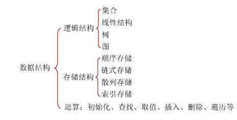
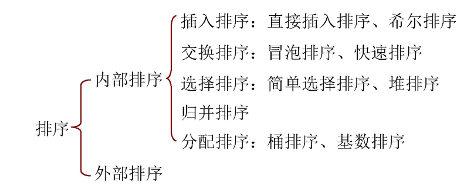

# 数据结构绪论

* 抽象数据类型（ADT）：一个数学模型及定义在该模型上的一组操作

  

# 线性表

* 线性表定义：零个或多个数据元素的有限序列
  * 序列：元素之间有顺序，第一个元素无前驱，最后一个元素无后驱，其他元素都有且只有一个前驱和后继
  * 有限

## 顺序存储——vector

## 链式存储——List链表

* 双向链表：一个结点具有两个指针域，分别指向他的前一个结点和后一个结点

## 栈

* 数据$\{a_1, a_2,\dots,a_n \}$，$a_n$是栈顶

## 队列

* 数据$\{a_1, a_2,\dots,a_n \}$，$a_1$是队头
* 循环队列
  * `front`指针指向队头
  * `rear`指针指向队尾元素的下一个位置
  * 当`front`等于`rear`时，队列为空
  * 当(`rear`+1)%`size`==`front`时，队列已满

## 串

* 串的比较
  * 从左到右比较字符大小，“silly”<”“stupid”
  * 对应字母相等，长的字符串较大
* `\0`标志串值得终结，不计入串长度
* KMP模式匹配：从主串`S="goodgoogle"`找到子串`T="google"`的位置
  * 主串序号`i`一直是递增，不回溯；回溯通过子串序号`j`
  * 计算`next`数组——前缀与后缀的相似度
  * *TODO*

# 树

* 结点拥有的子树数称为结点的度
* 度为0的结点称为叶结点或者终端结点
* 树的度是树内各结点的度的最大值

## 满二叉树

> 如果所有分支结点都存在左子树和右子树，并且所有叶子结点都在同一层上

## 完全二叉树

> 对一棵具有n个结点的二叉树按层序编号，如果编号为`i`的结点与同样深度的满二叉树编号为`i`的结点在二叉树中位置完全相同

## 线索二叉树

## 二叉排序树

* 二叉查找树
  * 左子树上所有结点值小于根的值
  * 右子树上所有结点值大于根的值
  * 左右子树也是二叉排序树
  * 中序遍历是有序数组
* 二叉排序树删除结点
  * 如果只有左子树或者右子树——直接使其子树代替即可
  * 既有左子树又有右子树——找到该节点的直接前驱或者直接后驱
    * 直接前驱：左子树的右子树的右子树。。。
    * 直接后驱：右子树的左子树的左子树。。。

## 平衡二叉树（AVL树）

* AVL：一种二叉排序树，其中每一个结点的左子树和右子树的高度差至多等于1
* 构建：*TODO*
* 插入：
* 删除：

# 查找

## 二分查找

> 有序序列可以使用二分查找

* 查找时间复杂度：`log(n)`

## 二叉排序树

## 平衡二叉树

## 散列表查找

*TODO*

# 排序

## 插入排序

> 每次讲一个待排序的记录，按其关键字大小插入已经排好序的数据序列中，保持数据序列仍然有序

### 直接插入排序

* 时间复杂度：$O(n^2)$
* 空间按复杂度：$O(1)$

* **稳定排序方法**

### 希尔排序

> 直接插入排序中，如果待排序序列的记录个数比较少，而且基本有序，则排序的效率较高
>
> 从**减少记录个数**和**基本有序**方面进行改进，提出希尔排序

* 时间复杂度：下界是$O(nlogn)$，没有快速排序快
* 空间复杂度：$O(1)$
* **不稳定排序方法**

## 交换排序

> 交换：根据两个关键字值得比较结果，不满足次序要求时交换位置

### 冒泡排序

> 通过两两比较关键字，如果逆序就交换，使关键字大的记录像泡泡一样冒出来放在尾部

* 时间复杂度：$O(n^2)$
* 空间复杂度：$O(1)$
* **稳定排序方法**

### 快速排序

> 基本思想：通过一组排序将要排序的数据分割成独立的两部分，其中一部分的所有数据都比另外一部分的所有数据小，然后再按此方法对这两部分数据分别进行快速排序

* 时间复杂度：$O(nlgn)$
* 空间复杂度：$O(lgn)$
* **不稳定排序方法**

## 选择排序

### 简单选择排序

* 时间复杂度：$O(n^2)$
* 空间复杂度：$O(1)$
* **不稳定排序方法**

### 堆排序

* 时间复杂度：$O(nlgn)$
* 空间复杂度：$O(1)$
* **不稳定排序方法**

