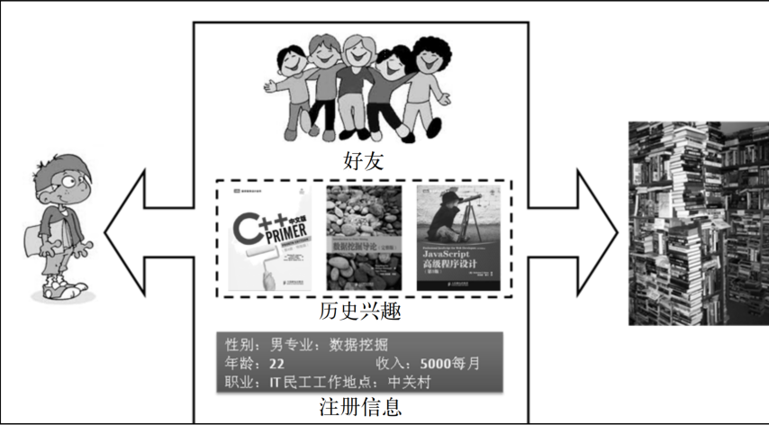
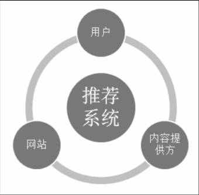

参考：《推荐系统实践》——项亮

[TOC]

# 好的推荐系统

## 什么是推荐系统

* 推荐系统是自动联系用户和物品的一种工具，能够在信息过载的环境中帮助用户发现令他们感兴趣的信息，也能将信息推送给它们感兴趣的用户，从而实现信息消费者和信息生产者的双赢

* 为了解决信息过载的问题，代表性的解决方案
  * 分类目录
    * 将著名的网站分门别类，从而方便用户根据类别查找网站
    * 但随着互联网规模的不断扩大，分类目录网站也只能覆盖少量的热门网站，越来越不能满足用户的需求
  * 搜索引擎
    * 搜索引擎可以让用户通过搜索关键词找到自己需要的信息
    * 但是搜索引擎需要用户主动提供准确的关键词来寻找信息，因此不能解决用户的很多其他需求
  * 推荐系统：不需要用户提供明确的需求，而是通过分析用户的历史行为给用户的兴趣建模，从而主动给用户推荐能够满足他们兴趣和需求的信息
* 从物品的角度出发，推荐系统可以更好地发掘物品的长尾（long tail）
  * 长尾理论：传统的80/20原则（80%的销售额来自于20%的热门品牌）
  * 互联网条件下，由于货架成本极端低廉，电子商务网站往往能出售比传统零售店更多的商品
    * 虽然这些商品绝大部分都不热门，但与传统零售业相比，这些不热门的商品数量极其庞大，因此这些长尾商品的总销售额将是一个不可小觑的数字，也许会超过热门商品（即主流商品）带来的销售额
    * 主流商品往往代表了绝大多数用户的需求，而长尾商品往往代表了一小部分用户的个性化需求
    * 如果要通过发掘长尾提高销售额，就必须充分研究用户的兴趣，而这正是个性化推荐系统主要解决的问题；推荐系统通过发掘用户的行为，找到用户的个性化需求，从而将长尾商品准确地推荐给需要它的用户，帮助用户发现那些他们感兴趣但很难发现的商品
* 推荐算法的本质是通过一定的方式将用户和物品联系起来，主要方式
  * 利用好友
  * 用户的历史兴趣记录
  * 用户的注册信息

## 个性化推荐系统的应用

## 推荐系统评测

* 好的推荐系统：同时考虑三方的利益，令三方共赢的系统

  * 一个完整的推荐系统一般存在3个参与方
    * 用户
    * 物品提供者
    * 提供推荐系统的网站
  * 首先：推荐系统需要满足用户的需求，给用户推荐那些令他们感兴趣的物品
  * 其次：推荐系统要让各商品提供商的商品都能够被推荐给对其感兴趣的用户，而不是只推荐几个大型出版社的书
  * 最后：能够让推荐系统本身收集到高质量地用户反馈，不断完善推荐的质量，增加用户和网站的交互，提高网站的收入

  

  

### 推荐系统实验方法

* 离线方法

  * 步骤

  1. 通过日志系统获得用户行为数据，并按照一定格式生成一个标准的数据集
  2. 将数据集按照一定的规则分成训练集和测试集
  3. 在训练集上训练用户兴趣模型，在测试集上进行预测
  4. 通过实先定义的离线指标评测算法在测试集上的预测结果

  * 优点
    * 不需要一个实际的系统来供它实验
    * 不需要真实用户参与
    * 可以直接快速地计算出来，可以测试大量算法
  * 缺点
    * 无法计算商业上关心的指标
    * 离线实验的指标和商业指标存在差距

* 用户调查

  * 步骤
    1. 需要一些真实用户，在需要测试的推荐系统上完成一些任务
    2. 在他们完成任务时，需要观察和记录他们的行为，并让他们回答一些问题
    3. 通过分析他们的行为和答案了解测试系统的性能
  * 优点
    * 可以获得很多体现用户主观感受的指标，相对在线实验风险很低
    * 出现错误后很容易弥补
  * 缺点
    * 招募测试用户代价较大，很难组织大规模的测试用户，使得测试结果的统计意义不足
    * 设计双盲实验非常困难：尽量保证测试用户的分布和真实用户的分布相同
    * 用户在测试环境下的行为和真实环境下的行为可能有所不同，因而在测试环境下收集的测试指标可能在真实环境下无法重现

* 在线实验

  * AB测试：通过一定的规则将用户随机分成几组，并对不同组的用户采用不同的算法，然后通过统计不同组用户的各种不同的评测指标比较不同算法

  * AB测试优点：可以公平获得不同算法实际在线时的性能指标，包括商业上关注的指标

  * AB测试缺点：周期比较长，必须进行长期的实验才能得到可靠的结果

  * 一个大型网站的AB测试系统的设计很复杂

    * 一个大型网站的架构分前端和后端，从前端展示给用户的界面到最后端的算法，中间往往经过了很多层，这些层往往由不同的团队控制，而且都有可能做AB测试；

    * 切分流量是AB测试的关键，不同的层以及控制这些层的团队需要从一个统一的地方获得自己AB测试的流量，而不同层之间的流量应该是正交的

    * 测试系统

      * 用户进入网站：流量分配系统决定用户是否需要被进行AB测试，如果需要的话，流量分配系统会给用户打上在测试中属于什么分组的标签
      * 用户浏览网页：用户浏览网页时的行为会被日志系统发回后台的日志数据库；如果用户有测试分组的标签，那么该标签也会被发回后台数据库
      * 后台
        * 实验人员的工作首先是配置流量分配系统，决定满足什么条件的用户参加什么样的测试
        * 实验人员需要统计日志数据库中的数据，通过评测系统生成不同分组用户的实验报告，并比较和评测实验结果

      

### 评测指标（TODO）

* 用户满意度

  * 用户作为推荐系统的重要参与者，其满意度是评测系统的最重要指标
  * 但是用户满意度没有办法离线计算，只能通过用户调查或者在线实验获得
  * 在线系统中，用户满意度主要通过一些对用户行为的统计得到
    * 在电子商务网站中，可以利用购买率度量用户的满意度
    * 通过设计用户反馈界面收集用户满意度
    * 用点击率、用户停留时间和转化率等指标度量用户的满意度

* 预测准确度：度量一个推荐系统预测用户行为的能力——最重要的离线预测指标

  * 评分预测：预测用户对物品评分的行为；评分预测的预测准确度一般通过均方根误差（RMSE）和平均绝对误差（MAE）计算——用户$u$和物品$i$，令$r_{ui}$是用户$u$对物品$i$的实际评分，$\hat r_{ui}$是推荐算法给出的预测评分

    * RMSE
      $$
      RMSE = \frac{{\sqrt {\sum\nolimits_{u,i \in T} {{{({r_{ui}} - {{\hat r}_{ui}})}^2}} } }}{{\left| T \right|}}
      $$

    * MAE
      $$
      MAE = \frac{{\sum\nolimits_{u,i \in T} {\left| {{r_{ui}} - {{\hat r}_{ui}}} \right|} }}{{\left| T \right|}}
      $$

    * 两个指标的优缺点

      * RMSE对异常值更敏感，加大了对预测不准的用户物品评分的惩罚，因而对系统的评测更加苛刻
      * 如果评分系统是基于整数建立的（用户给的评分都是整数），对预测结果取整会降低MAE的误差

  * TopN推荐：网站在提供推荐服务时，一般是给用户一个个性化的推荐列表；TopN推荐的预测准确率一般通过准确率/召回率度量

    * 令$R(U)$是根据用户在训练集上的行为给用户做出的推荐列表，$T(u)$是用户在测试集上的行为列表

      * 推荐结果的召回率
        $$
        {\mathop{\rm Re}\nolimits} call = \frac{{\sum\nolimits_{u \in U} {\left| {R(u) \cap T(u)} \right|} }}{{\sum\nolimits_{u \in U} {\left| {T(u)} \right|} }}
        $$

      * 推荐结果的准确率
        $$
        \Pr ecision = \frac{{\sum\nolimits_{u \in U} {\left| {R(u) \cap T(u)} \right|} }}{{\sum\nolimits_{u \in U} {\left| {R(u)} \right|} }}
        $$

    * 为了全面评测TopN推荐的准确率和召回率，一般会选取不同的推荐列表长度$N$，计算出一组准确率/召回率，然后画出准确率/召回率曲线

  * 关于评分预测和TopN推荐的讨论

    * 评分预测一直是推荐系统研究的热点，绝大多数推荐系统的研究都是基于用户评分数据的评分预测
    * 电影推荐的目的是找到用户最有可能感兴趣的电影，而不是预测用户看了电影后会给电影什么样的评分——因此TopN推荐更符合实际的应用需求

* 覆盖率（coverage）：描述一个推荐系统对物品长尾的发掘能力——覆盖率是一个内容提供商会关心的指标

  * 最简单的定义为推荐系统能够推荐出来的物品占总物品集合的比例；假设系统的用户集合为$U$，推荐系统给每一个用户推荐一个长度为$N$的物品列表$R(u)$，那么覆盖率为
    $$
    Coverage = \frac{{\left| {{ \cup _{u \in U}}R(u)} \right|}}{{\left| I \right|}}
    $$

  * 上面的定义过于粗略，为了更细致地描述推荐系统发掘长尾的能力，需要统计推荐列表中不同物品出现次数的分布；如果所有的物品都出现在推荐列表中，且出现的次数差不多，那么推荐系统发掘长尾的能力就很好
  
    * 信息熵：$p(i)$是物品$i$的流行度除以所有物品流行度之和
      $$
      H =  - \sum\limits_{i = 1}^n {p(i)\log p(i)}
      $$
  
    * 基尼系数：$i_j$是按照物品流行度从小到大排序的物品列表中第$j$个物品
      $$
      G = \frac{1}{{n - 1}}\sum\limits_{j = 1}^n {(2j - n - 1)p({i_j})}
      $$
  
* 多样性
### 评测维度

* 一个推荐算法，虽然整体性能不好，但可能在某种情况下性能比较好，而增加评测维度的目的就是知道一个算法在什么情况下性能最好
  * 用户维度：用户的人口统计学信息、活跃度以及是不是新用户等
  * 物品维度：物品的属性信息、流行度、平均分以及是不是新加入的物品等
  * 时间维度：包括季节，是工作日还是周末，是白天还是晚上等
* 如果能够在推荐系统评测报告中包含不同维度下的系统评测指标，就能帮我们全面地了解推荐系统性能
  * 找到一个看上去比较弱的算法的优势
  * 发现一个看上去比较强的算法的缺点

# 利用用户行为数据

## 用户行为数据简介（TODO）

## 用户行为分析（TODO）

## 实验设计和算法评测（TODO）

## 基于邻域的算法

### 基于用户的协同过滤算法

* 定义：在一个在线个性化推荐系统中，当一个用户A需要个性化推荐时，可以先找到和他有相似兴趣的其他用户，然后把那些用户喜欢的、而用户A没有听说过的物品推荐给A
  * 找到和目标用户兴趣相似的用户集合：利用行为的相似度计算两个用户的兴趣相似度——给定用户$u$和用户$v$，令$N(u)$表示用户$u$曾经有过正反馈的物品集合，令$N(v)$表示用户$v$曾经有过正反馈的物品集合

### 基于物品的协同过滤算法

### UserCF和ItemCF的综合比较

## 隐语义模型

## 基于图的模型

# 推荐系统冷启动问题

# 利用用户标签数据

# 利用上下文信息

# 利用社交网络数据

# 推荐系统实例

# 评分预测问题

