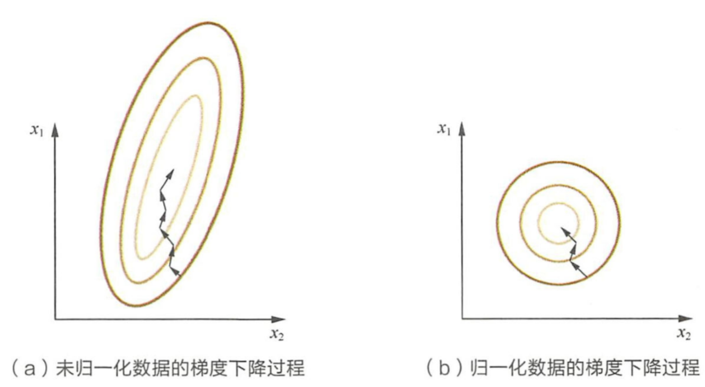

[TOC]

# 特征工程

* 定义：对原始数据进行一系列工程处理，将其提炼为特征，作为输入供算法和模型使用
  * 本质上，特征工程师一个表示和展现数据的过程
  * 实际工作中，特征工程旨在去除原始数据中的杂质和冗余，设计更高效的特征以刻画求解的问题与预测模型之间的关系

## 特征归一化

* 为什么需要对数值类型的特征做归一化

  * 原因

    * 消除数据特征之间的量纲影响，需要对特征进行归一化处理，使得不同指标之间具有可比性

    * 通过梯度下降法求解的模型通常是需要归一化的
  
      * 归一化到相同数值空间，容易更快地通过梯度下降找到最优解
      * 线性回归、逻辑回归、支持向量机、神经网络等模型需要归一化；决策树模型不需要归一化，因为决策树在进行节点分裂时主要依据数据集$D$关于特征$x$的信息增益比选择最优切分点，与值无关

      
  
  * 归一化方法
  
  * 线性函数归一化（Min-Max Scaling）：对原始数据进行线性变换，使结果映射到$[0,1]$的范围，实现对原始数据的等比缩放
      $$
      {X_{norm}} = \frac{{X - {X_{\min }}}}{{{X_{\max }} - {X_{\min }}}}
      $$
  
    * 零均值归一化（Z-Score Normalization，标准化）：将原始数据映射到均值为0，标准差为1的分布上
      $$
      z = \frac{{x - \mu }}{\sigma }
      $$
  
    - [ ] ==两种归一化方法的区别及各自适用于什么场景==

## 类别型特征

