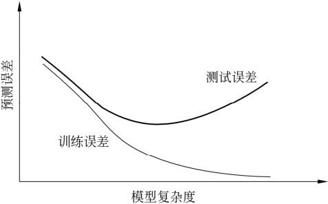

参考：《统计学习方法》——李航

---
[TOC]

# 统计学习

- 统计学习（statistical learning）定义：关于计算机**基于数据构建概率统计模型**并运用模型对数据进行预测与分析的一门学科

  - 特点

    - 以计算机及网络为平台，建立在计算机及网络之上
    - 以数据为研究对象，是数据驱动的学科
    - 目的是对数据进行预测与分析
    - 以方法为中心，构建模型并应用模型进行预测与分析
    - 统计学习是概率论、统计学、信息论、计算理论、最优化理论及计算机科学等多个领域的交叉学科，并且在发展中逐步形成独自的理论体系与方法论
  - 对象
    - 统计学习的对象是数据（data）
    - 从数据出发，提取数据的特征，抽象出数据的模型，发现数据中的知识，又回到对数据的分析与预测中去
  - 目的
    - 用于对数据进行预测与分析， 特别是对未知新数据进行预测与分析
    - 对数据的预测可以使计算机更加智能化， 或者说使计算机的某些性能得到提高
  - 方法
    - 基于数据构建统计模型从而对数据进行预测与分析
    - 由监督学习（supervised learning）、非监督学习（unsupervised learning）、半监督学习（semi-supervised      learning）和强化学习（reinforcement learning）组成
- 监督学习可以概括如下：
  - 从给定的、有限的、用于学习的训练数据（training data）集合出发，假设数据是独立同分布产生的；
  - 并且假设要学习的模型属于某个函数的集合，称为**假设空间**（hypothesis space）；
  - 应用某个评价准则（evaluation criterion），从假设空间中选取一个最优的模型，使它对已知训练数据及未知测试数据（test data）在给定的评价准则下有最优的预测；
  - 最优模型的选取由算法实现

# 监督学习

## 基本概念

* 输入空间、特征空间与输出空间
  * 输入与输出所有可能取值的集合分别称为输入空间（input space）与输出空间（output space）
    * 输入与输出空间可以是有限元素的集合，也可以是整个欧式空间
    * 输入空间与输出空间可以是同一空间，也可以是不同的空间
    * 通常输出空间远远小于输入空间
  * 每个具体的输入是一个实例（instance），通常由一个特征向量（feature vector）表示；此时所有特征向量存在的空间称为特征空间
    * 特征空间每一维对应于一个特征
    * 有时假设输入空间与特征空间为相同的空间，对它们不予区分；有时假设输入空间与特征空间为不同的空间，将实例从输入空间映射到特征空间
    * 模型实际上都是定义在特征空间上
* 联合概率分布：假设输入与输出的随机变量$\bf{X}$和$\bf{Y}$遵循联合概率分布$P(\bf{X},\bf{Y})$
  * 学习过程中假定这一联合概率分布存在，但对学习系统来说，联合概率分布的具体定义是未知的
  * 训练数据与测试数据被看做是依联合概率分布$P(\bf{X},\bf{Y})$独立同分布产生的
  * 统计学习假设数据存在一定的统计规律，$X$和$Y$具有联合概率分布的假设就是监督学习关于数据的基本假设
* 假设空间（hypothesis space）
  * 监督学习目的是学习一个模型表示由输入到输出的映射
  * 由输入空间到输出空间的映射的集合就是假设空间
  * 假设空间的确定意味着学习范围的确定
  * 监督学习的模型可以是概率模型或非概率模型，由条件概率分布$P(\bf{Y} | \bf{X})$或决策函数（decision function）$\bf{Y}=f(\bf{X})$表示

## 问题的形式化

* 监督学习利用训练数据集学习一个模型，再用模型对测试样本集进行预测（prediction），分为学习和预测两个过程
  * 给定训练数据集$T = \{ ({x_1},{y_1}),({x_2},{y_2}), \cdots ,({x_N},{y_N})\} $，其中$(x_i,y_i),i=1,2,\cdots,N$称为样本或样本点，${x_i} \in x \subseteq {\Re ^n}$是输入的观测值，称为输入或实例，$y_i\in \cal Y$是输出的观测值，称为输出
  * 学习过程中，学习系统利用给定的训练数据集，通过学习（训练）得到一个模型，表示为条件概率分布$\hat P(Y|X)$ 或决策函数$Y = \hat f(X)$——描述输入与输出随机变量之间的映射关系
  * 预测过程中，预测系统对于给定的测试样本集中的输入$x_{N+1}$，由模型${y_{N + 1} } = \mathop {\arg \max }\limits_{y_{N + 1}} \hat P({y_{N + 1}}|{x_{N + 1}})$或${y_{N + 1}} = \hat f({x_{N + 1}})$给出相应的输出$y_{N+1}$

# 统计学习三要素——模型、策略和算法

## 模型

> 在监督学习过程中，模型就是所要学习的条件概率分布或决策函数

* 模型的假设空间包含所有的条件概率分布或决策函数

  * 如：假设决策函数是输入变量的线性函数，那么模型的假设空间就是所有这些线性函数构成的函数集合
  * 假设空间中的模型一般有无穷多个

* 假设空间用$\cal F$表示

  * 定义为决策函数的集合
    $$
    {\cal F} = \{ f|Y = f(X)\}
    $$
    其中，$X$和$Y$是定义在输入空间$\cal X$和$\cal Y$上的变量，此时$\cal F$通常是由一个参数向量决定的函数簇
    $$
    {\cal F} = \{ f|Y = {f_\theta }(X),\theta  \in {\Re ^n}\}
    $$
    参数向量$\theta$取值属于$n$维欧式空间$\Re^n$，称为参数空间（parameter space）

  * 定义为条件概率的集合
    $$
    {\cal F} = \{ P|P(Y|X)\} 
    $$
    其中，$X$和$Y$是定义在输入空间$\cal X$和$\cal Y$上的变量，此时$\cal F$通常是由一个参数向量决定的条件概率分布簇
    $$
    {\cal F} = \{ P|{P_\theta }(Y|X),\theta  \in {\Re ^n}\} 
    $$
    参数向量$\theta$取值属于$n$维欧式空间$\Re^n$，称为参数空间（parameter space）

## 策略

* 损失函数和风险函数
  
  * 损失函数（loss function，代价函数 cost function）：度量模型一次预测的好坏，损失函数值越小，模型就越好
  
    * 0-1损失函数（0-1 loss function）
  
    $$
    L(Y,f(X)) = \left\{ {\begin{array}{*{20}{c}}
    {1,Y \ne f(X)}\\
    {0,Y = f(X)}
    \end{array}} \right.
    $$
  
    * 平方损失函数（quadratic loss function）
  
    $$
    L(Y,f(X)) = {(Y - f(X))^2}
    $$
  
    * 绝对损失函数（absolute loss function）
  
    $$
    L(Y,f(X)) = \left| {Y - f(X)} \right|
    $$
  
    * 对数损失函数（logarithmic loss function）或对数似然损失函数（loglikelihood loss function）
  
    $$
    L(Y,P(Y|X)) =  - \log P(Y|X)
    $$
  
  * 风险函数（risk function，期望损失 expected loss）：度量平均意义下模型预测的好坏
  
    * 由于模型的输入、输出$(X,Y)$是随机变量，遵循联合分布$P(X,Y)$，所以损失函数的期望——风险函数（期望损失函数）是
  
    $$
    {R_{\exp }}(f) = {E_p}[L(Y,f(X))] = \int\limits_{\chi  \times \cal Y } {L(Y,f(X))P(x,y)dxdy}
    $$
  
  * 学习的目标是选择期望风险最小的模型，由于联合分布$P(X,Y)$是未知的，所以无法直接计算风险函数
  
    * 如果知道联合分布$P(X,Y)$，可以直接求出条件概率分布$P(Y|X)$，也就不需要学习了
    * 一方面根据期望风险最小学习模型要用到联合分布，另一方面联合分布又是未知的，所以监督学习就成为一个病态问题（ill-formed problem）
  
  * 经验风险（empirical risk）或经验损失（empirical loss）：给定一个训练数据集$T = \{ ({x_1},{y_1}),({x_2},{y_2}), \cdots ,({x_N},{y_N})\} $，模型关于训练数据集的平均损失
    $$
    {R_{emp}}(f) = \frac{1}{N}\sum\limits_{i = 1}^N {L({y_i},f({x_i}))}
    $$
  
    * 期望风险$R_{exp}(f)$是模型关于联合分布的期望损失，经验风险$R_{emp}(f)$是模型关于训练样本集的平均损失
    * 根据大数定理，当样本容量$N$趋于无穷时，经验风险趋于期望风险，所以用经验风险估计期望风险
    * 由于现实中训练样本数目有限，甚至很小，所以用经验风险估计期望风险常常并不理想，要对经验风险进行一定的矫正——经验风险最小化和结构风险最小化
  
* 经验风险最小化和结构风险最小化

  * 经验风险最小化（empirical risk minimization，ERM）策略

    * 经验风险最小的模型就是最优模型，按照经验风险最小化求最优模型就是求解最优化模型

    $$
    \mathop {\min }\limits_{f \in \cal F} \frac{1}{N}\sum\limits_{i = 1}^N {L({y_i},f({x_i}))}
    $$
  ​       其中$\cal F$是假设空间

    * 例如：极大似然估计（maximum likelihood estimation）就属于经验风险最小化——当模型是条件概率分布，损失函数是对数损失函数时，经验风险最小化就等价于极大似然估计

  * 结构风险最小化（structural risk minimization，SRM）：防止过拟合而提出的策略，等价于正则化（regularizer）

    * 在假设空间、损失函数以及训练数据集确定的情况下，结构风险等于经验风险加上表示模型复杂度的正则化项或罚项（penalty term）
      $$
      \mathop {\min }\limits_{f \in \cal F}{R_{srm}}(f) = \frac{1}{N}\sum\limits_{i = 1}^N {L({y_i},f({x_i})) + \lambda J(f)}
      $$
      其中，$J(f)$为模型的复杂度，是定义在假设空间$\cal F$上的泛函；$\lambda \ge 0$是系数，用以权衡经验风险和模型复杂度

    * 例如：贝叶斯估计中的最大后验概率估计（maximum posterior probability estimation，MAP）就属于结构风险最小化——当模型是条件概率分布、损失函数是对数损失函数、模型复杂度由模型的先验概率表示时，结构风险最小化就等价于最大后验概率估计

## 算法

> 算法——模型的具体计算方法

* 统计学习基于训练数据集，根据学习策略，从假设空间中选择最优模型；此时统计学习问题归结为最优化问题，统计学习的算法成为求解最优化问题的算法
* 如果最优化问题有显式的解析解，问题就比较简单，但是通常解析解不存在，需要用数值的方法求解

# 模型评估与模型选择

* 训练误差（training error）与测试误差（test error）：假设学习到的模型是$Y = \hat f(X)$

  * 训练误差是模型$Y = \hat f(X)$关于训练数据集的平均损失
    $$
    {R_{emp}}(\hat f) = \frac{1}{N}\sum\limits_{i = 1}^N {L(y_i,f({\hat x}_i))}
    $$
    其中，$N$是训练样本容量

  * 测试误差是模型$Y = \hat f(X)$关于测试数据集的平均损失
    $$
    {e_{test}} = \frac{1}{{N'}}\sum\limits_{i = 1}^{N'} {L({y_i},f({\hat x}_i))}
    $$
    其中，$N'$是测试样本容量

  * 例如：当损失函数是0-1损失时

    * 测试误差就变成了常见的测试测试集上的误差率（error rate）

    $$
    {e_{test}} = \frac{1}{{N'}}\sum\limits_{i = 1}^{N'} {I({y_i} \ne f({\hat x}_i))}
    $$

    其中，$I$是指示函数（indicator function），$I = \left\{ {\begin{array}{*{20}{c}}
    {1,  y \ne \hat f(x)}\\
    {0,  y=\hat f(x)}
    \end{array}} \right.$

    * 相应地，常见的测试数据集上的准确率（accuracy）为${r_{test}} = \frac{1}{{N'}}\sum\limits_{i = 1}^{N'} {I({y_i} = \hat f({x_i}))} $

* 过拟合与模型选择

  * 过拟合（over-fitting）：一味追求提高对训练数据的预测能力，所选模型的复杂度则往往会比真实模型高，泛化能力降低

    

# 正则化与交叉验证

## 正则化（regularization）

* 正则化项一般是模型复杂度的单调递增函数，模型越复杂，正则化值就越大
  $$
  \mathop {\min }\limits_{f \in \cal{F}} \frac{1}{N}\sum\limits_{i = 1}^N {L({y_i},f({x_i})) + \lambda J(f)} 
  $$
  其中，第1项是经验风险，第2项是正则化项，$\lambda \ge 0$为调整两者之间关系的系数

  * 参数向量的$L_2$范数：$\frac{\lambda }{2}{\left\| \omega  \right\|^2}$
  * 参数向量的$L_1$范数：$\lambda\left\| \omega  \right\|_1$

  
  
* 正则化符合奥卡姆剃刀原理：在所有可能选择的模型中，能够很好地解释已知数据并且十分简单才是最好的模型；

* 从贝叶斯估计的角度来看，正则化项对应于模型权重的先验概率

  * L1正则化对应拉普拉斯概率分布
  * L2正则化对应高斯分布

* 正则化为什么能抑制过拟合：

  * [正则化讲解](https://baijiahao.baidu.com/s?id=1621054167310242353&wfr=spider&for=pc)
  * [知乎](https://zhuanlan.zhihu.com/p/35356992)

* 线性回归的L1正则化为Lasso回归；线性回归的L2正则化为岭回归

## 交叉验证（cross validation）

* 样本数据充足，进行模型选择的一种简单方法：随机地将数据集切分成三部分，分别为训练集（training set）、验证集（validation  set）和测试集（test set）
  * 训练集用来训练模型
  * 验证集用于模型的选择
  * 测试集用于最终对学习方法的评估
* 交叉验证的基本想法：重复地使用数据；把给定的数据进行切分，将切分的数据集组合为训练集与测试集，在此基础上反复地进行训练、测试以及模型选择
  * 简单交叉验证：随机地将数据分为两部分，一部分作为训练集，另一部分作为测试集；然后用训练集在各种条件下（例如，不同的参数个数）训练模型，从而得到不同的模型；在测试集上评价各个模型的测试误差，选出测试误差最小的模型
  * S折交叉验证（S-fold cross validation）：首先随机地将已给数据切分为S个互不相交的大小相同的子集；然后后利用S-1个子集的数据训练模型，利用余下的子集测试模型；将这一过程对可能的S中选择重复进行；最后选出S次评测中平均测试误差最小的模型
  * 留一交叉验证：是S折交叉验证的特殊情况S=N，往往在数据缺乏的情况下使用

# 泛化能力

* 泛化能力（generalization ability）：由该方法学习到的模型对未知数据的预测能力

* 泛化误差：如果学到的模型是$\hat {f}$，那么用这个模型对未知数据预测的误差即为泛化误差
  $$
  {R_{\exp }}(f) = {R_p}[L(Y,\hat f(X))] = \int\limits_{\chi  \times \cal{Y}} {L(y,\hat f(x))P(x,y)dxdy} 
  $$
  泛化误差反映了学习方法的泛化能力，如果一种方法学习的模型比另一种方法学习的模型具有更小的泛化误差，那么这种方法就更有效；事实上，泛化误差就是所学习到的模型的期望风险

* 泛化能力上界：TODO

# 生成模型与判别模型

* 监督学习的任务是学习一个模型，应用这一模型，对给定的输入预测相应的输出，一般形式为

  * 决策函数：$Y=f(X)$
  * 条件概率函数：$P(Y|X)$

* 监督学习方法可以分为生成方法（generative approach）和判别方法（discriminative approach），学到的模型分别称为生成模型和判别模型

  * 生成方法：由数据学习联合概率分布$P(X,Y)$，然后求出条件概率分布$P(Y|X)$作为预测的模型，即生成模型
    $$
    P(Y|X) = \frac{P(X,Y)}{P(X)}
    $$
    生成模型表示了给定输入$X$产生输出$Y$的生成关系，典型的生成模型有：朴素贝叶斯法和隐马尔科夫模型

  * 判别方法：由数据直接学习决策函数$Y=f(X)$或者条件概率$P(Y|X)$作为预测的模型，即判别模型

    * 判别方法关心的是对给定的输入$X$，应该预测什么样的输出$Y$
    * 典型的判别方法包括：k近邻法、感知机、决策树、逻辑斯蒂回归模型、最大熵模型、支持向量机、提升方法和条件随机场

  * 生成方法和判别方法的特点

    * 生成方法
      * 可以还原出联合概率分布$P(X,Y)$，而判别方法不能
      * 生成方法的学习收敛速度更快，即当样本容量增加的时候，学到的模型可以更快地收敛于真实模型
      * 当存在隐变量时，仍可以用生成方法学习，此时判别方法就不能用
    * 判别方法
      * 判别方法直接学习条件概率$P(Y|X)$或决策函数$f(X)$，直接面对预测，往往学习的准确率更高
      * 由于直接学习$P(Y|X)或$$f(X)$，可以对数据进行各种程度上的抽象、定义特征并使用特征，因此可以简化学习问题

# 监督学习分类

## 分类问题

* 监督学习中，当输出遍历$Y$取有限个离散值时，预测问题便成为分类问题

  * 输入遍历$X$可以是离散的，也可以是连续的

  * 监督学习从数据中学习一个分类模型或分类决策函数，称为分类器（classifier），分类器对新的输入进行输出的预测（prediction），称为分类（classification）

  * 可能输出的称为类（class），分类的类别为多个时，称为多类分类问题

* 分类问题包括学习和分类两个过程
    * 学习过程中，根据已知的训练数据集$T = \{ ({x_1},{y_1}),({x_2},{y_2}), \cdots ,({x_N},{y_N})\} $利用有效的学习方法学习一个分类器$P(Y|X)$或$Y=f(X)$ 
    * 在分类过程中，利用学习的分类器对新的输入实例$x_{N+1}$进行分类，即预测其输出的类标记$y_{N+1}$

* 分类器性能评价指标

  * 一般是分类准确率（accuracy）——对于给定的测试数据集，分类器正确分类的样本数与总样本数之比，也就是损失函数是0-1损失时测试数据集上的准确率

  * 对于二类分类问题常用的评价指标是精确率（precision）与召回率（recall）；通常以关注的类为正类，其他类为负类

    * 分类器在测试集上的预测正确与否，4中情况出现总数分别记作

      * TP——将正类预测为正类的数目
      * FN——将正类预测为负类的数目
      * FP——将负类预测为正类的数目
      * TN——将负类预测为负类的数目

    * 精确率：正类预测正确数目占预测为正类的数目之比
      $$
      P = \frac{{TP}}{{TP + FP}}
      $$

    * 召回率：正类预测正确数目占正类的数目之比
      $$
      P = \frac{TP}{TP + FN}
      $$

    * F1值：精确率和召回率的调和平均
      $$
      \begin{array}{l}
      \frac{2}{F_1} = \frac{1}{P} + \frac{1}{R}\\
      {F_1} = \frac{2TP}{2TP + FP + FN}
      \end{array}
      $$
      
## 标注问题

* 标注（tagging）是监督学习问题

  * 输入是一个观测序列，输出是一个标记序列或状态序列
  * 标注问题的目标在于学习一个模型，使它能够对观测序列给出标记作为预测
  * 可能的标记个数是有限的，但其组合所成的标记序列的个数是依序列长度呈指数级增长的
  * 常用的标记统计学习方法：隐马尔可夫模型和条件随机场
  * 标注问题在信息抽取、自然语言处理等领域被广泛应用，例如自然语言处理中的词性标注（part of speech tagging）

* 标注问题分为学习和标注两个过程

  * 首先给定一个训练数据集$T = \{ ({x_1},{y_1}),({x_2},{y_2}), \cdots ,({x_N},{y_N})\} $，这里${x_i} = {(x_i^{(1)},x_i^{(2)}, \cdots ,x_i^{(n)})^T},i=1,2,\cdots,N$是输入观测序列，${y_i} = {(y_i^{(1)},y_i^{(2)}, \cdots ,y_i^{(n)})^T},i=1,2,\cdots,N$是相应的输出标记序列，$n$是序列的长度，对不同样本可以有不同的值

  * 学习系统基于训练数据集构建一个模型，表示为条件概率分布
    $$
    P({Y^{(1)}},{Y^{(2)}}, \cdots ,{Y^{(N)}}|{X^{(1)}},{X^{(2)}}, \cdots ,{X^{(N)}})
    $$
    其中，$X^{(i)}$取值为所有可能的观测，$Y^{(i)}$取值为所有可能的标记

  * 标注系统按照学习得到的条件概率分布模型，对新的输入观测序列找到相应的输出标记序列——对一个观测序列${x_{N + 1}} = {(x_{N + 1}^{(1)},x_{N + 1}^{(2)}, \cdots ,x_{N + 1}^{(n)})^T}$找到使条件概率$P({Y^{(1)}},{Y^{(2)}}, \cdots ,{Y^{(N)}}|{X^{(1)}},{X^{(2)}}, \cdots ,{X^{(N)}})$最大的标记序列${y_{N + 1}} = {(y_{N + 1}^{(1)},y_{N + 1}^{(2)}, \cdots ,y_{N + 1}^{(n)})^T}$

    

## 回归问题

* 回归（regression）：用于预测输入变量（自变量）和输出变量（因变量）之间的关系
  * 回归模型正是表示从输入变量到输出变量之间映射的函数
  * 回归问题的学习等价于函数拟合：选择一条函数曲线使其很好地拟合已知数据且很好地预测未知数据
  * 最常用的损失函数是平方损失函数，此情况下，回归问题可以由著名的最小二乘法（least squares）求解
* 回归问题分为学习和预测两个过程
  * 首先给定一个训练数据集$T = \{ ({x_1},{y_1}),({x_2},{y_2}), \cdots ,({x_N},{y_N})\} $，其中$x_i \in \Re^n$是输入，$y \in \Re$是对应的输出，学习系统基于训练数据构建一个模型，即函数$Y=f(X)$
  * 对新的输入$x_{N+1}$，预测系统根据学习的模型确定相应的输出$y_{N+1}$