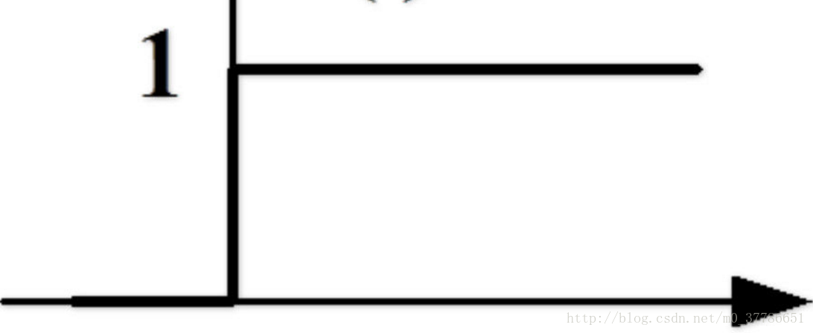
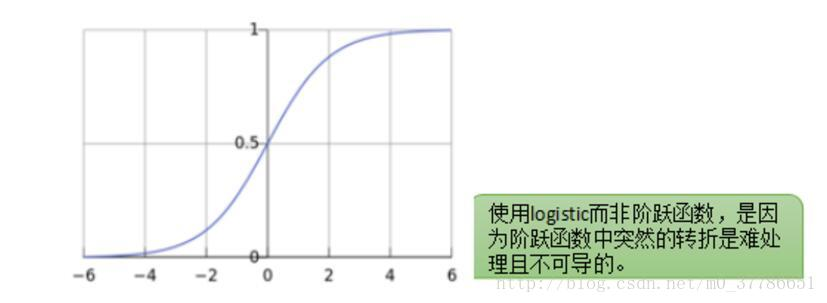

[TOC]

# 感知机模型
* 感知机（Perceptron）是二类分类的线性分类模型，其输入为实例的特征向量，输出为实例的类别，取$\{+1,-1\}$二值
    * 假设输入空间（**特征空间**）是$\bf{x}\subseteq {\Re ^n}$，输出空间是${\cal Y}=\{  + 1, - 1\}$
    
    * 输入$x\in \bf{x}$表示实例的特征向量，对应于输入空间（特征空间）的点；输出$y\in \cal{Y}$表示实例的类别
    
    * 由输入空间到输出空间的函数为
        $$
        f(x) = {\mathop{\rm sign}\nolimits} (\omega  \cdot x + b)
        $$
    
        * $\omega$和$b$是感知机模型参数，$\omega$叫做权值（weight）或权值向量（weight vector）
        * $b\in R$叫作偏置（bias）
        * $\rm sign$是符号函数$f(x)=\left\{ \begin{aligned} +1 & ,x\ge0  \\ -1 &,x<0 \end{aligned} \right.$
    
    * 感知机是一种**线性分类**模型，属于**判别模型**；假设空间是定义在特征空间中的所有线性分类模型（linear classification model）或线性分类器（linear classifier），即函数集合$\{f|f(x)=\omega \cdot x+b\}$
    
* 几何解释：线性方程$\omega  \cdot x + b=0$对应于特征空间中的一个超平面，将特征空间划分为正、负两类
    * $\omega$是超平面的法向量
    * $b$是超平面的截距
    * 超平面S称为**分离超平面**（separating hyperplane）
        
# 感知机学习策略
* 数据集的线性可分性：给定一个数据集$T = \{ (x_1,y_1),(x_2,y_2),\cdots,(x_N,y_N)\}$，其中$x_i\in {\bf{x}} ={\Re ^n},y_i\in  {\cal Y}=\{+1,-1\},i=1,2,\cdots,N$，如果存在某个超平面S：$\omega  \cdot x + b=0$能够将数据集的正实例点和负实例点**完全正确**地划分到**超平面**的**两侧**，则称数据集T为**线性可分数据集**（linearly separable data set）
    * 对所有$y_i=+1$的实例$x_i$，有$\omega  \cdot x + b>0$
    * 对所有$y_i=-1$的实例$x_i$，有$\omega  \cdot x + b<0$

* 感知机学习策略：假设训练数据集是线性可分的
    * 感知机目标：找到一个能够将训练集正实例点和负实例点完全正确分开的分离超平面
    * 损失函数：误分类点到超平面S的**总距离**
        * 空间${\Re ^n}$中任一点$x_0$到超平面S的距离：$\frac{1}{\left\| \omega  \right\|}\left| {\omega  \cdot {x_0} + b} \right|$
          
            * $\left\| \omega  \right\|$是$\omega$的$L_2$范数
            
        * 对于误分类的数据$(x_i,y_i)$来说，$- {y_i}(\omega  \cdot {x_i} + b) > 0$成立
            * 当$\omega  \cdot x + b>0$，误分类点预测$y_i=-1$
            * 当$\omega  \cdot x + b<0$，误分类点预测$y_i=+1$
            
        * 因此第一点公式中绝对值可以去掉，误分类点$x_i$到超平面S的距离是：$- \frac{1}{{\left\| \omega  \right\|}}{y_i}(\omega  \cdot {x_i} + b)$
        
        * 假设超平面S的误分类点集合为M，那么所有误分类点到超平面S的总距离为$- \frac{1}{{\left\| \omega  \right\|}}\sum\limits_{{x_i} \in M} {{y_i}(\omega  \cdot {x_i} + b)}$
        
        * 不考虑$\frac{1}{{\left\| \omega  \right\|}}$，就得到感知机学习的**损失函数**
            $$
            L(\omega,b)=- \sum\limits_{{x_i} \in M} {{y_i}(\omega  \cdot {x_i} + b)}
            $$
        
        * 损失函数$L(\omega,b)$是非负的，如果没有误分类点，损失函数值是0；误分类点越少，误分类点离超平面越近，损失函数值越小

# 感知机学习算法
## 感知机学习算法的原始形式
* 感知机学习算法是对以下最优化问题的算法：给定一个数据集$T=\{ ({x_1},{y_1}),({x_2},{y_2}),\cdots,({x_N},{y_N})\}$，其中$x_i\in \bf{x} ={\Re ^n},y_i\in  {\cal Y}=\{+1,-1\},i=1,2,\cdots,N$，求参数$\omega,b$，使其为以下损失函数极小化问题的解
    $$
    \mathop {\min }\limits_{\omega ,b} L(\omega ,b) =  - \sum\limits_{{x_i} \in M} {{y_i}(\omega  \cdot {x_i} + b)}
    $$

* 感知机学习算法是误分类驱动的，采用随机梯度下降法（stochastic gradient descent）
    * 任意选取一个超平面$\omega_0,b_0$
    
    * 在训练集中选取数据$(x_i,y_i)$
    
* 损失函数的梯度是
  $\begin{array}{l}
{\nabla_\omega }L(\omega ,b) =-\sum\limits_{{x_i} \in M} {y_i}{x_i} \\
    {\nabla_b}L(\omega ,b) = -\sum\limits_{{x_i} \in M} {y_i} 
\end{array}$
  
* 随机选取一个误分类点$(x_i,y_i)$，对参数进行更新
  $$
      \begin{array}{l}
      \omega  \leftarrow \omega  + \eta {y_i}{x_i}\\
      b \leftarrow b + \eta {y_i}
      \end{array}
  $$
  
* 学习算法的直观解释：当一个实例点被误分类，即位于超平面的错误一侧，则调整$\omega,b$的值，使分离超平面向该误分类点的一侧移动，以减少该误分类点与超平面的距离，直至超平面越过该误分类点使其被正确分类

* 感知机学习算法由于采取不同的初值或选取不同的误分类点，解可以不同

## 算法的收敛性
TODO

## 感知机学习算法的对偶形式

* 对偶形式的基本想法：将$\omega$和$b$表示为实例$x_i$和标记$y_i$的线性组合的形式，通过求解其系数而求得$\omega$和$b$；对偶形式和原始形式没有本质区别，可以实现算好所有特征向量之间的内积——Gram矩阵，大大地**加快计算速度**

  * 假设样本点$(x_i,y_i)$在更新过程中使用了$n_i$次，因此最后学习到的$\omega$和$b$可以分别表示为
    $$
    \begin{array}{l}
    \omega  = \sum\limits_{i = 1}^N {{n_i}\eta {y_i}{x_i}} \\
    b = \sum\limits_{i = 1}^N {{n_i}\eta {y_i}} 
    \end{array}
    $$

    * 考虑$n_i$的意义：如果$n_i$的值越大，意味着这个样本点经常被误分——离超平面很近的点，超平面稍微移动一点点，这个点就从正变为负，或者从负变为正。在SVM中，这种点很有可能就是支持向量

  * 将上述公式代入到原始形式的感知机模型中
    $$
    \begin{array}{l}
    f(x) &= {\rm{sign}}(\omega  \cdot x + b)\\
     &= {\rm{sign}}(\sum\limits_{i = 1}^N {{n_i}\eta {y_i}{x_i} \cdot x}  + \sum\limits_{i = 1}^N {{n_i}\eta {y_i}} )
    \end{array}
    $$
    此时，学习的目标就不再是$\omega$和$b$，而是$n_i,i=1,2,\cdots,N$

  * 相应地，训练过程变为

    * 初始时$\forall n_i=0$
    * 在训练集中选取数据$(x_i,y_i)$
    * 如果${y_i}(\sum\limits_{j = 1}^N {{n_j}\eta {y_j}{x_j} \cdot {x_i}}  + \sum\limits_{j = 1}^N {{n_j}\eta {y_j}} ) \le 0$，更新：${n_i} \leftarrow {n_i} + 1$
    * 转至2直至没有误分类数据

  * 对偶形式中训练实例仅以内积的形式出现，为了方便，可以预先将训练集中实例间的内积计算出来并以矩阵的形式存储——Gram矩阵$G = {[{x_i} \cdot {x_j}]_{N \times N}}$

# 感知机、logistic与SVM区别与联系

> https://blog.csdn.net/m0_37786651/article/details/61614865

* 感知机

  * 找到一个超平面把正负两类分开$f(x) = sign({{\bf{\omega }}^T} + b)$，相当于一个**阶跃函数**
  * 损失函数：误分类点样本与分类超平面的距离
  * 只有误分类的点会影响损失函数的值

  

* logistic回归

  * 感知机模型简单直观，但模型不够光滑
    * 假如${{\bf{\omega }}^T} + b=0.0001$，只比0大了一点点就会被分为正样本，极易过拟合
    * 在0处有一个阶跃，导致这一点不连续，在数学上处理起来不方便
  * logistic函数特性：输入是$( - \infty , + \infty )$，输出光滑地分布在$(0,1)$
    * 正样本点分类的超平面距离越远，${{\bf{\omega }}^T} + b$越大，logistic函数值则越接近1
    * 负样本点分类的超平面距离越远，${{\bf{\omega }}^T} + b$越小，logistic函数值则越接近0
  * 损失函数：当分类错误时，样本距离超平面距离越大，则损失函数值越大；当分类正确时，样本距离超平面距离越大，则损失函数值越小$log (1 + \exp ( - y({\omega ^T} + b)))$
  * 所有样本点分布情况都会影响损失函数最后的值

  

* SVM
  * 选择距离正样本和负样本最远的超平面作为分类超平面
  * 损失函数：分类错误时，函数间隔越大，则损失函数值越大；当分类正确且样本点距离超平面一定距离以上，则损失函数值为0