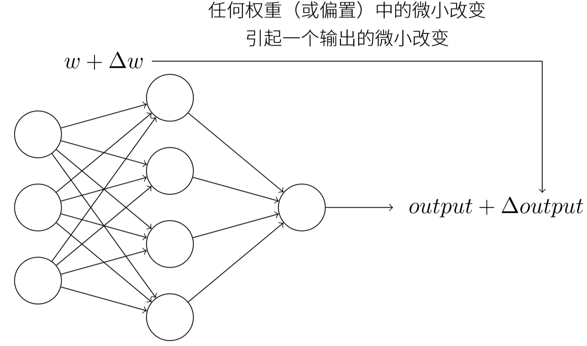
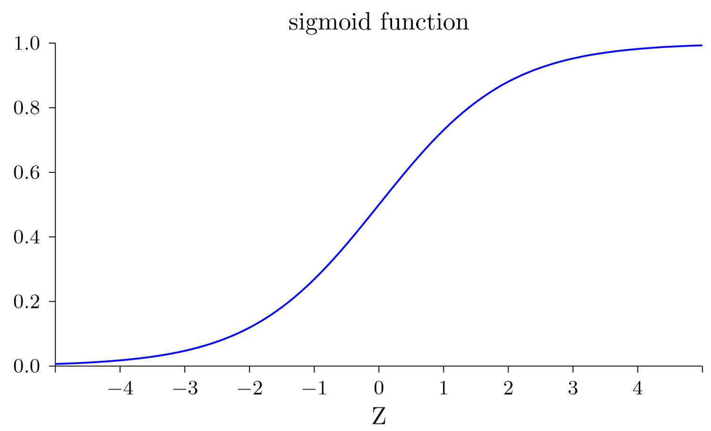
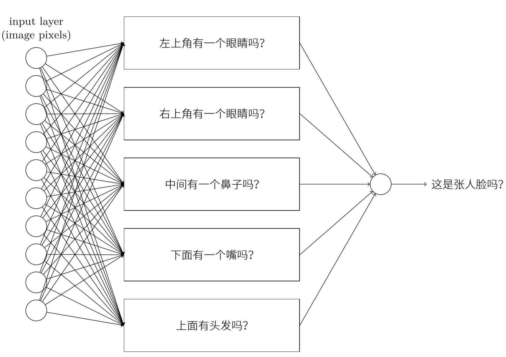
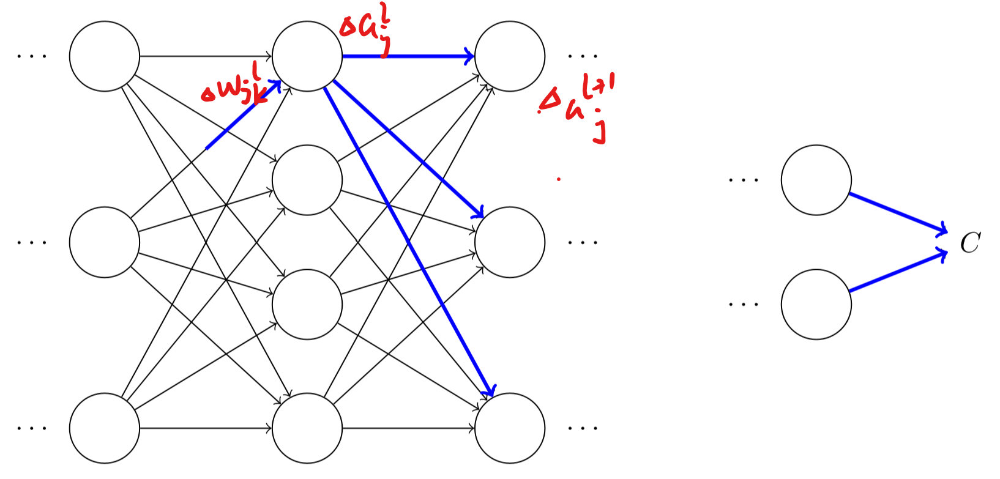
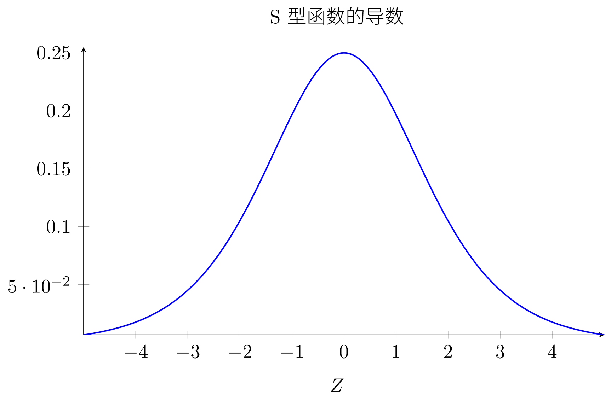

参考：《神经网络与深度学习》——Michael Nielsen

​             [NeuralNetworksandDeepLearning](http://neuralnetworksanddeeplearning.com/index.html)

​             [本文代码](https://github.com/mnielsen/neural-networks-and-deep-learning)

[TOC]

# 使用神经网络识别手写数字

## 感知器

* 感知器是一种人工神经元

  * 接收几个二进制输入$x_1,x_2,\cdots$并产生一个二进制输出

  * 引入权重$\omega_1,\omega2,\cdots$，表示相应输入对于输出重要性的实数$\sum\nolimits_j {{w_j}{x_j}}$ 

  * 神经元的输出`0或者1`，则由分配权重后的总和小于或者大于一些阈值决定
    $$
    output = \left\{ {\begin{array}{*{20}{c}}
    {0,\;\;\;\;\;\;\;\;\;\;\;\;if\;\sum\nolimits_j {{\omega _j}{x_j} \le threshold} }\\
    {1,\;\;\;\;\;\;\;\;\;\;\;\;if\;\sum\nolimits_j {{\omega _j}{x_j} \ge threshold} }
    \end{array}} \right.
    $$

  * 引入偏置`b=-threshold`（表示激活感知器的难易）
  $$
    output = \left\{ {\begin{array}{*{20}{c}}
    {0,\;\;\;\;\;\;\;\;\;\;\;\;if\;\omega  \cdot x + b \le 0}\\
    {1,\;\;\;\;\;\;\;\;\;\;\;\;if\;\omega  \cdot x + b \ge 0}
    \end{array}} \right.
  $$
  
* 感知器可以很容易地计算基本的**逻辑功能**,如**与**,**或**,**与非**.所以感知器网络可以计算任何逻辑功能。
  
* 使感知器能够自动调整权重和偏置的**学习算法**是神经网络有别于传统逻辑门的关键。

## S型神经元

* 感知器的输出决策是一个阶跃函数，网络中单个感知器上一个权重或偏置的微小改动有时候会引起感知器的输出完全翻转，使得逐步修改权重和偏置来让网络接近行为变得困难

* 引入平滑的S型神经元，为了达到下图的目的：网络中的权重（或者偏置）做些微小的改动，引起输出的微小变化，利用这一事实让网络向我们期望的方向进展

  

  *    S型函数：$\sigma (z) = \frac{1}{{1 + {e^{ - z}}}}$，相当于阶跃函数的平滑版本——意味着权重和偏置的微小变化会产生一个微小的输出变化
  
       
  
       

## 神经网络的架构

- 神经网络一般由**输入层**(包含输入神经元),**输出层**(包含输出神经元)和**隐藏层**组成.有时这种多层网络被称为**多层感知器(MLP)**,但要注意它是由**S型神经元**构成的。
- 设计网络的**输入输出层**通常是比较**直接**的,取决于输入数据的格式和希望得到的输出数据。
- **前馈神经网络**中不存在**回路**,这种网络的应用较为广泛.**递归神经网络**允许反馈环路的存在。

## 一个简单的分类手写数字的网络

- 识别手写数字的问题可以分成两个子问题：重点是第二个问题
  - **分割图像**：⽤数字分类器对每⼀个切分⽚段打分
    - 如果数字分类器对每⼀个⽚段的置信度都⽐较⾼，那么这个分割⽅式就能得到较⾼的分数；
    - 如果数字分类器在⼀或多个⽚段中出现问题，那么这种分割⽅式就会得到较低的分数。
  - **分类数字**
- 假设一个数字是28*28的灰度图,那么输入层就包含**784个**输入神经元.
- 输出层使用**10个神经元**来表示0~9的数字.为什么不用4个神经元,通过二进制表示10个数字
  - 如果我们有4个输出，那么第⼀个输出神经元将会尽⼒去判断数字的最⾼有效位是什么。把数字的最⾼有效位和数字的形状联系起来并不是⼀个简单的问题。很难想象出有 什么恰当的历史原因，⼀个数字的形状要素会和⼀个数字的最⾼有效位有什么紧密联系。
  - 这个问题没有确切的答案,只能通过**启发式**的方法来解释：假设神经网络中每个隐藏层的神经元视图识别图像中的某一部分,那么很显然10个输出神经元是更合理的方案。

## 使用梯度下降算法进行学习

* 用于学习的数据集是经典的MNIST数据集，采用的代价函数（损失函数）是均方误差（MSE）
  $$
  C(\omega ,b) = \frac{1}{{2n}}\sum\limits_x {{{\left\| {y(x) - a} \right\|}^2}} 
  $$

  * 之所以**最小化二次代价函数**而不是直接**最大化正确分类**的图像数量,是因为在神经网络中后者关于权重和偏置的函数不是平滑的.而用前者能更好地解决如何用权重和偏置中的微小改变来取得更好的效果.

  * 神经网络中经常含有**大量**变量,因此采用**梯度下降法**来计算代价函数最小值：重复计算梯度,然后沿着**相反**的方向移动

    * 每次选取一个样本，进行梯度下降
      $$
      \begin{array}{l}
      {\omega _k} \to \omega _k' = {\omega _k} - \eta \frac{{\partial C}}{{\partial {\omega _k}}}\\
      {b_l} \to b_l' = {b_l} - \eta \frac{{\partial C}}{{\partial {b_l}}}
      \end{array}
      $$
      
    * 假如需要计算每个训练输入的梯度值,训练速度会相当缓慢.因此引入了**随机梯度下降**，只计算**小批量数据(mini-batch)**的梯度值来求平均值
      $$
      \begin{array}{l}
      {\omega _k} \to \omega _k' = {\omega _k} - \frac{\eta }{m}\sum\limits_j {\frac{{\partial {C_{{X_j}}}}}{{\partial {\omega _k}}}} \\
      {b_l} \to b_l' = {b_l} - \frac{\eta }{m}\sum\limits_j {\frac{{\partial {C_{{X_j}}}}}{{\partial {b_l}}}} 
      \end{array}
      $$
    * 随机梯度下降不断地选定小批量数据来进行训练,直到用完了所有的训练输入,就称为完成了一个迭代期(epoch),然后会开始一个新的迭代期.
      

## 实现我们的网络来分类数字（TODO）

## 迈向深度学习——理解智能背后的机制

* 神经网络如何识别人脸，启发式的想法是将问题分解成子问题

  * 子问题1

    * 图像的左上角有一个眼睛吗
    * 图像的右上角有一个眼睛吗
    * 中间有一个鼻子吗
    * ...

  * 子问题继续分解

    * 左上角有睫毛吗
    * 右上角有虹膜吗
    * ...

  * 上述子问题同样可以被继续分解，并通过多个网络层传递，最终子网络可以回答那些只包含若干个像素点的简单问题

    

* 上述这种包含多层结构（两层或更多隐藏层）的网络被称为深度神经网络；深度神经网络能构建起一个复杂概念的层次结构

# 反向传播算法如何工作

## 热身：神经网络中使用矩阵快速计算输出的方法

* 参数定义

  * $\omega _{jk}^l$表示从$(l-1)^{th}$的$k^{th}$个神经元到$l^{th}$层的$j^{th}$个神经元的链接上的权重

  * $b_j^l$表示在$l^{th}$层第$j^{th}$个神经元的偏置

  * $a_j^l$表示在$l^{th}$层第$j^{th}$个神经元的激活值

  * 权重矩阵$\omega^l$：矩阵的元素就是连接到$l^{th}$层神经元的权重

  * 偏置向量$b^l$：每个元素就是$b_j^l$

  * 激活向量$a^l$：每个元素就是$a_j^l$

  * $\delta _j^l$：在$l^{th}$层第$j^{th}$个神经元上的误差
    $$
    \delta _j^l = \frac{{\partial C}}{{\partial z_j^l}}
    $$

  * $l^{th}$层的第$j^{th}$个神经元的激活值$a_j^l$就和$(l-1)^th$层的激活值通过方程关联起来
    $$
    a_j^l = \sigma (\sum\limits_k {\omega _{jk}^la_k^{l - 1} + b_j^l} )
    $$

  * 简介的向量形式
    $$
    {a^l} = \sigma (z^l) \\
    z^l={\omega ^l}{a^{l - 1}} + {b^l}
    $$

* 关于代价函数的两个假设：反向传播的目标是计算代价函数关于$\omega$和 $b$的偏导数

  * 代价函数可以被写成一个在每个训练样本$x$上的代价函数的均值
    $$
    C = \frac{1}{n}\sum\nolimits_x {{C_x}}
    $$

    * 需要这个假设的原因是反向传播实际上是一个对独立的训练样本计算了$\partial {C_x}/\partial \omega $和$\partial {C_x}/\partial b $，然后我们通过在所有训练样本上进行平均化获得$\partial {C}/\partial \omega $和$\partial {C}/\partial b $

  * 代价可以写成神经网络输出的函数

* Hadamard乘积，s⊙t：假设$s$和$t$是两个同样维度的向量，使用$s \odot t$表示按元素的乘积
  $$
  {(s \odot t)_j} = {s_j}{t_j}
  $$

## 反向传播的四个基本方程

* 输出层误差的方程

  * ${\delta ^L}$：每个元素定义如下

  $$
  \delta _j^L = \frac{{\partial C}}{{\partial z_j^L}} = \sum\limits_k {\frac{{\partial C}}{{\partial a_k^L}}\frac{{\partial a_k^L}}{{\partial z_j^L}}}
  $$
  求和是在输出层的所有神经元$k$上运行的，但是第$k^{th}$个神经元的输出激活值$a_{k}^{l}$只依赖于当$k=j$时第$j^{th}$个神经元的输入权重$z_j^{l}$，当$k \ne j$时$\frac{{\partial a_k^L}}{{\partial z_j^L}}=0$，所以
  $$
  \delta _j^L = \frac{{\partial C}}{{\partial a_j^L}}\sigma '(z_j^L)
  $$
  
  * 矩阵形式的方程
  $$
  {\delta ^L} = {\nabla _a}C \odot \sigma '({z^L})
  $$
  
* 使用下一层的误差${\delta ^{l+1}}$来表示当前层的误差${\delta ^l}$

  * ${\delta ^l}$：每个元素定义如下
    $$
    \begin{array}{l}
    \delta _j^l = \frac{{\partial C}}{{\partial z_j^l}}\\
    \;\;\;\;\; = \sum\limits_k {\frac{{\partial C}}{{\partial z_k^{l + 1}}}\frac{{\partial z_k^{l + 1}}}{{\partial z_j^l}}} \\
    \;\;\;\;\; = \sum\limits_k {\frac{{\partial z_k^{l + 1}}}{{\partial z_j^l}}\delta _k^{l + 1}} 
    \end{array}
  $$
    将$z_k^{l + 1} = \sum\limits_j {\omega _{kj}^{l + 1}a_j^l}  + b_k^{l + 1} = \sum\limits_j {\omega _{kj}^{l + 1}\sigma (z_j^l)}  + b_k^{l + 1}$带入上式
    $$
    \delta _j^l = \sum\limits_k {\omega _{kj}^{l + 1}\delta _k^{l + 1}\sigma '(z_j^l)}
    $$
    
  * 矩阵形式的方程
    $$
    {\delta ^l} = ({({w^{l + 1}})^T}{\delta ^{l + 1}}) \odot \sigma '({z^l})
    $$

* 代价函数关于网络中任意偏置的改变率

  * 每个元素

  $$
  \frac{{\partial C}}{{\partial b_j^l}} = \frac{{\partial C}}{{\partial z_j^l}}\frac{{\partial z_j^l}}{{\partial b_j^l}} = \delta _j^l
  $$

  * 矩阵形式
    $$
    \frac{{\partial C}}{{\partial b}} = \delta
    $$

* 代价函数关于任何一个权重的改变率

  * 每个元素
    $$
    \frac{{\partial C}}{{\partial \omega _{jk}^l}} = \frac{{\partial C}}{{\partial z_j^l}}\frac{{\partial z_j^l}}{{\partial \omega _{jk}^l}} = \delta _j^la_j^{l - 1}
    $$
  
  * 矩阵形式
  
    $$
    \frac{{\partial C}}{{\partial \omega }} = {a_{in}}{\delta _{out}}
    $$
    * 其中$a_{in}$是输入给权重$\omega$的神经元的激活值
    * $\delta_{out}$是输出自权重$\omega$的神经元的误差
    * 从公式可以看出，当输入神经元激活值很小，或者输出神经元已经饱和了（过高或者过低的激活值），梯度也会趋向很小，权重会学习缓慢

## 反向传播算法

* 反向传播方程给出了一种计算代价函数梯度的方法
  1. **输入x**：为输入层设置对应的激活值$a^1$
  2. **前向传播**：从前往后对每层计算相应的$z^l=w^la^{l-1}+b^l$和$a^l=\sigma(z^l)$
  3. **输出层误差**$\delta^L$：计算向量${\delta ^L} = {\nabla _a}C \odot \sigma '({z^L})$
  4. **反向误差传播**：每层计算误差向量${\delta ^l} = ({({w^{l + 1}})^T}{\delta ^{l + 1}}) \odot \sigma '({z^l})$
  5. **输出**：计算代价函数的梯度$\frac{{\partial C}}{{\partial \omega _{jk}^l}} = \delta _j^la_j^{l - 1}$和$\frac{{\partial C}}{{\partial b}} = \delta$

## 代码（TODO）

## 在哪种层面上，反向传播是快速的算法（TODO）

## 反向传播：全局观（TODO）

* 反向传播算法小实验
  * 对网络中的$\omega_{jk}^l$做一点点小的变动$\Delta \omega _{kj}^l$
  * 这个改变会导致在输出激活值上的相应改变$\Delta a _{kj}^l$
  * 然后会对下一层所有激活值的改变
  * 接着，这些改变将影响到一个个下一层，到达输出层，最终影响代价函数
  * 所以代价函数$\Delta C$改变和$\Delta \omega _{kj}^l$就按照下面的公式关联起来
  * $\Delta C$和$\Delta \omega _{kj}^l$就按照下式关联$\Delta C \approx \frac{{\partial C}}{{\partial \omega _{jk}^l}}\Delta \omega _{jk}^l$

# 改进神经网络的学习方法

## 交叉熵代价函数

## 过度拟合和规范化

## 权重初始化

## 再看手写识别问题：代码

## 如何选择神经网络的超参数

## 其他技术

# 神经网络可以计算任何函数的可视化证明（TODO）

* 神经网络可以计算任何的函数，这是一种**普遍性**，这个定理有两个预先声明
  * 这不是说一个网络可以被用来**准确地**计算任何函数,而是尽可能好的一个**近似**。
  * 可以被近似的函数一般是**连续函数**,因为神经网络计算的就是输入的连续函数。

# 深度神经网络为何很难训练

## 消失的梯度问题

* 如果单纯地在先前创建的网络上增加隐藏层的层数，会发现效果会先随着隐藏层层数的增加提高，然后变差
* 因为通过隐藏层反向传播的时候**梯度倾向于变小**，导致前面的隐藏层中的神经元学习速度慢于后面的隐藏层，这就是**梯度弥散(梯度消失)**。
* 梯度弥散是可以避免的，但替代方法又会造成前面的层中的梯度过大，也就是**梯度爆炸**。

## 什么导致了消失的梯度问题?深度神经网络中的梯度不稳定性

* sigmoid函数的导数图像，最大值为$\frac{1}{4}$；如果使用标准方法来初始化网络中的权重，则使用一个均值为0标准差为1的高斯分布，通常权重会满足$\omega_j<1$；这导致项越多，乘积下降的越快

  

- 根本问题就是前面层的梯度是来自后面的层上项的乘积；所以当层次过多时仍采用**标准的基于梯度的**学习算法,就会产生**不稳定的梯度问题**.解决方法有使用**ReLu**作为激活函数,使用**Batch Normalization层**等.

## 在更加复杂网络中的不稳定梯度

## 其他深度学习的障碍

* 不稳定梯度
* 激活函数的选择
* 权重的初始化
* 学习算法的实现方式（SGD、Adam等）

# 深度学习

