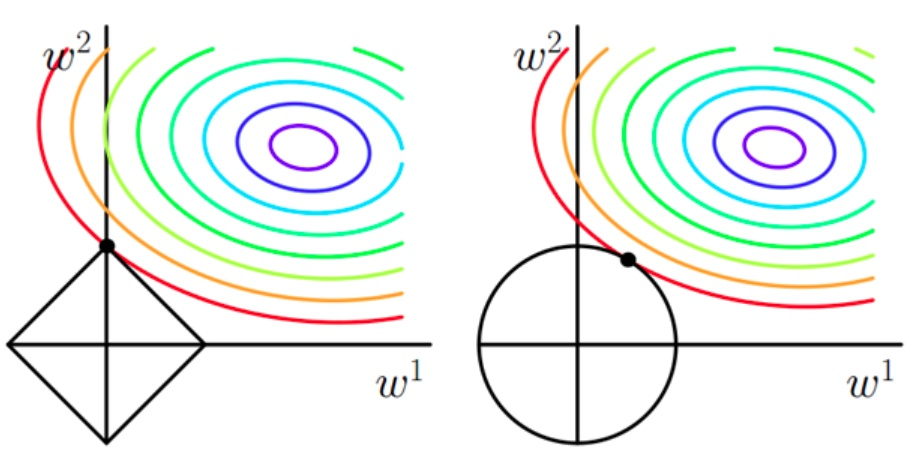

参考：《统计学习方法》——李航

[TOC]

# 统计学习方法概论

## 统计学习

- 统计学习（statistical learning）定义：关于计算机**基于数据构建概率统计模型**并运用模型对数据进行预测与分析的一门学科

  - 特点

    - 以计算机及网络为平台，建立在计算机及网络之上
    - 以数据为研究对象，是数据驱动的学科
    - 目的是对数据进行预测与分析
    - 以方法为中心，构建模型并应用模型进行预测与分析
    - 统计学习是概率论、统计学、信息论、计算理论、最优化理论及计算机科学等多个领域的交叉学科，并且在发展中逐步形成独自的理论体系与方法论
  - 对象
    - 统计学习的对象是数据（data）
    - 从数据出发，提取数据的特征，抽象出数据的模型，发现数据中的知识，又回到对数据的分析与预测中去
  - 目的
    - 用于对数据进行预测与分析， 特别是对未知新数据进行预测与分析
    - 对数据的预测可以使计算机更加智能化， 或者说使计算机的某些性能得到提高
  - 方法
    - 基于数据构建统计模型从而对数据进行预测与分析
    - 由监督学习（supervised learning）、非监督学习（unsupervised learning）、半监督学习（semi-supervised      learning）和强化学习（reinforcement learning）组成
- 监督学习可以概括如下：
  - 从给定的、有限的、用于学习的训练数据（training data）集合出发，假设数据是独立同分布产生的；
  - 并且假设要学习的模型属于某个函数的集合，称为**假设空间**（hypothesis space）；
  - 应用某个评价准则（evaluation criterion），从假设空间中选取一个最优的模型，使它对已知训练数据及未知测试数据（test data）在给定的评价准则下有最优的预测；
  - 最优模型的选取由算法实现

## 监督学习

### 基本概念

* 输入空间、特征空间与输出空间
  * 输入与输出所有可能取值的集合分别称为输入空间（input space）与输出空间（output space）
    * 输入与输出空间可以是有限元素的集合，也可以是整个欧式空间
    * 输入空间与输出空间可以是同一空间，也可以是不同的空间
    * 通常输出空间远远小于输入空间
  * 每个具体的输入是一个实例（instance），通常由一个特征向量（feature vector）表示；此时所有特征向量存在的空间称为特征空间
    * 特征空间每一维对应于一个特征
    * 有时假设输入空间与特征空间为相同的空间，对它们不予区分；有时假设输入空间与特征空间为不同的空间，将实例从输入空间映射到特征空间
    * 模型实际上都是定义在特征空间上
* 联合概率分布：假设输入与输出的随机变量$\bf{X}$和$\bf{Y}$遵循联合概率分布$P(\bf{X},\bf{Y})$
  * 学习过程中假定这一联合概率分布存在，但对学习系统来说，联合概率分布的具体定义是未知的
  * 训练数据与测试数据被看做是依联合概率分布$P(\bf{X},\bf{Y})$独立同分布产生的
  * 统计学习假设数据存在一定的统计规律，$X$和$Y$具有联合概率分布的假设就是监督学习关于数据的基本假设
* 假设空间（hypothesis space）
  * 监督学习目的是学习一个模型表示由输入到输出的映射
  * 由输入空间到输出空间的映射的集合就是假设空间
  * 假设空间的确定意味着学习范围的确定
  * 监督学习的模型可以是概率模型或非概率模型，由条件概率分布$P(\bf{Y} | \bf{X})$或决策函数（decision function）$\bf{Y}=f(\bf{X})$表示

### 问题的形式化

* 监督学习利用训练数据集学习一个模型，再用模型对测试样本集进行预测（prediction），分为学习和预测两个过程
  * 给定训练数据集$T = \{ ({x_1},{y_1}),({x_2},{y_2}), \cdots ,({x_N},{y_N})\} $，其中$(x_i,y_i),i=1,2,\cdots,N$称为样本或样本点，${x_i} \in x \subseteq {\Re ^n}$是输入的观测值，称为输入或实例，$y_i\in \cal Y$是输出的观测值，称为输出
  * 学习过程中，学习系统利用给定的训练数据集，通过学习（训练）得到一个模型，表示为条件概率分布$\hat P(Y|X)$ 或决策函数$Y = \hat f(X)$——描述输入与输出随机变量之间的映射关系
  * 预测过程中，预测系统对于给定的测试样本集中的输入$x_{N+1}$，由模型${y_{N + 1}} = \mathop {\arg \max }\limits_{{y_{N + 1}}} \hat P({y_{N + 1}}|{x_{N + 1}})$或${y_{N + 1}} = \hat f({x_{N + 1}})$给出相应的输出$y_{N+1}$

## 统计学习三要素——模型、策略和算法

### 模型

> 在监督学习过程中，模型就是所要学习的条件概率分布或决策函数

* 模型的假设空间包含所有的条件概率分布或决策函数

  * 如：假设决策函数是输入变量的线性函数，那么模型的假设空间就是所有这些线性函数构成的函数集合
  * 假设空间中的模型一般有无穷多个

* 假设空间用$\cal F$表示

  * 定义为决策函数的集合
    $$
    {\cal F} = \{ f|Y = f(X)\}
    $$
    其中，$X$和$Y$是定义在输入空间$\cal X$和$\cal Y$上的变量，此时$\cal F$通常是由一个参数向量决定的函数簇
    $$
    {\cal F} = \{ f|Y = {f_\theta }(X),\theta  \in {\Re ^n}\}
    $$
    参数向量$\theta$取值属于$n$维欧式空间$\Re^n$，称为参数空间（parameter space）

  * 定义为条件概率的集合
    $$
    {\cal F} = \{ P|P(Y|X)\} 
    $$
    其中，$X$和$Y$是定义在输入空间$\cal X$和$\cal Y$上的变量，此时$\cal F$通常是由一个参数向量决定的条件概率分布簇
    $$
    {\cal F} = \{ P|{P_\theta }(Y|X),\theta  \in {\Re ^n}\} 
    $$
    参数向量$\theta$取值属于$n$维欧式空间$\Re^n$，称为参数空间（parameter space）

### 策略

* 损失函数和风险函数
  
  * 损失函数（loss function，代价函数 cost function）：度量模型一次预测的好坏，损失函数值越小，模型就越好
  
    * 0-1损失函数（0-1 loss function）
  
    $$
    L(Y,f(X)) = \left\{ {\begin{array}{*{20}{c}}
    {1,Y \ne f(X)}\\
    {0,Y = f(X)}
    \end{array}} \right.
    $$
  
    * 平方损失函数（quadratic loss function）
  
    $$
    L(Y,f(X)) = {(Y - f(X))^2}
    $$
  
    * 绝对损失函数（absolute loss function）
  
    $$
    L(Y,f(X)) = \left| {Y - f(X)} \right|
    $$
  
    * 对数损失函数（logarithmic loss function）或对数似然损失函数（loglikelihood loss function）
  
    $$
    L(Y,P(Y|X)) =  - \log P(Y|X)
    $$
  
  * 风险函数（risk function，期望损失 expected loss）：度量平均意义下模型预测的好坏
  
    * 由于模型的输入、输出$(X,Y)$是随机变量，遵循联合分布$P(X,Y)$，所以损失函数的期望——风险函数（期望损失函数）是
  
    $$
    {R_{\exp }}(f) = {E_p}[L(Y,f(X))] = \int\limits_{\chi  \times \cal Y } {L(Y,f(X))P(x,y)dxdy}
    $$
  
  * 学习的目标是选择期望风险最小的模型，由于联合分布$P(X,Y)$是未知的，所以无法直接计算风险函数
  
    * 如果知道联合分布$P(X,Y)$，可以直接求出条件概率分布$P(Y|X)$，也就不需要学习了
    * 一方面根据期望风险最小学习模型要用到联合分布，另一方面联合分布又是未知的，所以监督学习就成为一个病态问题（ill-formed problem）
  
  * 经验风险（empirical risk）或经验损失（empirical loss）：给定一个训练数据集$T = \{ ({x_1},{y_1}),({x_2},{y_2}), \cdots ,({x_N},{y_N})\} $，模型关于训练数据集的平均损失
    $$
    {R_{emp}}(f) = \frac{1}{N}\sum\limits_{i = 1}^N {L({y_i},f({x_i}))}
    $$
  
    * 期望风险$R_{exp}(f)$是模型关于联合分布的期望损失，经验风险$R_{emp}(f)$是模型关于训练样本集的平均损失
    * 根据大数定理，当样本容量$N$趋于无穷时，经验风险趋于期望风险，所以用经验风险估计期望风险
    * 由于现实中训练样本数目有限，甚至很小，所以用经验风险估计期望风险常常并不理想，要对经验风险进行一定的矫正——经验风险最小化和结构风险最小化
  
* 经验风险最小化和结构风险最小化

  * 经验风险最小化（empirical risk minimization，ERM）策略

    * 经验风险最小的模型就是最优模型，按照经验风险最小化求最优模型就是求解最优化模型

    $$
    \mathop {\min }\limits_{f \in \cal F} \frac{1}{N}\sum\limits_{i = 1}^N {L({y_i},f({x_i}))}
    $$

    ​       其中$\cal F$是假设空间

    * 例如：极大似然估计（maximum likelihood estimation）就属于经验风险最小化——当模型是条件概率分布，损失函数是对数损失函数时，经验风险最小化就等价于极大似然估计

  * 结构风险最小化（structural risk minimization，SRM）：防止过拟合而提出的策略，等价于正则化（regularizer）

    * 在假设空间、损失函数以及训练数据集确定的情况下，结构风险等于经验风险加上表示模型复杂度的正则化项或罚项（penalty term）
      $$
      \mathop {\min }\limits_{f \in \cal F}{R_{srm}}(f) = \frac{1}{N}\sum\limits_{i = 1}^N {L({y_i},f({x_i})) + \lambda J(f)}
      $$
      其中，$J(f)$为模型的复杂度，是定义在假设空间$\cal F$上的泛函；$\lambda \ge 0$是系数，用以权衡经验风险和模型复杂度

    * 例如：贝叶斯估计中的最大后验概率估计（maximum posterior probability estimation，MAP）就属于结构风险最小化——当模型是条件概率分布、损失函数是对数损失函数、模型复杂度由模型的先验概率表示时，结构风险最小化就等价于最大后验概率估计

### 算法

> 算法——模型的具体计算方法

* 统计学习基于训练数据集，根据学习策略，从假设空间中选择最优模型；此时统计学习问题归结为最优化问题，统计学习的算法成为求解最优化问题的算法
* 如果最优化问题有显式的解析解，问题就比较简单，但是通常解析解不存在，需要用数值的方法求解

## 模型评估与模型选择

* 训练误差（training error）与测试误差（test error）：假设学习到的模型是$Y = \hat f(X)$

  * 训练误差是模型$Y = \hat f(X)$关于训练数据集的平均损失
    $$
    {R_{emp}}(\hat f) = \frac{1}{N}\sum\limits_{i = 1}^N {L({y_i},f({{\hat x}_i}))}
    $$
    其中，$N$是训练样本容量

  * 测试误差是模型$Y = \hat f(X)$关于测试数据集的平均损失
    $$
    {e_{test}} = \frac{1}{{N'}}\sum\limits_{i = 1}^{N'} {L({y_i},f({{\hat x}_i}))}
    $$
    其中，$N'$是测试样本容量

  * 例如：当损失函数是0-1损失时

    * 测试误差就变成了常见的测试测试集上的误差率（error rate）

    $$
    {e_{test}} = \frac{1}{{N'}}\sum\limits_{i = 1}^{N'} {I({y_i} \ne f({{\hat x}_i}))}
    $$

    其中，$I$是指示函数（indicator function），$I = \left\{ {\begin{array}{*{20}{c}}
    {1,  y \ne \hat f(x)}\\
    {0,  y=\hat f(x)}
    \end{array}} \right.$

    * 相应地，常见的测试数据集上的准确率（accuracy）为${r_{test}} = \frac{1}{{N'}}\sum\limits_{i = 1}^{N'} {I({y_i} = \hat f({x_i}))} $

* 过拟合与模型选择

  * 过拟合（over-fitting）：一味追求提高对训练数据的预测能力，所选模型的复杂度则往往会比真实模型高，泛化能力降低

    

## 正则化与交叉验证

### 正则化（regularization）

* 正则化项一般是模型复杂度的单调递增函数，模型越复杂，正则化值就越大
  $$
  \mathop {\min }\limits_{f \in \cal{F}} \frac{1}{N}\sum\limits_{i = 1}^N {L({y_i},f({x_i})) + \lambda J(f)} 
  $$
  其中，第1项是经验风险，第2项是正则化项，$\lambda \ge 0$为调整两者之间关系的系数

  * 参数向量的$L_2$范数：$\frac{\lambda }{2}{\left\| \omega  \right\|^2}$
  * 参数向量的$L_1$范数：$\lambda\left\| \omega  \right\|_1$

  
  
* 正则化符合奥卡姆剃刀原理：在所有可能选择的模型中，能够很好地解释已知数据并且十分简单才是最好的模型；

* 从贝叶斯估计的角度来看，正则化项对应于模型权重的先验概率

  * L1正则化对应拉普拉斯概率分布
  * L2正则化对应高斯分布

* 正则化为什么能抑制过拟合：

  * [正则化讲解](https://baijiahao.baidu.com/s?id=1621054167310242353&wfr=spider&for=pc)
  * [知乎](https://zhuanlan.zhihu.com/p/35356992)

* 线性回归的L1正则化为Lasso回归；线性回归的L2正则化为岭回归

### 交叉验证（cross validation）

* 样本数据充足，进行模型选择的一种简单方法：随机地将数据集切分成三部分，分别为训练集（training set）、验证集（validation  set）和测试集（test set）
  * 训练集用来训练模型
  * 验证集用于模型的选择
  * 测试集用于最终对学习方法的评估
* 交叉验证的基本想法：重复地使用数据；把给定的数据进行切分，将切分的数据集组合为训练集与测试集，在此基础上反复地进行训练、测试以及模型选择
  * 简单交叉验证：随机地将数据分为两部分，一部分作为训练集，另一部分作为测试集；然后用训练集在各种条件下（例如，不同的参数个数）训练模型，从而得到不同的模型；在测试集上评价各个模型的测试误差，选出测试误差最小的模型
  * S折交叉验证（S-fold cross validation）：首先随机地将已给数据切分为S个互不相交的大小相同的子集；然后后利用S-1个子集的数据训练模型，利用余下的子集测试模型；将这一过程对可能的S中选择重复进行；最后选出S次评测中平均测试误差最小的模型
  * 留一交叉验证：是S折交叉验证的特殊情况S=N，往往在数据缺乏的情况下使用

## 泛化能力

* 泛化能力（generalization ability）：由该方法学习到的模型对未知数据的预测能力

* 泛化误差：如果学到的模型是$\hat {f}$，那么用这个模型对未知数据预测的误差即为泛化误差
  $$
  {R_{\exp }}(f) = {R_p}[L(Y,\hat f(X))] = \int\limits_{\chi  \times \cal{Y}} {L(y,\hat f(x))P(x,y)dxdy} 
  $$
  泛化误差反映了学习方法的泛化能力，如果一种方法学习的模型比另一种方法学习的模型具有更小的泛化误差，那么这种方法就更有效；事实上，泛化误差就是所学习到的模型的期望风险

* 泛化能力上界：TODO

## 生成模型与判别模型

* 监督学习的任务是学习一个模型，应用这一模型，对给定的输入预测相应的输出，一般形式为

  * 决策函数：$Y=f(X)$
  * 条件概率函数：$P(Y|X)$

* 监督学习方法可以分为生成方法（generative approach）和判别方法（discriminative approach），学到的模型分别称为生成模型和判别模型

  * 生成方法：由数据学习联合概率分布$P(X,Y)$，然后求出条件概率分布$P(X,Y)$作为预测的模型，即生成模型
    $$
    P(Y|X) = \frac{{P(X,Y)}}{{P(X)}}
    $$
    生成模型表示了给定输入$X$产生输出$Y$的生成关系，典型的生成模型有：朴素贝叶斯法和隐马尔科夫模型

  * 判别方法：由数据直接学习决策函数$Y=f(X)$或者条件概率$P(Y|X)$作为预测的模型，即判别模型

    * 判别方法关心的是对给定的输入$X$，应该预测什么样的输出$Y$
    * 典型的判别方法包括：k近邻法、感知机、决策树、逻辑斯蒂回归模型、最大熵模型、支持向量机、提升方法和条件随机场

  * 生成方法和判别方法的特点

    * 生成方法
      * 可以还原出联合概率分布$P(X,Y)$，而判别方法不能
      * 生成方法的学习收敛速度更快，即当样本容量增加的时候，学到的模型可以更快地收敛于真实模型
      * 当存在隐变量时，仍可以用生成方法学习，此时判别方法就不能用
    * 判别方法
      * 判别方法直接学习条件概率$P(Y|X)$或决策函数$f(X)$，直接面对预测，往往学习的准确率更高
      * 由于直接学习$P(Y|X)或$$f(X)$，可以对数据进行各种程度上的抽象、定义特征并使用特征，因此可以简化学习问题

## 分类问题

* 监督学习中，当输出遍历$Y$取有限个离散值时，预测问题便成为分类问题

  * 输入遍历$X$可以是离散的，也可以是连续的

  * 监督学习从数据中学习一个分类模型或分类决策函数，称为分类器（classifier），分类器对新的输入进行输出的预测（prediction），称为分类（classification）

  * 可能输出的称为类（class），分类的类别为多个时，称为多类分类问题

* 分类问题包括学习和分类两个过程
    * 学习过程中，根据已知的训练数据集$T = \{ ({x_1},{y_1}),({x_2},{y_2}), \cdots ,({x_N},{y_N})\} $利用有效的学习方法学习一个分类器$P(Y|X)$或$Y=f(X)$ 
    * 在分类过程中，利用学习的分类器对新的输入实例$x_{N+1}$进行分类，即预测其输出的类标记$y_{N+1}$

* 分类器性能评价指标

  * 一般是分类准确率（accuracy）——对于给定的测试数据集，分类器正确分类的样本数与总样本数之比，也就是损失函数是0-1损失时测试数据集上的准确率

  * 对于二类分类问题常用的评价指标是精确率（precision）与召回率（recall）；通常以关注的类为正类，其他类为负类

    * 分类器在测试集上的预测正确与否，4中情况出现总数分别记作

      * TP——将正类预测为正类的数目
      * FN——将正类预测为负类的数目
      * FP——将负类预测为正类的数目
      * TN——将负类预测为负类的数目

    * 精确率：正类预测正确数目占预测为正类的数目之比
      $$
      P = \frac{{TP}}{{TP + FP}}
      $$

    * 召回率：正类预测正确数目占正类的数目之比
      $$
      P = \frac{{TP}}{{TP + FN}}
      $$

    * F1值：精确率和召回率的调和平均
      $$
      \begin{array}{l}
      \frac{2}{{{F_1}}} = \frac{1}{P} + \frac{1}{R}\\
      {F_1} = \frac{{2TP}}{{2TP + FP + FN}}
      \end{array}
      $$

## 标注问题

* 标注（tagging）是监督学习问题

  * 输入是一个观测序列，输出是一个标记序列或状态序列
  * 标注问题的目标在于学习一个模型，使它能够对观测序列给出标记作为预测
  * 可能的标记个数是有限的，但其组合所成的标记序列的个数是依序列长度呈指数级增长的
  * 常用的标记统计学习方法：隐马尔可夫模型和条件随机场
  * 标注问题在信息抽取、自然语言处理等领域被广泛应用，例如自然语言处理中的词性标注（part of speech tagging）

* 标注问题分为学习和标注两个过程

  * 首先给定一个训练数据集$T = \{ ({x_1},{y_1}),({x_2},{y_2}), \cdots ,({x_N},{y_N})\} $，这里${x_i} = {(x_i^{(1)},x_i^{(2)}, \cdots ,x_i^{(n)})^T},i=1,2,\cdots,N$是输入观测序列，${y_i} = {(y_i^{(1)},y_i^{(2)}, \cdots ,y_i^{(n)})^T},i=1,2,\cdots,N$是相应的输出标记序列，$n$是序列的长度，对不同样本可以有不同的值

  * 学习系统基于训练数据集构建一个模型，表示为条件概率分布
    $$
    P({Y^{(1)}},{Y^{(2)}}, \cdots ,{Y^{(N)}}|{X^{(1)}},{X^{(2)}}, \cdots ,{X^{(N)}})
    $$
    其中，$X^{(i)}$取值为所有可能的观测，$Y^{(i)}$取值为所有可能的标记

  * 标注系统按照学习得到的条件概率分布模型，对新的输入观测序列找到相应的输出标记序列——对一个观测序列${x_{N + 1}} = {(x_{N + 1}^{(1)},x_{N + 1}^{(2)}, \cdots ,x_{N + 1}^{(n)})^T}$找到使条件概率$P({Y^{(1)}},{Y^{(2)}}, \cdots ,{Y^{(N)}}|{X^{(1)}},{X^{(2)}}, \cdots ,{X^{(N)}})$最大的标记序列${y_{N + 1}} = {(y_{N + 1}^{(1)},y_{N + 1}^{(2)}, \cdots ,y_{N + 1}^{(n)})^T}$

    

## 回归问题

* 回归（regression）：用于预测输入变量（自变量）和输出变量（因变量）之间的关系
  * 回归模型正是表示从输入变量到输出变量之间映射的函数
  * 回归问题的学习等价于函数拟合：选择一条函数曲线使其很好地拟合已知数据且很好地预测未知数据
  * 最常用的损失函数是平方损失函数，此情况下，回归问题可以由著名的最小二乘法（least squares）求解
* 回归问题分为学习和预测两个过程
  * 首先给定一个训练数据集$T = \{ ({x_1},{y_1}),({x_2},{y_2}), \cdots ,({x_N},{y_N})\} $，其中$x_i \in \Re^n$是输入，$y \in \Re$是对应的输出，学习系统基于训练数据构建一个模型，即函数$Y=f(X)$
  * 对新的输入$x_{N+1}$，预测系统根据学习的模型确定相应的输出$y_{N+1}$

# 感知机
## 感知机模型
* 感知机（Perceptron）是二类分类的线性分类模型，其输入为实例的特征向量，输出为实例的类别，取$\{+1,-1\}$二值
    * 假设输入空间（**特征空间**）是$\bf{x}\subseteq {\Re ^n}$，输出空间是${\cal Y}=\{  + 1, - 1\}$
    * 输入$x\in \bf{x}$表示实例的特征向量，对应于输入空间（特征空间）的点；输出$y\in \cal{Y}$表示实例的类别
    * 由输入空间到输出空间的函数为$f(x) = {\mathop{\rm sign}\nolimits} (\omega  \cdot x + b)$
        * $\omega$和$b$是感知机模型参数，$\omega$叫做权值（weight）或权值向量（weight vector）
        * $b\in R$叫作偏置（bias）
        * $\rm sign$是符号函数$f(x)=\left\{ \begin{aligned} +1 & ,x\ge0  \\ -1 &,x<0 \end{aligned} \right.$
    * 感知机是一种**线性分类**模型，属于**判别模型**；假设空间是定义在特征空间中的所有线性分类模型（linear classification model）或线性分类器（linear classifier），即函数集合$\{f|f(x)=\omega \cdot x+b\}$
    
* 几何解释：线性方程$\omega  \cdot x + b=0$对应于特征空间中的一个超平面，将特征空间划分为正、负两类
    * $\omega$是超平面的法向量
    * $b$是超平面的截距
    * 超平面S称为**分离超平面**（separating hyperplane）
        
## 感知机学习策略
* 数据集的线性可分性：给定一个数据集$T = \{ ({x_1},{y_1}),({x_2},{y_2}),\cdots,({x_N},{y_N})\}$，其中$x_i\in {\bf{x}} ={\Re ^n},y_i\in  {\cal Y}=\{+1,-1\},i=1,2,\cdots,N$，如果存在某个超平面S：$\omega  \cdot x + b=0$能够将数据集的正实例点和负实例点**完全正确**地划分到**超平面**的**两侧**，则称数据集T为**线性可分数据集**（linearly separable data set）
    * 对所有$y_i=+1$的实例$x_i$，有$\omega  \cdot x + b>0$
    * 对所有$y_i=-1$的实例$x_i$，有$\omega  \cdot x + b<0$

* 感知机学习策略：假设训练数据集是线性可分的
    * 感知机目标：找到一个能够将训练集正实例点和负实例点完全正确分开的分离超平面
    * 损失函数：误分类点到超平面S的**总距离**
        * 空间${\Re ^n}$中任一点$x_0$到超平面S的距离：$\frac{1}{{\left\| \omega  \right\|}}\left| {\omega  \cdot {x_0} + b} \right|$
            * $\left\| \omega  \right\|$是$\omega$的$L_2$范数
        * 对于误分类的数据$(x_i,y_i)$来说，$- {y_i}(\omega  \cdot {x_i} + b) > 0$成立
            * 当$\omega  \cdot x + b>0$，误分类点预测$y_i=-1$
            * 当$\omega  \cdot x + b<0$，误分类点预测$y_i=+1$
        * 因此第一点公式中绝对值可以去掉，误分类点$x_i$到超平面S的距离是：$- \frac{1}{{\left\| \omega  \right\|}}{y_i}(\omega  \cdot {x_i} + b)$
        * 假设超平面S的误分类点集合为M，那么所有误分类点到超平面S的总距离为$- \frac{1}{{\left\| \omega  \right\|}}\sum\limits_{{x_i} \in M} {{y_i}(\omega  \cdot {x_i} + b)}$
        * 不考虑$\frac{1}{{\left\| \omega  \right\|}}$，就得到感知机学习的**损失函数**$L(\omega,b)=- \sum\limits_{{x_i} \in M} {{y_i}(\omega  \cdot {x_i} + b)}$
        * 损失函数$L(\omega,b)$是非负的，如果没有误分类点，损失函数值是0；误分类点越少，误分类点离超平面越近，损失函数值越小

## 感知机学习算法
### 感知机学习算法的原始形式
* 感知机学习算法是对以下最优化问题的算法：给定一个数据集$T=\{ ({x_1},{y_1}),({x_2},{y_2}),\cdots,({x_N},{y_N})\}$，其中$x_i\in \bf{x} ={\Re ^n},y_i\in  {\cal Y}=\{+1,-1\},i=1,2,\cdots,N$，求参数$\omega,b$，使其为以下损失函数极小化问题的解$\mathop {\min }\limits_{\omega ,b} L(\omega ,b) =  - \sum\limits_{{x_i} \in M} {{y_i}(\omega  \cdot {x_i} + b)}$
* 感知机学习算法是误分类驱动的，采用随机梯度下降法（stochastic gradient descent）
    * 任意选取一个超平面$\omega_0,b_0$
    * 在训练集中选取数据$(x_i,y_i)$
    * 损失函数的梯度是
      $\begin{array}{l}
{\nabla_\omega }L(\omega ,b) =-\sum\limits_{{x_i} \in M} {y_i}{x_i} \\
{\nabla_b}L(\omega ,b) = -\sum\limits_{{x_i} \in M} {y_i} 
\end{array}$
    * 随机选取一个误分类点$(x_i,y_i)$，对参数进行更新$\begin{array}{l}
\omega  \leftarrow \omega  + \eta {y_i}{x_i}\\
b \leftarrow b + \eta {y_i}
\end{array}$

* 学习算法的直观解释：当一个实例点被误分类，即位于超平面的错误一侧，则调整$\omega,b$的值，使分离超平面向该误分类点的一侧移动，以减少该误分类点与超平面的距离，直至超平面越过该误分类点使其被正确分类
* 感知机学习算法由于采取不同的初值或选取不同的误分类点，解可以不同

### 算法的收敛性
TODO

### 感知机学习算法的对偶形式

* 对偶形式的基本想法：将$\omega$和$b$表示为实例$x_i$和标记$y_i$的线性组合的形式，通过求解其系数而求得$\omega$和$b$；对偶形式和原始形式没有本质区别，可以实现算好所有特征向量之间的内积——Gram矩阵，大大地加快计算速度

  * 假设样本点$(x_i,y_i)$在更新过程中使用了$n_i$次，因此最后学习到的$\omega$和$b$可以分别表示为
    $$
    \begin{array}{l}
    \omega  = \sum\limits_{i = 1}^N {{n_i}\eta {y_i}{x_i}} \\
    b = \sum\limits_{i = 1}^N {{n_i}\eta {y_i}} 
    \end{array}
    $$

    * 考虑$n_i$的意义：如果$n_i$的值越大，意味着这个样本点经常被误分——离超平面很近的点，超平面稍微移动一点点，这个点就从正变为负，或者从负变为正。在SVM中，这种点很有可能就是支持向量

  * 将上述公式代入到原始形式的感知机模型中
    $$
    \begin{array}{l}
    f(x) &= {\rm{sign}}(\omega  \cdot x + b)\\
     &= {\rm{sign}}(\sum\limits_{i = 1}^N {{n_i}\eta {y_i}{x_i} \cdot x}  + \sum\limits_{i = 1}^N {{n_i}\eta {y_i}} )
    \end{array}
    $$
    此时，学习的目标就不再是$\omega$和$b$，而是$n_i,i=1,2,\cdots,N$

  * 相应地，训练过程变为

    * 初始时$\forall n_i=0$
    * 在训练集中选取数据$(x_i,y_i)$
    * 如果${y_i}(\sum\limits_{j = 1}^N {{n_j}\eta {y_j}{x_j} \cdot {x_i}}  + \sum\limits_{j = 1}^N {{n_j}\eta {y_j}} ) \le 0$，更新：${n_i} \leftarrow {n_i} + 1$
    * 转至2直至没有误分类数据

  * 对偶形式中训练实例仅以内积的形式出现，为了方便，可以预先将训练集中实例间的内积计算出来并以矩阵的形式存储——Gram矩阵$G = {[{x_i} \cdot {x_j}]_{N \times N}}$

# k近邻法

* K近邻法是一种基本分类与回归方法，分类时对新的实例，根据其**k个最近邻**的训练实例的类别，通过**多数表决**等方式进行预测
    * 输入为实例的特征向量，对应于特征空间的点
    * 输出为实例的类别
    * 不具有显式的学习过程，实际上利用训练数据集对**特征向量空间**进行**划分**，并作为其分类的模型

* K近邻法的三个基本要素
    * k值的选择
    * 距离度量
    * 分类决策规则

## k近邻算法
* 算法实现
    * 输入：训练数据集$T = \{ ({x_1},{y_1}),({x_2},{y_2}),\cdots,({x_N},{y_N})\}$，其中${x_i} \in x \subseteq {\Re ^n}$为实例的特征向量，${y_i} \in {\cal{Y}} = \{ {c_1},{c_2}, \cdots ,{c_k}\}$为实例的类别，$i=1,2,\cdots,N$
    * 输出：实例$x$所属的类别$y$
    * 根据给定的距离度量，在训练集$T$中找出与x最近邻的k个点，涵盖这k个点的x的邻域记作$N_k(x)$
    * 在$N_k(x)$中根据分类决策规则（如多数表决）决定$x$的类别$y$：$y = \mathop {\arg \max }\limits_{{c_j}} \sum\limits_{{x_i} \in {N_k}(x)} {I({y_i} = {c_j})}$，$i=1,2,\cdots,N;j=1,2,\cdots,K$
    其中$I$是指示函数，即当$y_i=c_j$时$I=1$，否则为0
* k=1时称为最近邻算法

## k近邻模型
* 模型：
    * 特征空间中，对每个训练实例点$x_i$，距离改该点比其他点更近的所有点组成一个区域，叫做单元（cell）
    * 每个训练实例点拥有一个单元，所有训练实例点的单元构成对特征空间的一个划分

k近邻法的模型对应特征空间的一个划分

* 距离度量：特征空间中两个实例点相似程度的反映，假设特征空间x是n维实数向量空间${\Re ^n}$，${x_i},{x_j} \in \chi ,{x_i} = {(x_i^{(1)},x_i^{(2)}, \cdots ,x_i^{(n)})^T},{x_j} = {(x_j^{(1)},x_j^{(2)}, \cdots ,x_j^{(n)})^T}$
    * Lp距离（Lp distance）：${L_p}({x_i},{x_j}) = {\left( {\sum\limits_{l = 1}^n {{{\left| {x_i^{(l)} - x_j^{(l)}} \right|}^p}} } \right)^{\frac{1}{p}}}$，$p \ge 1$
        * 当p=2时，称为欧式距离，即${L_2}({x_i},{x_j}) = {\left( {\sum\limits_{l = 1}^n {{{\left| {x_i^{(l)} - x_j^{(l)}} \right|}^2}} } \right)^{\frac{1}{2}}}$
        * 当p=1时，称为曼哈顿（Manhattan distance）：${L_1}({x_i},{x_j}) = { {\sum\limits_{l = 1}^n {{{\left| {x_i^{(l)} - x_j^{(l)}} \right|}}} } }$
        * 当$p = \infty$，它是各个坐标距离的最大值${L_\infty }({x_i},{x_j}) = \mathop {\max }\limits_i \left| {x_i^{(l)} - x_j^{(l)}} \right|$

上图为二维空间中p取不同值时，与原点的$L_p$距离为1的点的图形
* k值的选择
    * 选择较小的值：相当于用较小的邻域中的训练实例进行预测，k值的减小意味着整体模型变复杂，容易发生**过拟合**
        * 学习的近似误差（approximation error）会减小
        * 学习的估计误差（estimation error）会增大，预测结果会对近邻的实例点非常敏感
    * 选择较大的值：相当于用较大的邻域中的训练实例进行预测，意味着模型变得简单
        * 可以减少学习的估计误差
        * 近似误差会增大
    * k=N：无论输入实例是什么，都将简单地预测它属于在训练实例中最多的类，模型过于简单，完全忽略训练实例中的大量有用信息，不可取
    * 在实际应用中，k值一般取一个比较小的数值，通常采用交叉验证法来选取最优的k值

* 分类决策规则：往往是多数表决，即由输入实例的k个邻近的训练实例中的多数类决定输入实例的类
    * 如果分类的损失函数为0-1损失函数，分类函数为$f:{\Re ^n} \to \{ {c_1},{c_2}, \cdots ,{c_k}\}$，那么误分类的概率为$P(Y \ne f(X)) = 1 - P(Y = f(X))$
    * 对于给定的实例$x_i\in x$，其最近邻的k个训练实例点构成集合$N_k(x)$；如果涵盖$N_k(x)$的区域的类别是$c_j$，那么误分类率是$\frac{1}{k}\sum\limits_{{x_i} \in {N_k}(x)} {I({y_i} \ne {c_j})}  = 1 - \frac{1}{k}\sum\limits_{{x_i} \in {N_k}(x)} {I({y_i} = {c_j})}$
    * 要使误分类率最小即经验风险最小，就要使$\sum\limits_{{x_i} \in {N_k}(x)} {I({y_i} = {c_j})}$最大
    * 所以多数表决规则等价于经验风险最小化（损失函数最小化）
## k近邻法的实现：kd树
TODO

# 朴素贝叶斯法

## 基本方法
* 设输入空间${\bf{\chi }}\subseteq {\Re ^n}$，为n维向量的集合，输出空间为类标记集合${\cal{Y }} = \{ {c_1},{c_2}, \cdots ,{c_k}\}$；输入为特征向量$x \in {\bf{\chi }}$，输出为类标记$y \in {\cal{Y }}$
    * $P(X,Y)$是X和Y的联合概率分布，其中X是输入空间$\bf{\chi }$上的随机向量，Y是定义在输出空间$\cal{Y}$上的随机变量
    * 训练数据集$T = \{ ({x_1},{y_1}),({x_2},{y_2}), \cdots ,({x_N},{y_N})\}$由$P(X,Y)$独立同分布产生

* 朴素贝叶斯法通过训练数据集**学习联合概率分布**$P(X,Y)$
    * 先验概率分布$P(Y=c_k),k=1,2,\cdots,K$
    
    * 条件概率分布$P(X = x|Y = {c_k}) = P({X^{(1)}} = {x^{(1)}}, \cdots ,{X^{(n)}} = {x^{(n)}}|Y = c)$

* 条件概率分布$P(X=x|Y=c_k)$有指数级数量的参数，其估计是不可行的，因此对条件概率分布作了**条件独立性的假设**
  $$
  \begin{array}{l}
      P(X = x|Y = {c_k}) &= P({X^{(1)}} = {x^{(1)}}, \cdots ,{X^{(n)}} = {x^{(n)}}|Y = c)\\
       &= \prod\limits_{j = 1}^n {P({X^{(j)}} = {x^{(j)}}|Y = {c_k})} 
      \end{array}
  $$
  
* 朴素贝叶斯法实际上学习到生成数据的机制，所以属于**生成模型**，条件独立假设使朴素贝叶斯法变得简单，但有时会牺牲一定的分类准确率
* 朴素贝叶斯分类时
    * 对给定的输入x，通过学习到的模型计算后验概率分布$P(Y=c_k|X=x)$，将后验概率最大的类作为x的类输出
  $$
      P(Y = {c_k}|X = x) = \frac{{P(X = x|Y = {c_k})P(Y = {c_k})}}{{\sum\nolimits_k {P(X = x|Y = {c_k})P(Y = {c_k})} }}
  $$
  
    * 将上式代入得到
      $$
  P(Y = {c_k}|X = x) = \frac{{P(Y = {c_k})\prod\nolimits_j {P({X^{(j)}} = {x^{(j)}}|Y = {c_k})} }}{{\sum\nolimits_k {P(Y = {c_k})\prod\nolimits_j {P({X^{(j)}} = {x^{(j)}}|Y = {c_k})} } }}
      $$
    
    * 于是，朴素贝叶斯分类器可表示为
      $$
      y = f(x) = \mathop {\arg \max }\limits_{{c_k}} \frac{{P(Y = {c_k})\prod\nolimits_j {P({X^{(j)}} = {x^{(j)}}|Y = {c_k})} }}{{\sum\nolimits_k {P(Y = {c_k})\prod\nolimits_j {P({X^{(j)}} = {x^{(j)}}|Y = {c_k})} } }}
      $$
    
    * 注意，分母对于所有比较式都是一样的，所以可以简化为
      $$
      y = f(x) = \mathop {\arg \max }\limits_{{c_k}} P(Y = {c_k})\prod\nolimits_j {P({X^{(j)}} = {x^{(j)}}|Y = {c_k})}
      $$

## 后验概率最大化的含义
* 朴素贝叶斯将实例分到**后验概率最大**的类中，**等价于期望风险最小化**

  * 假设选择0-1损失函数
    ${L(Y,f(X))}=\left\{ \begin{aligned} 1,Y \ne f(x)  \\ 0,Y = f(x) \end{aligned} \right.$

  * 期望风险函数为 ${R_{\exp }}(f) = E[L(Y,f(X))]$

  * 期望是对联合分布$P(X,Y)$取的，由此取条件期望${R_{\exp }}(f) = E[L({c_k},f(X))]P({c_k}|X)$

  * 为了使期望风险最小化，只需对$X=x$逐个进行最小化，得到
    $$
    \begin{array}{l}
    f(x) &= \mathop {\arg \min }\limits_{y \in Y} \sum\limits_{k = 1}^K {L({c_k},y)P({c_k}|X = x)} \\
     &= \mathop {\arg \min }\limits_{y \in Y} \sum\limits_{k = 1}^K {P(y \ne {c_k}|X = x)} \\
     &= \mathop {\arg \min }\limits_{y \in Y} (1 - P(y = {c_k}|X = x))\\
     &= \mathop {\arg \max }\limits_{y \in Y} P(y = {c_k}|X = x)
    \end{array}
    $$

## 朴素贝叶斯法的参数估计

### 极大似然估计

* 在朴素贝叶斯法中，学习意味着估计$P(Y=c_k)$和$P({X^{(j)}} = {x^{(j)}}|Y = {c_k})$，可以应用极大似然估计法估计相应的概率

  * 先验概率$P(Y=c_k)$的极大似然估计
    $$
    P(Y = {c_k}) = \frac{{\sum\limits_{i = 1}^N {I({y_i} = {c_k})} }}{N},k=1,2,\cdots,K
    $$

  * 设第j个特征$x^{(j)}$可能取值为$\{ {a_{j1}},{a_{j2}}, \cdots ,{a_{js}}\} $，条件概率$P({x^{(j)}} = {a_{jl}}|Y = {c_k})$的极大似然估计
    $$
    P({x^{(j)}} = {a_{jl}}|Y = {c_k}) = \frac{{\sum\limits_{i = 1}^N {I(x_i^{(j)} = {a_{jl}},{y_i} = {c_k})} }}{{\sum\limits_{i = 1}^N {I({y_i} = {c_k})} }}\\
    j=1,2,\cdots,n;l=1,2,\cdots,S_i;k=1,2,\dots,K
    $$
    式中，${x_i^{(j)}}$是第i个样本的第j个特征；$a_{jl}$是第j个特征可能取的第i个值

### 学习与分类算法

* 相当于实施步骤，前面的总结

  * 前提

    * 输入：训练数据$T={(x_1,y_1),(x_2,y_2),\cdots,(x_N,y_N)}$，其中${x_i} = {(x_i^{(1)},x_i^{(2)}, \cdots ,x_i^{(n)})^T}$，$x_i^{(j)}$是第i个样本的第j个特征，$x_i^{(j)} \in \{a_{j1},a_{j2},\cdots,a_{js_j}\}$，$a_{jl}$是第j个特征可能取的第l个值，$j=1,2,\cdots,n$，$l=1,2,\cdots,S_j$；
    * 输出：实例x的分类

  * 计算先验概率及条件概率
    $$
    P(Y = {c_k}) = \frac{{\sum\limits_{i = 1}^N {I({y_i} = {c_k})} }}{N},k=1,2,\cdots,K \\
    P({x^{(j)}} = {a_{jl}}|Y = {c_k}) = \frac{{\sum\limits_{i = 1}^N {I(x_i^{(j)} = {a_{jl}},{y_i} = {c_k})} }}{{\sum\limits_{i = 1}^N {I({y_i} = {c_k})} }}\\
    j=1,2,\cdots,n;l=1,2,\cdots,S_i;k=1,2,\dots,K
    $$

  * 对于给定的实例$x=(x^{(1)},x^{(2)},\cdots,x^{(n)})^T$，计算
    $$
    P(Y = {c_k})\prod\nolimits_j {P({X^{(j)}} = {x^{(j)}}|Y = {c_k})}
    $$

  * 确定实例x的类
    $$
    y = \mathop {\arg \max }\limits_{{c_k}} P(Y = {c_k})\prod\nolimits_j {P({X^{(j)}} = {x^{(j)}}|Y = {c_k})}
    $$

### 贝叶斯估计

* 用极大似然估计可能会出现所要估计的概率值为0的情况，这样会影响到后验概率的计算结果，使分类产生偏差——采用贝叶斯估计可以解决这一问题

* 条件概率的贝叶斯估计
  $$
  {P_\lambda }({X^{(j)}} = {a_{jl}}|Y = {c_k}) = \frac{{\sum\limits_{i = 1}^N {I(x_i^{(j)} = {a_{jl}},{y_i} = {c_k}) + \lambda } }}{{\sum\limits_{i = 1}^N {I({y_i} = {c_k}) + {S_j}\lambda } }}
  $$
  式中$\lambda \ge 0$，等价于在随机变量各个取值的频数上赋予一个整数$\lambda$；

  * 当$\lambda=0$就是极大似然估计

  * 常取$\lambda=1$，这时称为拉普拉斯平滑（Laplace smoothing）

  * 对任何$l=1,2,\cdots,S_j$，$k=1,2,\cdots,K$，
    $$
    \begin{array}{l}
    {P_\lambda }({X^{(j)}} = {a_{jl}}|Y = {c_k}) > 0\\
    \sum\limits_{l = 1}^{{S_j}} {P({X^{(j)}} = {a_{jl}}|Y = {c_k}) = 1} 
    \end{array}
    $$

* 先验概率的贝叶斯估计
  $$
  {P_\lambda }(Y = {c_k}) = \frac{{\sum\limits_{i = 1}^N {I({y_i} = {c_k})}  + \lambda }}{{N + K\lambda }}
  $$

  

# 决策树

## 决策树模型与学习

### 决策树模型

* 定义：由**结点**（node）和**有向边**（directed edge）组成
    * 结点
        * **内部结点**：一个**特征**或属性——每个节点包含的样本结合根据属性测试的结果被划分到子节点中
        
        * **叶结点**（下面没有分支的节点）：一个**类别**

      
      
        * 决策树学习的**目的**：为了产生一颗**泛化能力强**，即处理未见示例能力强的决策树；
    
    * 从根节点到每个叶节点的路径对应了一个判定测试序列，其基本流程遵循简单且直观地“**分而治之**”（divide-and-conquer）策略
    
* 可以将决策树看成一个**if-then**规则的集合：互斥且完备——每一个实例都被一条路径或一条规则所覆盖，而且只被一条规则所覆盖
  流程图如下所示

  
* 决策树的生成是一个递归过程，有三种情形导致递归返回：
    * 当前节点包含的样本全属于同一类别，无法划分；
    * 当前属性集为空，或是所有样本在所有属性上取值相同，无法划分；把当前节点标记为叶节点，并将其类别设定为该节点所含样本最多的类别；
    * 当前节点包含的样本集合为空，不能划分；把当前节点标记为叶节点，但将其类别设定为其父节点所含样本最多的类别；

### 决策树与条件概率

* 决策树表示给定特征条件下类的条件概率分布——定义在特征空间的一个划分（partition）上
  * 将特征空间划分为互不相交的单元（cell）或区域（region），并在每个单元定义一个类的概率分布就构成了一个条件概率分布
  * 决策树的一条路径相应于划分中的一个单元
  * 决策树所表示的条件概率分布由各个单元给定条件下类的条件概率分布组成$P(Y|X)$
  * 各叶结点（单元）上的条件概率往往偏向某一个类——属于某一类的概率较大

## 划分选择
* 希望决策树的分支节点所包含的样本尽可能属于同一类别，即节点的“纯度”越来越高
    * **信息熵**（information entropy）：度量样本集合纯度最常用的一种指标。假设当前集合D中第k类样本所占的**比例**为$p_k$，则信息熵公式为$Ent(D) =  - \sum\limits_{k = 1}^y {{p_k}{{\log }_2}{p_k}}$，**值越小**，**纯度越高**；
    
    * 经验熵（conditional entropy）：设有随机变量$(X,Y)$，其联合概率分布为
        $$
        P(X = {x_i},Y = {y_i}) = {p_{ij}},i = 1,2, \cdots ,n;j = 1,2, \cdots ,m
        $$
        条件熵表示在已知随机变量$X$的条件下随机变量$Y$的不确定性，定义为$X$给定条件下$Y$的条件概率分布的熵对$X$的数学期望
        $$
        H(Y|X) = \sum\limits_{i = 1}^n {{p_i}H(Y|X = {x_i})} 
        $$
        其中，${p_i} = P(X = {x_i}),i = 1,2, \cdots ,n$
    
        当熵和条件熵中的概率由数据估计（特别是极大似然估计）得到时，所对应的熵与条件熵分别称为经验熵（empirical entropy）和经验条件熵（empirical conditional entropy）
    
    * **信息增益**（information gain）：表征选用不同**属性**作为**划分准则**的信息熵减少的数值，所以**信息增益越大**，意味着使用这个属性进行划分获得的**纯度提升大**；
      
        * 特征$A$对训练数据集$D$的信息增益定义为集合$D$的经验熵$H(D)$与特征$A$给定条件下$D$的经验条件熵$H(D|A)$之差
            $$
            g(D,A)=H(D)-H(D|A)
            $$
        
        * 基本假设
        
            * 训练数据集为$D$，$|D|$表示其样本容量，即样本个数
              
                * 有$K$个类$C_k,k=1,2,\cdots,K$，$|C_K|$为属于类$C_k$的样本数量，$\sum\limits_{k = 1}^K {|{C_k}|}  = |D|$
            * 假如离散属性$A$有$n$个可能取值$\left\{ {{a^1},{a^2}, \cdots ,{a^n}} \right\}$，若使用$A$来对$\bf{D}$进行划分，将$D$划分为$n$个子集$D_1,D_2,\cdots,D_n$，$|D_i|$为$D_i$的样本个数，$\sum\limits_{i= 1}^n {|{D_i}|}  = |D|$
            
            * 子集$D_i$中属于类$C_k$的样本的集合为$D_{ik}$
              
            * 计算数据集$D$的经验熵$H(D)$
                $$
                H(D) =  - \sum\limits_{k = 1}^K {\frac{{|{C_k}|}}{{|D|}}{{\log }_2}} \frac{{|{C_k}|}}{{|D|}}
                $$
        
            * 计算特征$A$对数据集$D$的经验熵$H(D|A)$
                $$
                H(D|A) = \sum\limits_{i = 1}^n {\frac{{|{D_i}|}}{{|D|}}H({D_i})}  =  - \sum\limits_{i = 1}^n {\frac{{|{D_i}|}}{{|D|}}\sum\limits_{k = 1}^K {\frac{{|{D_{ik}}|}}{{|{D_i}|}}{{\log }_2}} \frac{{|{D_{ik}}|}}{{|{D_i}|}}} 
                $$
        
            * 计算信息增益
                $$
                g(D,A) = H(D) - H(D|A)
                $$
        
        * 著名的**ID3**（Iterative Dichotomiser，迭代二分器）决策树学习算法就是以信息增益为准则来选择划分属性；
            * 输入：训练数据集$\bf{D}$，特征集$\bf{A}$，阈值$\varepsilon$
            * 输出：决策树$\bf{T}$
            * 若$\bf{D}$中所有实例属于同一类$C_k$，则$\bf{T}$为单结点树，并将类$C_k$作为该结点的类标记，返回$\bf{T}$
            * 若$\bf{A}=\emptyset$，则$\bf{T}$为单结点树，并将$\bf{D}$中实例数最大的类$C_k$作为该结点的类标记，返回$\bf{T}$
            * 否则，计算$\bf{A}$中各特征对$\bf{D}$的信息增益，选择信息增益最大的特征$A_g$
            * 如果$A_g$的信息增益小于阈值$\varepsilon$，则置$\bf{T}$为单结点树，并将$\bf{D}$中实例数最大的类$C_k$作为该结点的类标记，返回$\bf{T}$
            * 否则，对$A_g$的每一可能值$a_i$，将$\bf{D}$分割为若干非空子集$D_i$，将$D_i$中实例数最大的类作为标记，构建子结点，由结点及其子结点构成树T，返回T
            * 对第i个子结点，以$D_i$为训练集，以$\bf{A}-\bf{A_g}$为特征集，递归调用，得到子树$T_i$，返回$T_i$
            只有树的**生成**，所以易产生**过拟合**
        
    * **增益率**：
        * 举例说明信息增益的缺点：**倾向于选择有更多取值的属性**
          比如有20个训练实例，有属性a有20个取值，则根据属性a进行划分，将产生20个分支，每个分支下有1个实例，这样分支节点的纯度已达到最大；然而这样的决策树显然不具有泛化能力，无法对新样本进行有效预测；
        * **信息增益对可取值数目较多的属性有所偏好**，为减少这种偏好可能带来的不利影响，著名的C4.5决策树算法不直接使用信息增益，而是使用增益率来选择最优划分属性：${g_R}(D,A) = \frac{{g(D,A)}}{{H(D)}} = \frac{{H(D) - H(D|A)}}{{H(D)}}$
        * 需要注意的是：**增益率准则对可取值数目较少的属性有所偏好**，因此，**C4.5**算法并不是直接选择增益率最大的候选划分属性，而是使用了一个启发式：**先从候选划分中找出信息增益高于平均水平的属性**，**再**从中**选择增益率最高**的；
    * C4.5的生成算法，用信息增益比来选择特征，其他与ID3算法相同
      
    * 基尼系数（Gini index）：**CART决策树**（Classification and Regression Tree，分类和回归任务都可以使用）使用基尼系数选择划分属性。
      * 基尼值：$Ginin(D) = \sum\limits_{k = 1}^y {\sum\limits_{k' \ne k} {{p_k}{p_{k'}}} }  = 1 - \sum\limits_{k = 1}^y {p_k^2}$
      直观来说，Gini(D)反映了从数据集D中**随机抽取两个样本**，其类别**标记不一致**的**概率**。Gini(D)**越小**，则数据集D的**纯度越高**；
      * 属性a的基尼指数定义为$\sum\limits_{v = 1}^V {\frac{{\left| {{D^v}} \right|}}{{\left| D \right|}}Gini({D^v})}$; 在候选属性集合中，选择那个使得划分后基尼指数最小的属性作为最优划分属性，即 ${a^*} = \mathop {\arg \min }\limits_{a \in A} Gini\_index(D,a)$

## 剪枝处理
* 剪枝（pruning）是决策树学习算法**避免过拟合**的主要手段。决策树中有时节点划分过程不断重复，造成决策树分支过多，从而导致过拟合。决策树剪枝的基本策略有**预剪枝**（prepruning）和**后剪枝**（postpruning）。
    * 预剪枝是指在决策树生成过程中，对每个节点在划分前**先基于信息增益准则进行估计**，若当前节点的划分不能带来决策树泛化性能提升，则停止划分并将当前节点标记为叶节点，其类别标记为训练样例最多的类别
      - 跟不剪枝树相比，预剪枝使得决策树的很多剪枝都没有展开，这不仅**降低了过拟合**的风险，还显著**减少**了决策树的**训练时间开销和测试时间开销**；
  - 另一方面，有些分支的当前划分虽不能提升泛化性能、甚至可能导致泛化性能暂时下降，但在其基础上进行的后续划分却可能导致性能显著提高；预剪枝基于“本质”禁止这些分支展开，给预剪枝决策树带来了**欠拟合**的风险；
* 后剪枝是先从训练集生成一颗完整的决策树，然后**自底向上**地对非叶节点进行**考察**，若将该节点对应的子树替换为叶节点能带来决策树泛化性能提升，则将该子树替换为叶节点；如果**不变**，根据奥卡姆剃刀定律（越简单越好）**也要剪枝**（通过预留一部分数据用作验证集进行性能评估）
  
    * 后剪枝决策树通常比预剪枝决策树保留了更多的分支。一般情况下，**后剪枝**决策树的**欠拟合风险**很**小**，**泛化性能**往往**优于**预剪枝决策树。但后剪枝过程是在生成完全决策树之后进行的，并且要自底向上地对树中的所有非叶节点进行逐一考察，因此其**训练时间开销**比未剪枝决策树和预剪枝决策树都要**大**得多；
    
* 决策树的剪枝往往通过极小化决策树整体的损失函数（loss function）或代价函数（cost function）来实现

    * 设树$T$的叶结点个数为$|T|$，$t$是树$T$的叶结点，该叶结点由$N_t$个样本点，其中$k$类的样本点有$N_{tk},k=1,2,\cdots,K$，$H_t(T)$为叶结点$t$上的经验熵，$\alpha \ge 0$为系数

    * 决策树学习的损失函数可以定义为
        $$
        {C_\alpha }(T) = \sum\limits_{t = 1}^{|T|} {{N_t}{H_t}(T)}  + \alpha |T|
        $$
        其中经验熵为
        $$
        {H_t}(T) =  - \sum\limits_k {\frac{{{N_{tk}}}}{{{N_t}}}\log } \frac{{{N_{tk}}}}{{{N_t}}}
        $$
        在损失函数中，将右端的第一项记为$C(T)$
        $$
        {C_\alpha }(T) = C(T) + \alpha |T|
        $$
        式中，$C(T)$表示模型对训练数据的预测误差，即模型与训练数据的拟合程度，$|T|$表示模型复杂度，参数$\alpha$控制两者之间的影响

    * 上面定义的损失函数的极小化等价于正则化的极大似然估计

        

## CART算法

* 分类与回归树（classification and regression tree，CART）由特征选择、树的生成及剪枝组成，既可以用于分类也可以用于回归
  * CART是在给定输入随机变量$X$条件下输出随机变量$Y$的条件概率分布的学习方法
  * CART假设决策树是二叉树，内部结点特征的取值“是”和“否”
  * 决策树等价于递归地二分每个特征，将输入空间即特征空间划分为有限个单元，并在这些单元上确定预测的概率分布，也就是在输入给定的条件下输出的条件概率分布

### CART生成

* CART树的生成就是递归地构建二叉决策树的过程

  * 回归树：平方误差最小化准则
  * 分类树：基尼指数最小化准则

* 回归树的生成

  * 假设$X$与$Y$分别为输入和输出变量，并且$Y$是连续变量，给定训练数据集$D$

  * 划分输入空间

    * 选择第$j$个变量$x^{(j)}$和它取的值$s$作为切分变量（splitting variable）和切分点（splitting point），并定义两个区域

    $$
    \begin{array}{l}
    {R_1}(j,s) = \{ x|{x^{\{ j\} }} \le s\} \\
    {R_2}(j,s) = \{ x|{x^{\{ j\} }} > s\} 
    \end{array}
    $$

    * 寻找最优切分变量$j$和最优切分点$s$

    $$
    \mathop {\min }\limits_{j,s} [\mathop {\min }\limits_{{c_1}} \sum\limits_{{x_i} \in {R_1}(j,s)} {{{({y_i} - {c_1})}^2}}  + \mathop {\min }\limits_{{c_2}} \sum\limits_{{x_i} \in {R_2}(j,s)} {{{({y_i} - {c_2})}^2}} ]
    $$

    ​	对固定输入变量$j$可以找到最优切分点$s$
    $$
    \begin{array}{l}
    {{\hat c}_1} = ave({y_i}|{x_i} \in {R_1}(j,s))\\
    {{\hat c}_2} = ave({y_i}|{x_i} \in {R_2}(j,s))
    \end{array}
    $$

    * 遍历所有输入变量，找到最优的切分变量$j$和最优切分点构成$(j,s)$对，依次将输入空间划分为两个区域

  * 对每个区域重复上述划分过程，直到满足停止条件为止，这样就生成了一棵回归树——最小二乘回归树（least square regression tree）
    $$
    f(x) = \sum\limits_{m = 1}^M {{{\hat c}_m}I(x \in {R_m})}
    $$

* 分类树的生成

  * 基尼指数

    * 分类问题中，假设有$K$个类，样本点属于第$k$类的概率为$p_k$，则概率分布的基尼指数定义为

    $$
    Gini(p) = \sum\limits_{k = 1}^K {{p_k}(1 - {p_k})}  = 1 - \sum\limits_{k = 1}^K {p_k^2} 
    $$

    * 对于给定的样本集合$D$，其基尼指数为
      $$
      Gini(p) = 1 - \sum\limits_{k = 1}^K {{{(\frac{{|{C_k}|}}{{|D|}})}^2}} 
      $$

    * 如果样本集合$D$根据特征$A$是否取某一可能值$a$被分割成$D_1$和$D_2$两部分，即${D_1} = \{ (x,y) \in D|A(x) = a\} ,{D_2} = D - {D_1}$，则在特征$A$的条件下，集合$D$的基尼指数定义为
      $$
      Gini(D,A) = \frac{{|{D_1}|}}{{|D|}}Gini({D_1}) + \frac{{|{D_2}|}}{{|D|}}Gini({D_2})
      $$
      

## 连续与缺失值

* 连续值处理：由于连续属性的可取值数目不再有限，需要**连续属性离散化**；C4.5决策树算法采用的就是**二分法**（bi-partition）对连续属性进行处理。
    * 给定样本集${\bf{D}}$和连续属性a，假定a在${\bf{D}}$上出现了n个不同的取值，将这些值从小到大进行**排序**，记为$\left\{ {{a^1},{a^2}, \cdots ,{a^n}} \right\}$。基于划分点t将D**分为子集**${\bf{D}}_t^ -$和${\bf{D}}_t^ +$，其中${\bf{D}}_t^ -$包含那些在属性a上取值不大于t的样本，而${\bf{D}}_t^ +$则包含在属性a上取值大于t的样本。对于相邻的属性取值$a^i$与$a^{i+1}$来说，t在两者之间取任意值所产生的划分结果相同。所以对连续属性a（有n个值）可考察**n-1个元素**的**候选划分点集合**
${T_a} = \{ \frac{{{a^i} + {a^{i + 1}}}}{2}|1 \le i \le n - 1\}$
候选划分点为两个**相邻值**之间的**中位值**；之后比较候选划分点的信息增益，选择最佳划分点；
* **缺失值处理**：现实任务中会遇到许多不完整样本，即样本的某些属性值缺失。如果简单地放弃不完整样本，仅适用无缺失值的样本来进行学习，显然是对数据信息极大的浪费；需要解决两个问题：
    * 如何在属性值缺失的情况下进行划分属性选择
        * 给定数据集$\bf{D}$和属性a，令$\mathop D\limits^\sim$表示$\bf{D}$中在属性a上**没有缺失值**的样本子集，可以仅根据$\mathop D\limits^\sim$判断属性a的**优劣**
        * 假定属性a上有V个可取值$\mathop {{D^v}}\limits^\sim$表示$\mathop D\limits^\sim$中在属性a上取值为$a^v$的样本子集，将$\mathop {{D_k}}\limits^\sim$表示$\mathop D\limits^\sim$中属于第k类的样本子集
            * 显然有$\mathop D\limits^\sim  =  \cup _{k = 1}^y\mathop {{D^k}}\limits^\sim  =  \cup _{v = 1}^V\mathop {{D^v}}\limits^\sim$
            * 假定我们为每个样本$\bf{x}$赋予一个权值$\omega_x$
                * 无缺失值样本所占的比例：$\rho  = \frac{{\sum\limits_{x \in \mathop D\limits^\sim } {{\omega _x}} }}{{\sum\limits_{x \in D} {{\omega _x}} }}$
                * 无缺失值样本中第k类所占的样本：$\mathop {{p_k}}\limits^\sim  = \frac{{\sum\nolimits_{x \in \mathop {{D_k}}\limits^\sim } {{\omega _x}} }}{{\sum\nolimits_{x \in \mathop D\limits^\sim } {{\omega _x}} }}$
                * 无缺失值样本中在属性a上取值$a^v$的样本所占的比例：$\mathop {{\gamma _v}}\limits^\sim  = \frac{{\sum\nolimits_{x \in \mathop {{D^v}}\limits^\sim } {{\omega _x}} }}{{\sum\nolimits_{x \in \mathop D\limits^\sim } {{\omega _x}} }}$
            * 将上述的信息增益计算式推广为：$Gain(D,a) = \rho *(Ent(\mathop D\limits^\sim) - \sum\limits_{v = 1}^V {\mathop {{\gamma _v}}\limits^\sim Ent(\mathop {{D^v}}\limits^\sim )} )$
            其中，$Ent(\mathop D\limits^\sim ) =  - \sum\limits_{k = 1}^y {\mathop {{p_k}}\limits^\sim {{\log }_2}} \mathop {{p_k}}\limits^\sim$
    * 给定划分属性，若样本在该属性上的值缺失，如何对样本进行划分
        * 若样本$\bf{x}$在划分属性a上取值已知，则将其划入与其取值对应的子结点，且样本权值在子结点中保持为$\omega_x$
        * 若样本$\bf{x}$在划分属性a上的取值未知，则将其划入所有子结点，且样本权值在与属性值$a^v$对应的子结点中调整为$\mathop {{\gamma _v} \cdot }\limits^\sim {\omega _x}$；直观地看，这就是让同一个样本以不同的概率划入到不同的子结点中去 

# 逻辑斯蒂回归与最大熵模型

## 逻辑斯蒂回归模型

* 逻辑斯蒂分布：设$\bf{X}$是连续随机变量，$\bf{X}$具有下列分布函数和密度函数：
  $$
  F(x) = P({\bf{X}} \le x) = \frac{1}{{1 + {e^{ - (x - \mu )/\gamma }}}}
  $$

  $$
  f(x) = F'(x) = \frac{{{e^{ - (x - \mu )/\gamma }}}}{{\gamma {{(1 + {e^{ - (x - \mu )/\gamma }})}^2}}}
  $$

  式中，$\mu$为位置参数，$\gamma>0$为形状参数，将z值转化为一个接近0或1的y值，并且在z=0附近变化很陡

* 二项逻辑斯蒂回归模型（binomial logistic regression model）

  * 分类模型，由条件概率分布$P(\bf{Y}|\bf{X})$表示，优点：直接对分类可能性进行建模，**无需事先假设数据分布**（避免了假设分布不准确所带来的问题）；且可得到近似概率预测；**sigmod函数是任意阶可导的凸函数**；

  * 随机变量$\bf{X}$取值为实数，随机变量$\bf{Y}$取值为$\{0,1\}$

  * 形式如下
    $$
    P(Y = 1|x) = \frac{{\exp (\omega  \cdot x + b)}}{{1 + \exp (\omega  \cdot x + b)}}
    $$

    $$
    P(Y = 0|x) = \frac{1}{{1 + \exp (\omega  \cdot x + b)}}
    $$

    输入$x \in {\Re ^n}$，输出$Y\in\{0,1\}$，权值向量$\omega\in {\Re ^n}$，偏置$b\in \Re $

  * 对于给定的输入实例$x$，按照上式可以求得$P(Y = 1|x)$和$P(Y = 0|x)$，比较两个条件概率值的大小，将实例分到概率值较大的一类

  * 事件的几率（odds）：该事件发生的概率与该事件不发生的概率的比值，即$\frac{p}{{1 - p}}$

    * 对数几率（log odds）：${\rm{logit}}(p) = \log \frac{p}{{1 - p}}$，
    * logistic function（**逻辑斯蒂函数**）**连续且可微**：$y = \frac{1}{{1 + {e^{ - z}}}}$
    * $y = \frac{1}{{1 + {e^{ - ({\omega ^T}x + b)}}}} \Leftrightarrow \ln \frac{y}{{1 - y}} = {{\bf{\omega }}^T}{\bf{x}} + b$ 其中，将y视为样本x作为正例的可能性，则1-y是其反例的可能性，输出$Y=1$的对数几率是输入x的线性函数

* 推导：[参考文章](https://zhuanlan.zhihu.com/p/44591359)

  * 线性回归表达式：$f({\bf{x}}) = {{\bf{\omega }}^T}{\bf{x}} + b$；
      * 对于给定的输入$\bf{x}$，输出一个数值$y$，是一个解决回归问题的算法
      * 为了公式的简洁美观，消除掉公式的$b$：令$x' = {[1\;x]^T}$，$\omega ' = {[b\;\omega ]^T}$，方程简化为$f(x') = \omega {'^T}x'$
      
  * 逻辑回归模型：实质是分类，得到标签为A的概率
      * 通过sigmod函数$\sigma (x) = \frac{1}{{1 + {e^{ - x}}}}$将线性回归的输出$( - \infty , + \infty )$映射到$[0,1]$，得到逻辑回归表达式
          $$
          y = \sigma (f(x)) = \frac{1}{{1 + {e^{ - {\omega ^T}x}}}}
          $$
          
      * 逻辑回归的损失函数
      * 假设只有两个标签0和1，把采集到的任何一组样本看做一个事件的话，那么设事件发生的概率为$p$，${P_{y = 1}} = \frac{1}{{1 + {e^{ - {\omega ^T}x}}}} = p$，因为标签不是1就是0，${P_{y = 0}} = 1-p$
      
  * 可以写成
    $$
    P(y|x) = \left\{ {\begin{array}{*{20}{c}}
    {p,y = 1}\\
    {1 - p,y = 0}
    \end{array}} \right.
    $$
    
    
      * 若有$N$个数据，合在一起的合事件的总概率为
        $$
        \begin{array}{l}
            {P_{all}} = P({y_1}|{x_1})P({y_2}|{x_2}) \cdots P({y_N}|{x_N})\\
             = \prod\limits_{n = 1}^N {{p^{{y_n}}}{{(1 - p)}^{1 - {y_n}}}} 
            \end{array}
        $$
        
    
    ​       上述函数不方便计算，可以简化为$P({y_i}|{x_i}) = {p^{{y_i}}}{(1 - p)^{1 - {y_i}}}$   
    ​        注意$P_{all}$是一个函数，未知量只有$\omega$            
    
       * 由于连乘很复杂，通过两边取对数变成连加的形式
         $$
         \begin{array}{l}
                 F(\omega ) = \ln ({P_{all}}) = \ln (\prod\limits_{n = 1}^N {{p^{{y_n}}}{{(1 - p)}^{1 - {y_n}}}} )\\
                  = \sum\limits_{n = 1}^N {\ln ({p^{{y_n}}}{{(1 - p)}^{1 - {y_n}}})} \\
                  = \sum\limits_{n = 1}^N {({y_n}\ln (p) + (1 - {y_n})\ln (1 - p))} 
                 \end{array}
         $$
    
      * 最大似然估计MLE求解参数：找到参数$\omega^*$使得概率P最大，也就是$F(\omega)$
        $$
        {\omega ^*} = \mathop {\arg \max }\limits_\omega  F(\omega ) =  - \mathop {\arg \min }\limits_\omega  F(\omega )
        $$
      
      * 求$F(\omega)$的梯度$\nabla F(\omega )$
        
          * 关于向量求导公式：$\frac{{\partial (Ax)}}{{\partial x}} = {A^T},\frac{{\partial ({x^T}A)}}{{\partial x}} = A$
          
      * 对$p$求导，$p$是一个关于变量$\omega$的函数
        $$
        \begin{array}{l}
        p' = f'(\omega ) = (\frac{1}{{1 + {e^{ - {\omega ^T}x}}}})'\\
         =  - \frac{1}{{{{(1 + {e^{ - {\omega ^T}x}})}^2}}}(1 + {e^{ - {\omega ^T}x}})'\\
         =  - \frac{1}{{{{(1 + {e^{ - {\omega ^T}x}})}^2}}} \cdot {e^{ - {\omega ^T}x}} \cdot ( - x)\\
             = \frac{{x{e^{ - {\omega ^T}x}}}}{{{{(1 + {e^{ - {\omega ^T}x}})}^2}}}\\
             = p(1 - p)x
        \end{array}
        $$
      
      * 正式对$F(\omega)$求导：变量只有$\omega$，$y_n,x_n$都是已知的
        $$
        \begin{array}{l}
        \nabla F(\omega ) = \nabla (\sum\limits_{n = 1}^N {({y_n}\ln (p) + (1 - {y_n})\ln (1 - p))} )\\
             = \sum\limits_{n = 1}^N {({y_n}{\mathop{\rm l}\nolimits} n'(p) + (1 - {y_n}){\mathop{\rm l}\nolimits} n'(1 - p))} \\
             = \sum\limits_{n = 1}^N {({y_n}\frac{1}{p}p' + (1 - {y_n})\frac{1}{{1 - p}}( - p'))} \\
             = \sum\limits_{n = 1}^N {({y_n} - p){x_n}} 
            \end{array}
        $$
        可以看出，是每个数据的（真实标签-预测概率）x特征的和
      * 求解目标函数：梯度下降法和拟牛顿法
      
          * 梯度下降法（GD）与随机梯度下降法（SGD）
        逻辑回归的损失函数是一个连续的凸函数，只有一个全局最优的点，不存在局部最优
    
  * 逻辑回归的可解释性
      * 可解释性很强：模型训练完成之后，我们获得了一组n维的权重向量$\omega$跟偏差b；对于权重向量，每一个维度的值代表了这个维度的特征对于最终分类结果的贡献大小，正数说明这个特征对于结果有正向的贡献，值越大说明这个特征对于分类为正起到的作用越重要
      * 对于偏差b，一定程度上代表了正负两个类别的判别的容易程度；如果b＞0，说明它更容易被分为正类

# 支持向量机

# 提升方法

# EM算法及其推广

# 隐马尔可夫模型

# 条件随机场

# 统计学习方法总结

