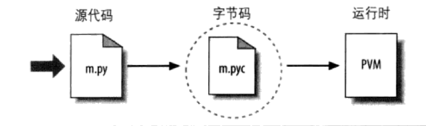
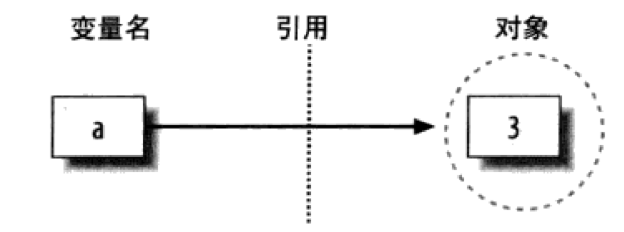

参考：《Python学习手册》

[TOC]

# Q&A

1. JIT技术与PyPy

# 运行Python程序

## Python执行

### 字节码编译

* 程序执行时，Python内部先将源代码编译成字节码的形式
  * Python通过把每一条源语句翻译成一组字节码指令
  * 字节码可以提高执行速度
* 如果Python进程在机器上拥有写入权限，将把程序的字节码保存为一个以`.pyc`为扩展名的文件
  * 下一次运行程序时，如果在上次保存字节码之后没有修改过源代码的话，Python将会加载`.pyc`文件并跳过编译步骤
  * 它会自动检查源文件和字节码文件的时间戳，如果又保存了源代码，下次程序运行时，字节码将自动重新创建
* 如果Python无法在机器上写入字节码，字节码将会在内存中生成并在程序结束时简单地丢弃

### Python虚拟机（PVM）

* 程序编译成字节码（或者字节码从已经存在的`.pyc`文件中载入），之后的字节码发送到Python虚拟机（Python Virtual Machine，PVM）上执行
* PVM时Python的运行引擎，迭代运行字节码指令的循环

### Python性能

* 性能：比C、C++运行慢

  * Python中没有C++中的`build`和`make`步骤
  * Python字节码不是机器的二进制代码
  * PVM循环仍然需要解释字节码，并且字节码指令与CPU指令相比需要更多的工作

  

## 执行模块的变体

### Python解释器

> 解释器是一种让其他程序运行起来的程序，Python解释器将读取程序，并按照其中的命令执行得出结果——实际上，解释器是代码与机器的计算机硬件之间的软件逻辑层。

* CPython：官方版本的解释器，是用C语言开发的，在命令行下运行`python`就是启动`CPython`解释器
* IPython：基于`CPython`之上的一个交互式解释器
* PyPy：目标是执行速度——采用`JIT`技术，对Python代码进行动态编译，显著提高Python代码的执行速度
* Jython：运行在Java平台上的Python解释器，可以直接把Python代码编译成Java字节码执行
* IronPython：运行在微软`.Net`平台上的Python解释器，直接把Python代码编译成`.Net`的字节码

### 执行优化工具（TODO）

* Psyco实时编译器：不是Python的实现方式，而是一个扩展字节码执行模块的组件，可以让程序运行地更快
* Shedskin C++转换器

### 冻结二进制文件

> 将Python程序转为可执行程序（Frozen Binary，冻结二进制文件）

* 冻结二进制文件将程序的字节码、PVM（解释器）以及任何程序所需要的Python支持文件捆绑在一起形成一个单独的文件（例如`Windows`中的`.exe`文件）
* 生产冻结二进制文件方法
  * `Windows`平台下的`py2exe`
  * `Linux`平台下的`PyInstaller`

## 模块导入和重载

> 每一个以扩展名py结尾的Python源代码文件都是一个模块。其他的文件可以通过导入一个模块读取这个模块的内容——导入的本质就是载入另一个文件，并能够读取那个文件的内容

* 导入模块时会运行一次，但是也只有一次，因为导入时一个开销很大的操作，以至于每个文件、每个程序运行不能够重复多余一次

* 如果想在同一次会话中再次运行文件，需要调用`imp`标准库模块中可用的`reload`函数

  ```python
  from imp import reload
  reload(test)
  ```


### 模块的显要特性：属性（TODO）

# 类型和运算

## Python对象类型

> 在Python中，数据以对象的形式出现——无论是Python提供的内置对象，还是使用Python或是像C扩展库这样的扩展语言工具创建的对象

* Python程序可以分解成模块、语句、表达式以及对象
  1. 程序由模块构成
  2. 模块包含语句
  3. 语句包含表达式
  4. 表达式建立并处理对象

* 为什么使用内置类型
  * 内置对象使程序更容易编写
  * 内置对象是扩展的组件
  * 内置对象往往比定制的数据结构更有效率——Python内置类型优化了用C实现数据结构算法

## 数字

### Python的数字类型

* 数字常量
  * 整数
  * 浮点数
  * 二进制（`0b`）、八进制（`0o`）、十六进制（`0x`）表示整数
  * 复数：`1+2j`或者`complex(1, 2)`是等价的
* 内置数学工具和扩展
  * 表达式操作费：`+、-、*、/、>>、**、&`
  
  * 内置数学函数：`pow、abs、round、int、hex、bin`
  
  * 公用模块：`random`、`math`
  
    ```python
    # math是数学模块
    import math
    math.pi
    math.sqrt(81)
    # random模块作为随机数字的生成器和随机选择器
    import random
    random.random()
    random.choice([1, 2, 3, 4])
    ```

## 字符串

## 列表

> 列表是一个任意类型的对象的位置相关的有序集合，没有固定的大小

## 字典

## 序列的操作

## 动态类型简介

### 缺少类型声明语句

> Python中，类型是在运行过程中自动决定的，而不是通过代码声明——这对变量、对象和她们之间的关系都适用

#### 变量、对象和引用

* 变量在赋值的时候才创建，他可以引用任何类型的对象，并且必须在引用之前赋值——不需要通过脚本声明所要适用的名字，但是必须初始化名字然后才能更新它们

* 例子：`a=3`

  * 创建一个对象来代表3
  * 创建一个变量a，如果它还没有创建的话
  * 将变量与新的对象3相连接（**在内部，变量事实上是到对象内存空间的一个指针**）

  

#### 类型属于对象，而不是变量

#### 对象的垃圾收集

### 共享引用

# 语句和语法

## Python语句简介

* 所有Python的复合语句都有相同的一般形式
  * 首行以冒号结尾
  * 下一行嵌套的代码往往按缩进的格式书写
  * 缩进的结束就是代码块的结束
* 括号是可选的——`if (x < y)`与`if x < y`是等价的
* 一行的结束会自动终止在该行的语句，不需要分号
  * 但是多行语句放到一行时需要分号作为语句界定符
  * 任何括在括号`()`、方括号`[]`、大括号`{}`里的程序代码都可横跨好几行

## 赋值、表达式和打印

### 赋值语句

* 赋值语句特性
  * 赋值语句建立对象引用值
    * Python赋值语句会把对象引用值存储在变量名或数据结构的元素内
    * 赋值语句总是建立对象的引用值，而不是复制对象
    * Python对象更像是指针，而不是数据存储区域
  * 变量名在首次赋值时会被创建
  * 变量名在引用钱必须先赋值
  * 执行隐式赋值的一些操作——正常的赋值是`=`，但是模块导入、函数和类的定义、for循环变量以及函数参数全都是隐式赋值运算
* 变量命名规则
  * (下划线或字母)+(任意数目的字母、数字或下划线)
  * 区分大小写
  * 禁止使用保留字
* 变量命名惯例
  * 以单一下划线开头的变量名（`_X`）不会被`from module imort *`语句导入
  * 前后有双下划线的变量名（`__X__`）是系统定义的变量名，对解释器有特殊意义
  * 类变量名通常以一个大写字母开头
  * 模块变量名以小写字母开头
* 对象有类型（整数、列表等），并且可能是可变的或不可变的；但是变量只是对象的引用值，没有不可变的观念，也没有相关联的类型信息

### 表达式语句

* 表达式语句通常用于执行可于远处修改列表的列表方法

### 打印操作

## if语句

```python
if <test1>:
    <statements1>
elif <test2>:
    <statements2>
else:
    <statements3>
```

## while和for循环

### break、continue、pass和循环else

- break：跳出最近所在的循环
- continue：调到最近所在循环的开头处
- pass：什么也不做，只是空占位语句（可以使用`...`代替）
- 循环else块：只有当循环正常离开时才会执行（也就是没有碰到break语句）

### while循环

```python
while condition:
    statements
```

### for循环

> for循环在Python中是一个通用的序列迭代器：可以遍历任何有序的序列对象内的元素

```python
for <target> in <object>:
    <statements>
```

* 当Python运行for循环时，会逐个将序列对象中的元素赋值给目标，然后为每个元素执行循环主体
* for首行中用作赋值目标的变量名通常是for语句在作用域中的变量，当循环一次后会自动被设成序列中的下一个元素
* 一般而言，`for`比`while`执行较快
* range
* 并行遍历`zip`
* 产生偏移和元素`enumerate`

## 迭代器和解析

> 对Python中所有会从左至右扫描对象的迭代工具都可应用于可迭代对象（Iterable），这些迭代工具包括了`for`循环、列表解析、`in`成员关系测试以及`map`内置函数

### 迭代器基础

* 可迭代对象（Iterable）

  * 定义：可迭代对象基本上是序列的通用化——如果对象是实际保存的序列，或者可以在迭代工具环境中一次产生一个结果的对象，就看做是可迭代的

    * 实际序列（`list`，`dict`，`tuple`）
    * 按照需求而计算的虚拟序列（`Iterator`）

  * 判断一个对象是`Iterable`

    ```python
    from collections import Iterable
    # 判断字符串是否可迭代
    isinstance('abc', Iterable)
    # 判断整数是否可迭代
    isinstance(123, Iterable)
    ```

  * 同时迭代索引和元素自身

    ```python
    for i, value in enumerate(['A', 'B', 'C'])
    	print(i, value)
    ```

    

### 列表解析

### 其他迭代环境

### 其他迭代主题

# 函数

## 函数基础

> 一个函数就是将一些语句集合在一起的部件，能够不止一次地在程序中运行。函数是Python为了代码最大程度的重用和最小化代码冗余而提供的最基本的程序结构。

### def语句


# 模块

# 类和oop

# 异常和工具

# 高级话题


