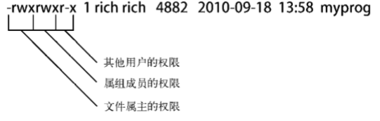

[TOC]

# 初识Linux shell

## 什么是Linux

# 走进shell

# 基本的bash shell 命令

## 启动shell

* GNU bash shell能提供对Linux系统的交互式访问——作为普通程序运行，通常是在用户登录终端时启动，登录时系统启动的shell依赖于用户账户的配置

* shell提示符：提示符是输入shell命令的地方——默认bash shell提示符是美元符号（$）

* bash手册：man命令用来访问存储在Linux上的手册页面，q键退出

* 浏览文件系统

  * Linux使用正斜线（/）而不是反斜线（\）在文件路径中划分目录

  * 遍历目录：使用切换目录命令cd将shell会话切换到另一个目录      cd destination

    * pwd显示shell会话的当前目录
    * 单点符（.）表示当前目录
    * 双点符（..）表示当前目录的父目录

  * 要想知道系统中有哪些文件，乐意使用列表命令 ls

    * ls命令输出的列表是按字母排序的（按列排序而不是按行排序）

    * ls -F 会在目录名后加了正斜线以方便用户在输出中分辨它们

    * ls -a：把隐藏文件和普通文件及目录一起显示出来，就得用到-a参数，隐藏文件以.开头

    * ls -R：递归选项，列出了当前目录下包含的子目录中的文件

    * ls -l：产生长列表格式的输出，包含了目录中每个文件的更多相关信息

      * 第一行显示了在目录中包含的总块数

      * 之后每一行包含了关于文件（或目录）的下述信息

        * 文件类型，比如目录（d）、文件（-）、字符型文件（c）或块设备（b）
        * 文件的权限
        * 文件的硬链接总数
        * 文件属主的用户名
        * 文件属组的组名
        * 文件的大小（以字节为单位）
        * 文件的上次修改时间
        * 文件名或目录名

      * 过滤输出列表：有时输出过多，可以用过滤器来决定应该在输出中显示哪些文件或目录——这个过滤器就是一个进行简单文本匹配的字符串

        ls -l my_scri*

        * 问号（？）代表一个字符
        * 星号（*）代表零个或多个字符
        * [] 中括号中字符是特定位置上可能出现的字符
          * [ai] 代表这个位置可以是a或者i 
          * [a - i]代表这个位置可以是a到i之间的所有字符
          * [!a]代表这个位置上不是a的

    * 选项可以多个分开输入，ls -F -R，也可以合并 ls -FR

  * 处理文件

    * 创建文件：touch file_name
    * 复制文件：cp source destination——cp命令将源文件复制成一个新文件，并且以destination命名。新文件就像全新的文件一样
      * cp -R Scripts/ Mod_Scripts    将整个目录下的内容递归的复制到其他目录

# 更多的bash shell

# 理解shell

# 使用Linux环境变量

## 什么是环境变量

# 理解Linux文件权限

## Linux的安全性

> Linux安全系统的核心是用户账户——每个能进入Linux系统的用户都会被分配唯一的用户账户
>
> 用户权限是通过创建用户时分配的用户ID(USERID，缩写为UID)跟踪的。每个用户都有唯一的UID

### /etc/passwd

> 标准的文本文件，可以用文本编辑器在文件中直接手动进行用户管理(添加、修改或删除用户账户等)

* 查看`cat /etc/passwd`

* Linux的UID分配

  * root用户账户是Linux系统的管理员，固定分配给他的UID是0

  * Linux系统为各种各样的功能创建不同的用户账户——并不是真的用户，叫做**系统账户**，是系统上运行的各种服务进程访问资源用的特殊账户

  * 所有运行在后台的服务都需要用一个系统账户登陆到Linux

    <!--之前这些服务是用root账户登陆的，但是如果有用户攻陷了这些服务中的一个，就能作为root用户进入系统，所以现在Linux后台的所有的服务基本都是自己账户登陆-->

  * Linux为系统账户预留了500以下的UID值，普通用户账户的UID为500及以上
  
* `/etc/passwd`文件每一行包含如下信息

  * 登陆用户名
  * 用户密码(被设置成了x，为了安全保存在`/etc/shadow`)
  * 用户账户的UID
  * 用户账户的组ID(GID)
  * 用户账户的文本描述(称为备注字段)
  * 用户HOME目录的位置
  * 用户的默认shell

### /etc/shadow

> 只有`root`用户能够访问，文件为系统上的每个用户账户保存了一条记录

* 登陆名
* 加密后的密码
* 自上次修改密码后过去的天数(自1970年1月1日开始计算)
* 多少天后才能修改密码
* 多少天后必须更改密码
* 密码过期前提前多少天提醒用户更改密码
* 密码过期后多少天禁用用户账户
* 用户账户被禁用的日期(自1970年1月1日到当天的天数表示)
* 预留字段给将来使用

### 添加新用户

### 删除用户

### 修改用户

## 使用Linux组

> 组权限允许多个用户对系统中的对象(文件、目录或设备等)共享一组共用的权限——每一组都有唯一的GID

### /etc/group

* 文件包含4个字段
  * 组名
  * 组密码
  * GID
  * 属于该组的用户列表
* 组密码允许非组内成员通过它临时成为该组成员
* 不要通过直接修改`/etc/group`文件来添加用户到 一个组，要用`usermod`命令

### 创建新组

* 使用`groupadd groupname`命令可在系统上创建新组
* `usermod -G groupname username`命令将用户`username`添加到组`groupname`中
  * 添加`-g`选项，指定的组名会替换掉该账户的默认组
  * 添加`-G`选项，将该组添加到用户的属组的列表里，不会影响默认组
  * 更改已登录系统账户所属用户组，该用户必须登出系统后再登陆，组关系的更改才能生效

### 修改组

## 理解文件权限

### 使用文件权限符

* 使用`ls -l`命令可以查看Linux系统上的文件、目录和设备的权限——输出的第一个字段是描述文件和目录权限的编码
  * 第一个字符代表了对象的类型
    * `-`代表文件
    * `d`代表目录
    * `l`代表链接
    * `c`代表字符型设备
    * `b`代表块设备
    * `n`代表网络设备
  * 之后是3组三字符的编码——**对象的属主**、**对象的属组**、**系统其它用户**，每一组定义了3种访问权限
    * `r`代表对象是可读的
    * `w`代表对象是可写的
    * `x`代表对象是可执行的
    * 若没有某种权限，在该权限位会出现单破折号

### 默认文件权限