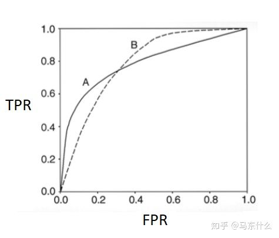

论文：`AUC: a misleading measure of the performance of predictive distribution models`

**参考资料**：[知乎分析](https://zhuanlan.zhihu.com/p/92792702)

[TOC]

# 摘要

目前普遍认为接收器工作特性（ROC）曲线下的面积—AUC是评估分类模型性能的标准方法。它避免了主观性地选择阈值，当连续的概率得到的分数被转换为二分类标签时，通过总结整体模型表现，其衡量模型区分正负样本的性能优于通过阈值来判断的其他方法（比如准确率、召回率等）。在这篇手稿中，我们回顾了这一度量的一些特点，并将其作为模型结果的准确性的比较度量，对其可靠性提出了质疑。我们不建议使用AUC出于 五个原因：

(1)忽略了预测的概率值和模型的拟合优度；（举个例子，假设某个模型对“1”类样本输出的概率都是0.51，对“0”类样本输出的概率均为0.49，此时AUC是1，但是二元交叉熵非常大，因为预测结果和真实标签之间的误差太大）；根据auc的公式我们可以知道auc对于具体的概率值不敏感，它的计算过程事先会把概率值转化为rank 排序，所以auc永远只对排序敏感对具体的概率指不敏感：

举个例子，假设有10000个样本，5000个正样本，5000个负样本，此时我们对5000个正样本的预测概率为0.2，对5000个负样本的预测概率为0.3，此时auc为1，但是模型的拟合优度非常差，二元交叉熵惨不忍睹，看起来完全就是没有拟合完全的情况。

(2)AUC反应了太过笼统的信息。无法反应召回率、精确率等在实际业务中经常关心的指标

看了原文，大意就是，比如我们在安全监测中，对查全率非常看重，对查准率倒是无所谓，反正尽量把恐怖分子查出来，即使错误检查了很多正常人也只是浪费点时间而已而恐怖事件相比不值一提，但是auc反应的是模型对正负样本的区分能力，在一些情况下无法满足建模的真实需求。

(3)对FPR和TPR两种错误的代价同等看待；这一点和第二点雷同，基本的意思就是当用户对不同类别的预测准确率有不同程度的需求时，auc不能很好的满足这个需求。

(4)它没有给出模型误差的空间分布信息（我们不知道模型预测错误的具体情况，比如哪一类预测的错误多，比如整体错误的分布情况等等，举个例子，我们通过对不同类别错误预测的概率和真实标签的误差进行画图可以了解到模型对哪一类样本预测错误率高对哪一类样本预测的精度高，从而有针对的对特征工程、样本权重等进行优化，但是auc无法反应这类信息），AUC只关注正负样本之间的排序，并不关心正样本内部，或者负样本内部的排序，这样我们也无法衡量样本对于好坏客户的好坏程度的刻画能力；

(5)最重要的一点，AUC的misleading的问题：

如图，modelA和modelB的ROC曲线下面积AUC是相等的，但是两个模型在不同区域的预测能力是不相同的，所以我们不能单纯根据AUC的大小来判断模型的好坏。

# 引言

